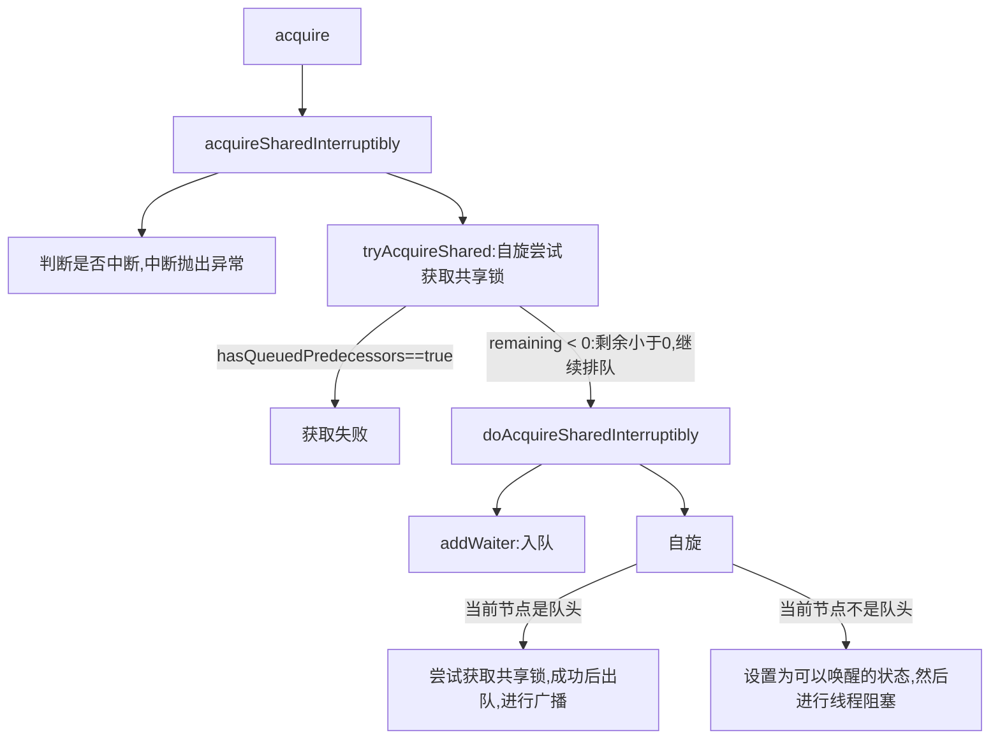

# 并发编程

## CPU 三级缓存架构

### CPU 读取存储器数据过程

1. CPU要取寄存器X的值，只需要一步：直接读取
2. PU要取L1 cache的某个值，需要1-3步（或者更多）：把cache行锁住，把某个数据拿来，解锁，如果没锁住就慢了
3. CPU要取L2 cache的某个值，先要到L1 cache里取，L1当中不存在，在L2里，L2开始加锁，加锁以后，把L2里的数据复制到L1，再执行读L1的过程，上面的3步，再解锁
4. CPU取L3 cache的也是一样，只不过先由L3复制到L2，从L2复制到L1，从L1到CPU
5. CPU取内存则最复杂：通知内存控制器占用总线带宽，通知内存加锁，发起内存读请求，等待回应，回应数据保存到L3（如果没有就到L2），再从L3/2到L1，再从L1到CPU，之后解除总线锁定

### 时间局部性

> 如果一个信息项正在被访问，那么在近期它很可能还会被再次访问。比如循环、递归、方法的反复调用等

### 空间局部性

> 如果一个存储器的位置被引用，那么将来他附近的位置也会被引用。比如顺序执行的代码、连续创建的两个对象、数组等

### 带有高速缓存的CPU执行计算的流程

1. 程序以及数据被加载到主内存
2. 指令和数据被加载到CPU的高速缓存
3. CPU执行指令，把结果写到高速缓存
4. 高速缓存中的数据写回主内存

### CPU运行安全等级

ring0（内核态）：可以运行所有操作；操作系统内部内部程序指令通常运行在ring0级别（修改内存；mysql 数据（undo和redo）刷盘；）

ring1

ring2

ring3：（用户态）操作系统以外的第三方程序运行在ring3级别第三方程序如果要调用操作,系统内部函数功能，由于运行安全级别不够,必须切换CPU运行状态，从ring3切换到ring0,然后执行系统函数，JVM创建线程，线程阻塞唤醒是重型操作了，因为CPU要切换运行状态

PS：进程和线程对应有两个堆栈；一个在用户空间里边；一个在内核空间里边

### 线程模型

> CPU调度的基本单位是线程，也划分为

用户线程模型：线程创建、销毁、调度由用户程序实现

线程阻塞不会引起进程阻塞。在多处理器系统上，多线程在多处理器上并行运行。线程的创建、调度和管
理由内核完成，效率比ULT要慢，比进程操作快

内核线程模型：线程创建、销毁、调度由操作系统完成

### 进程与线程

进程：现代操作系统在运行一个程序时，会为其创建一个进程；例如，启动一个Java程序，操作系统就会创建一个Java进程。进程是OS(操作系统)资源分配的最小单位

线程：线程是OS(操作系统)调度CPU的最小单元，也叫轻量级进程（Light Weight Process），在一个进程里可以创建多个线程，这些线程都拥有各自的计数器、堆栈和局部变量等属性，并且能够访问共享的内存变量

### 线程上下文切换

> CPU切换前把当前任务的状态保存下来，以便下次切换回这个任务时可以再次加载这个任务的状态，然后加载下一任务的状态并执行。任务的状态保存及再加载, 这段过程就叫做上下文切换

### 线程上下文切换问题

- **直接消耗**：指的是CPU寄存器需要保存和加载, 系统调度器的代码需要执行, TLB实例需要重新加载, CPU 的pipeline需要刷掉
- **间接消耗**：指的是多核的cache之间得共享数据, 间接消耗对于程序的影响要看线程工作区操作数据的大小

### 虚拟机指令架构

1. 栈指令集架构
   1. 设计和实现更简单,适用于资源受限的系统;
   2. 避开了寄存器的分配难题:使用零地址指令方式分配;
   3. 指令流中的指令大部分是零地址指令,其执行过程依赖与操作栈,指令集更小,编译器容易实现;
   4. 不需要硬件支持,可移植性更好,更好实现跨平台
2. 寄存器指令集架构
   1. 典型的应用是x86的二进制指令集:比如传统的PC以及Android的Davlik虚拟机。
   2. 指令集架构则完全依赖硬件,可移植性差。
   3. 性能优秀和执行更高效。
   4. 花费更少的指令去完成一项操作。
   5. 在大部分情况下,基于寄存器架构的指令集往往都以一地址指令、二地址指令和三地址指令为主,而基于栈式架构的指令集却是以零地址指令为主。Java符合典型的栈指令集架构特征，像Python、Go都属于这种架构。

## JMM

主内存

主要存储的是Java实例对象，所有线程创建的实例对象都存放在主内存中，不管该实例对象是成员变量还是方法中的本地变量(也称局部变量)，当然也包括了共享的类信息、常量、静态变量。由于是共享数据区域，多条线程对同一个变量进行访问可能会发生线程安全问题

工作内存

存储当前方法的所有本地变量信息(工作内存中存储着主内存中的变量副本拷贝)，每个线程只能访问自己的工作内存，即线程中的本地变量对其它线程是不可见的，就算是两个线程执行的是同一段代码，它们也会各自在自己的工作内存中创建属于当前线程的本地变量，当然也包括了字节码行号指示器、相关Native方法的信息

### 数据同步八大原子操作

1. lock(锁定)：作用于主内存的变量，把一个变量标记为一条线程独占状态
2. unlock(解锁)：作用于主内存的变量，把一个处于锁定状态的变量释放出来，释放后的变量才可以被其他线程锁定
3. read(读取)：作用于主内存的变量，把一个变量值从主内存传输到线程的工作内存中，以便随后的load动作使用
4. load(载入)：作用于工作内存的变量，它把read操作从主内存中得到的变量值放入工作内存的变量副本中
5. use(使用)：作用于工作内存的变量，把工作内存中的一个变量值传递给执行引擎
6. assign(赋值)：作用于工作内存的变量，它把一个从执行引擎接收到的值赋给工作内存的变量
7. store(存储)：作用于工作内存的变量，把工作内存中的一个变量的值传送到主内存中，以便随后的write的操作
8. write(写入)：作用于工作内存的变量，它把store操作从工作内存中的一个变量的值传送到主内存的变量中

### 并发编程特性

1. 可见性（volatile）不保证原子性

   - 代码层面：共享变量改变后其他线程**立刻**感知到修改
   - 字节码层面：多一个访问标志ACC_VOLATILE
   - 缓存一致性协议

2. 原子性：原子性指的是一个操作是不可中断的，即使是在多线程环境下，一个操作一旦开始就不会被其他线程影响（synchronized和Lock）

3. 有序性：

   > 在Java里面，可以通过volatile关键字来保证一定的“有序性”（具体原理在下一节讲述volatile关键字）。另外可以通过synchronized和Lock来保证有序性，很显然，synchronized和Lock保证每个时刻是有一个线程执行同步代码，相当于是让线程顺序执行同步代码，自然就保证了有序性

### Java内存模型

> 每个线程都有自己的工作内存（类似于前面的高速缓存）。线程对变量的所有操作都必须在工作内存中进行，而不能直接对主存进行操作。并且每个线程不能访问其他线程的工作内存

### 指令重排序

> 只要程序的最终结果与它顺序化情况的结果相等，那么指令的执行顺序可以与代码顺序不一致，此过程叫指令的重排序

### 内存屏障

1. LoadLoad屏障：对于这样的语句Load1; LoadLoad; Load2，在Load2及后续读取操作要读取的数据被访问前，保证Load1要读取的数据被读取完毕。
2. StoreStore屏障：对于这样的语句Store1; StoreStore; Store2，在Store2及后续写入操作执行前，保证Store1的写入操作对其它处理器可见。
3. LoadStore屏障：对于这样的语句Load1; LoadStore; Store2，在Store2及后续写入操作被刷出前，保证Load1要读取的数据被读取完毕。
4. StoreLoad屏障：对于这样的语句Store1; StoreLoad; Load2，在Load2及后续所有读取操作执行前，保证Store1的写入对所有处理器可见。它的开销是四种屏障中最大的。在大多数处理器的实现中，这个屏障是个万能屏障，兼具其它三种内存屏障的功能

#### 硬件层

#### volatile禁止重排优化

> 禁止指令重排优化，从而避免多线程环境下程序出现乱序执行的现象

#### volatile重排序规则表

| 是否能重排序 | 第二个操作 |            |            |
| ------------ | ---------- | ---------- | ---------- |
| 第一个操作   | 普通读写   | volatile读 | volatile写 |
| 普通读写     |            |            | NO         |
| volatile读   | NO         | NO         | NO         |
| volatile写   |            | NO         | NO         |

PS：

1. 当第二个操作是volatile 写时，不管第一个操作是什么，都不能重排序。这个规则确保volatile 写之前的操作不会被编译器重排序到volatile 写之后。
2. 当第一个操作是volatile 读时，不管第二个操作是什么，都不能重排序。这个规则确保volatile 读之后的操作不会被编译器重排序到volatile 读之前。
3. 当第一个操作是volatile 写，第二个操作是volatile 读时，不能重排序。

#### JVM-JMM-CPU底层全执行流程


#### 目前操作系统主要结构


### 硬件缓存锁定机制

#### 总线锁

> 前端总线(也叫CPU总线)是所有CPU与芯片组连接的主干道，负责CPU与外界所有部件的通信，包括高速缓存、内存、北桥，其控制总线向各个部件发送控制信号、通过地址总线发送地址信号指定其要访问的部件、通过数据总线双向传输

在CPU1要做 i++操作的时候，其在总线上发出一个LOCK#信号，其他处理器就不能操作缓存了该共享变量内存地址的缓存，也就是阻塞了其他CPU，使该处理器可以独享此共享内存

#### MESI协议

> 多核CPU的情况下有多个一级缓存，如何保证缓存内部数据的一致,不让系统数据混乱。这里就引出了一个一致性的协议MESI

PS：

**缓存一致性协议基于缓存行，如果超过大小则会升级为总线锁；总线裁决效率远高于总线锁**

**volatile 无法保证原子性**

**缓存一致性协议只能对缓存行有效，二对于寄存器无效**

## 如何解决线程并发安全问题

> 序列化访问临界资源。即在同一时刻，只能有一个线程访问临界资源，也称作同步互斥访问；锁的优化、膨胀过程，锁的状态记录在哪，标志位，消除，逃逸分析，（为什么要有，怎么去做）

面试怎么说：

synchronized是一种互斥锁，怎么去用（方法粒度）；原理层面（字节码如何判断）

### 实现方式

#### synchronized

> synchronized内置锁是一种对象锁(锁的是对象而非引用)，作用粒度是对象，可以用来实现对临界资源的同步互斥访问，是可
> 重入的；加锁解锁由JVM完成

内部实现


Pthread：系统维护

#### 加锁方式

1. 同步实例方法，锁是当前实例对象
2. 同步类方法，锁是当前类对象
3. 同步代码块，锁是括号里面的对象

PS：sout 为同步方法，多个线程同时调用会影响性能

### 对象的内存布局


#### 对象头如何记录对象锁


PS：**现在我们虚拟机基本是64位的，而64位的对象头有点浪费空间,JVM默认会开启指针压缩，所以基本上也是按32位的形式记录对象头**
**的**

#### 偏向锁、轻量级锁、重量级锁对应的hashcode放在哪里

偏向锁：调用hashcode后，system.lazyhashcode；会升级成轻量级锁

轻量级锁：lock record（markword）

当解释器执行monitorenter字节码轻度锁住一个对象时，就会在获取锁的线程的栈上显式或者隐式分配一个LockRecord，这个LockRecord存储锁对象markword的拷贝(Displaced Mark Word)

重量级锁：记录在monitor里边

PS：jol-core 用于打印对象内存数据

PS：操作系统的大端和小端模式

PS：IVM 内部将偏向锁延迟4s（默认）启动，JVM启动依赖大量的hashmap，class类，大量同步块，十几个线程；避免无谓的偏向锁-轻量级锁-重量级的升级过程

PS：无锁状态（匿名偏向，可偏向状态，只是没有指定线程ID）

PS：偏向锁调用hashcode后，system.lazyhashcode；会升级成轻量级锁（因为内部没有记录hashcode）


#### 线程逃逸分析

### 优化

1. 锁的膨胀升级（不可逆）
2. 锁的粗化
3. 锁的消除
4. 自旋锁

### AQS 特性

1. 公平/非公平
2. 可重入
3. 允许中断
4. 共享/独占
5. 阻塞等待队列

### 线程阻塞和唤醒方式

1. suspend()、resume()

   > 线程被挂起以后不会释放锁，可能与其他线程、主线程产生死锁

2. wait、notify

   > 1、对象操作都需要加同步synchronized；
   >
   > 2、线程需要阻塞的地方调用对象的wait方法；
   >
   > 存在的不足：面向对象的阻塞是阻塞当前线程，而唤醒的是随机的一个线程或者所有线程，偏重线程间的通信；同时某一线程在被另一线程notify之前必须要保证此线程已经执行到wait等待点，错过notify则可能永远都在等待

3. LockSupport提供的park和unpark方法

   > park与unpark方法控制的颗粒度更加细小，能准确决定线程在某个点停止，进而避免死锁的产生

### CAS

> load之前，都会有一个except值；如果被其他线程修改主内存值已经发生改变，比较except和主内存中的值，不相等重新load然后进行修改----------原子操作


#### 实现（Unsafe类）

> ```java
> public final native boolean compareAndSwapObject(Object var1, long var2, Object var4, Object var5);
> 
> public final native boolean compareAndSwapInt(Object var1, long var2, int var4, int var5);
> 
> public final native boolean compareAndSwapLong(Object var1, long var2, long var4, long var6);
> ```

### ReentrantLock

ReentrantLock是一种基于AQS框架的应用实现，是JDK中的一种线程并发访问的同步手段，它的功能类似于synchronized是一种互斥锁，可以保证线程安全。而且它具有比synchronized更多的特性，比如它支持手动加锁与解锁，支持加锁的公平性

> ReentrantLock如何实现synchronized不具备的公平与非公平性呢？
> 在ReentrantLock内部定义了一个Sync的内部类，该类继承AbstractQueuedSynchronized，对该抽象类的部分方法做了实现；并且还定义了两个子类：
> 1、FairSync 公平锁的实现
> 2、NonfairSync 非公平锁的实现
> 这两个类都继承自Sync，也就是间接继承了AbstractQueuedSynchronized，所以这一个ReentrantLock同时具备公平与非公平特性。上面主要涉及的设计模式：模板模式-子类根据需要做具体业务实现

PS：除了Lock外，Java.concurrent.util当中同步器的实现如Latch,Barrier,BlockingQueue等，都是基于AQS框架实现

PS：如何查看类和所有子类


Lock，公平与公平两种特性

三大核心原理

自旋，LocksSuport, CAS，queue队列

CAS依赖汇编指令：cmpxchg()

Lock可重入性：可重入！

synchronized：可重入

> 内部原理后期深入了解下（并发编程到时候好好看一下精髓，自己总结）

~~~java
exclusiveOwnerThread 当前获取锁的线程是谁！
state 状态器

public final void acquire(int arg) {
    if (!tryAcquire(arg) &&
        acquireQueued(addWaiter(Node.EXCLUSIVE), arg))
        selfInterrupt();
}

tryAcquire(arg) //锁竞争逻辑
//CLH 
addWaiter(Node.EXCLUSIVE) //线程入队,Node节点，Node对Thread引用
    Node：共享属性，独占属性 //响应式编程，异步非阻塞，FutureTask，Callbale
    创建节点Node = pre,next,waitestate,thread 重要属性
    waitestate节点的生命状态：信号量
        SIGNAL = -1 //可被唤醒
        CANCELLED = 1 //代表出现异常，中断引起的，需要废弃结束
        CONDITION = -2 // 条件等待
        PROPAGATE = -3 // 传播
        0 - 初始状态Init状态
为了保证所有阻塞线程对象能够被唤醒
compareAndSetTail(t, node) 入队也存在竞争
    
//当前节点,线程要开始阻塞
acquireQueued(Node(currentThread), arg)
    节点阻塞之前还得再尝试一次获取锁：
    1，能够获取到，节点出队，并且把head往后挪一个节点，新的头结点就是当前节点
    2、不能获取到，阻塞等待被唤醒
    	1.首先第1轮循环、修改head的状态，修改成sinal=-1标记处可以被唤醒.
    	2.第2轮循环，阻塞线程，并且需要判断线程是否是有中断信号唤醒的！
    	shouldParkAfterFailedAcquire(p, node)
    waitestate = 0 - > -1 head节点为什么改到-1，因为持有锁的线程T0在释放锁的时候，得判断head节点的waitestate是否!=0,如果！=0成立，会再把waitstate = -1->0,要想唤醒排队的第一个线程T1，T1被唤醒再接着走循环，去抢锁，可能会再失败（在非公平锁场景下），此时可能有线程T3持有了锁！T1可能再次被阻塞，head的节点状态需要再一次经历两轮循环：waitState = 0 -> -1
   Park阻塞线程唤醒有两种方式：
    1、中断
    2、release()
~~~

> 用多角度，多个线程不断去切换的一种解决问题的思维，抽象思维能力

### Lock（生产上如何实现也是这个思路）

> 显式锁

1. **自旋**
2. **CAS**
3. **LockSupport**
4. queue队列

## BlockingQueue

> 线程通信工具，不管并发多高，同一时间只有一个线程能对对队列进行入队和出队操作

1. 线程安全

### 应用场景

1. 线程池
2. Eureka的三级缓存
3. springcloud
4. Nacos
5. Netty
6. Rocketmq

### ArrayBlockingQueue源码剖析

~~~java
/*初始化一个ArrayBlockingQueue*/    
    public ArrayBlockingQueue(int capacity, boolean fair) {
            if (capacity <= 0)
                throw new IllegalArgumentException();
            this.items = new Object[capacity];
            lock = new ReentrantLock(fair);
            // 未放满状态量
            notEmpty = lock.newCondition();
            // 未空状态量
            notFull =  lock.newCondition();
        }

    public void put(E e) throws InterruptedException {
        checkNotNull(e);
        final ReentrantLock lock = this.lock;//加锁
        lock.lockInterruptibly();
        try {
            while (count == items.length)
                notFull.await();
            enqueue(e);
        } finally {
            lock.unlock();
        }
    }
~~~

线程通信工具

1. BlockingQueue
2. Semaphore
3. CountDownLatch
4. CyclicBarrier

## Semaphore

> 它的作用是控制访问特定资源的线程数目，底层依赖AQS的状态State，是在生产当中比较常用的一个工具类

##### AQS-共享模式



## CountDownLatch

## Atomic原子包

> 所有的底层实现都是基于无锁算法

### AtomicInteger分析

~~~java
/*核心思想：将拿到的值和主内存的值进行比较，如果一直则进行内存写入*/    
public final int getAndAddInt(Object var1, long var2, int var4) {
        int var5;
        do {
            var5 = this.getIntVolatile(var1, var2);
        } while(!this.compareAndSwapInt(var1, var2, var5, var5 + var4));

        return var5;
    }
/*偏移量：相对目前对象偏移多少位能拿到属性的值，比如为12位，则往前12就能拿到这个值*/ 
/*PS：修改某个对象某个属性的值，就需要属性在内存空间的偏移量*/
static class TulingStudent {
        private long id;
        private int age;
    }

public class AtomicStudentAgeUpdater {
    private String name ;
    private volatile int age;

    public AtomicStudentAgeUpdater(String name,int age){
        this.name = name;
        this.age = age;
    }

    public int getAge(){
        return this.age;
    }

    public static void main(String[] args) {
        AtomicStudentAgeUpdater updater = new AtomicStudentAgeUpdater("杨过",18);

        System.out.println(ClassLayout.parseInstance(updater).toPrintable());

        updater.compareAndSwapAge(18,56);
        System.out.println("真实的杨过年龄---"+updater.getAge());
    }
    
    /*PS：实现修改某个属性的并发安全方法*/
    private static final Unsafe unsafe = UnsafeInstance.reflectGetUnsafe();
    private static final long valueOffset;

    static {
        try {
            valueOffset = unsafe.objectFieldOffset(AtomicStudentAgeUpdater.class.getDeclaredField("age"));
            System.out.println("valueOffset:--->"+valueOffset);
        } catch (Exception e) {
            throw new Error(e);
        }
    }

    public void compareAndSwapAge(int old,int target){
        unsafe.compareAndSwapInt(this,valueOffset,old,target);
    }

}
~~~

### API基础

> 基于硬件原语CMPXCHG-实现原子操作CAS（用户态就可以完成）

1. compareAndSwapObject
2. compareAndSwapInt
3. compareAndSwapLong

> 1. 修改不是原值，而是clone了一个副本，所以返回后的新值才是改变后的状态，做所有复杂类型原子类的时候都要注意
> 2. 修改的对象的属性要加上volatile和public关键字

### AtomicIntegerArray

> PS：用于实现对数组的原子操作

### AtomicReferenceFieldUpdater

> PS：用于实现对象的具体属性的原子操作

## CAS的ABA问题

### AtomicStampedReference

> PS：
>
> 1. 设置初始值和初始版本号，修改的时候去比较当前版本号何和初始版本号
> 2. 只关心结果，忽视ABA；关心数据变化过程，最好使用ABA

#### Unsafe魔术类

> JDk1.7之后提供的执行内存操作的API（访问系统资源、管理系统资源），所以操作是不安全的

##### 并发上传文件

PS：

1. 可以用Unsafe申请对外内存来进行文件上传操作

2. 完成操作后一定要进行内存释放

3. 可以用Unsafe进行跨方法使用锁的操作

   > ```java
   > public class ObjectMonitorRunner {
   >  static Object object = new Object();
   >  static Unsafe unsafe = UnsafeInstance.reflectGetUnsafe();
   >  public void method1(){
   >      unsafe.monitorEnter(object);
   >  }
   > 
   >  public void method2(){
   >      unsafe.monitorExit(object);
   >  }
   > 
   >  public static void main(String[] args) {
   >      //jvm内置锁
   >      synchronized (object){
   > 
   >          //写逻辑
   >      }
   >  }
   > 
   > }
   > ```

# 集合类

## HashMap

> JDK1.7：数组+链表
>
> JDK1.8：数组+链表+红黑树

### 什么是哈希

> 把任意长度的 输入 （又叫做预映射pre-image）通过散列算法变换成固定长度的 输出 ，该输出就是散列值

### 什么是哈希冲突

> 不同的值,由哈希函数计算出的哈希值可能相同

### 重要属性值

1. DEFAULT_INITIAL_CAPACITY = 1 << 4; 默认为16；如果设置，对应大小为大于该数值而且为2^N

   PS：为什么是2的整数幂次

   > 因为计算索引的时候用的是位运算：h &  (table.length - 1)

2. MAXIMUM_CAPACITY = 1 << 30; 最大Hash表容量

3. DEFAULT_LOAD_FACTOR = 0.75f；默认加载因子

4. TREEIFY_THRESHOLD = 8；链表转红黑树阈值

5. UNTREEIFY_THRESHOLD = 6；红黑树转链表阈值

6. MIN_TREEIFY_CAPACITY = 64；链表转红黑树时hash表最小容量阈值，达不到优先扩容

### JDk1.7

#### 内部的链表如何实现

~~~java
static class Node<K,V> implements Map.Entry<K,V> {
        final int hash;
        final K key;
        V value;
        Node<K,V> next;
    }
~~~

#### 为什么容量是2的次幂

> 因为哈希的时候，采用的是位运算代替取余操作，并且采用如下方式使得hashcode更加散列

~~~java
// 计算hashcode
h ^= (h >>> 20) ^ (h >>> 12);
return h ^ (h >>> 7) ^ (h >>> 4);
// 计算在数组中的位置
return h & (length-1);
~~~

#### 什么情况触发扩容（为原来2倍）

> size() >= capacity * 扩容比例值  & null != table[bucketIndex] 计算出要放入的索引位置不为空

#### 为什么负载因子默认为0.75f

> 加载因子越大，填满的元素越多，空间利用率越高，但发生冲突的机会变大了；
>
> 加载因子越小，填满的元素越少，冲突发生的机会减小，但空间浪费了更多了，而且还会提高扩容rehash操作的次数，
>
> 空间0.75作为默认的加载因子，完全是时间和空间成本上寻求的一种折衷选择

#### 扩容后原数组元素如何迁移

~~~java
1.遍历所有key，利用while遍历链表
2.再次进行rehash，计算index
3.有两个指针e和next分别指向当前值和下一个值，然后将e移动到之后的新位置，然后改变e和next指向
void transfer(Entry[] newTable, boolean rehash) {
        int newCapacity = newTable.length;
        for (Entry<K,V> e : table) {
            while(null != e) {
                Entry<K,V> next = e.next;
                if (rehash) {
                    e.hash = null == e.key ? 0 : hash(e.key);
                }
                int i = indexFor(e.hash, newCapacity);
                // 要移动的元素的next为table[i]已经存在的那条链表
                e.next = newTable[i];
                // table[i]赋值为要移动的元素的next
                newTable[i] = e;
                // 向下继续走
                e = next;
            }
        }
    }
~~~

#### 死锁问题如何产生


PS：一次倒向形成一个指针，多线程经历了两次导向，形成了两个指针，所以会产生一堆的环

### JDk1.8

#### 什么情况触发扩容（为原来2倍）

> table.size() >=64并且链表长度>8

#### 链表阈值为什么为8

> 

#### 如何解决扩容死锁


> 高位指针 head，tail
>
> 低位指针 head，tai
>
> 最终按照和原数组table.size()进行按位；形成高位链表和低位链表；低位链表和原来的位置对应，高位链表和原来的位置+原来数组容量

扩容思想应用

> 分库分表、在线扩容

## ConcurrentHashMap

> 写同步，读无锁

### 重要属性值

- LOAD_FACTOR: 负载因子, 默认75%, 当table使用率达到75%时, 为减少table的hash碰撞, tabel长度将扩容一倍。负载因子计算: 元素总个数%table.lengh
- TREEIFY_THRESHOLD: 默认8, 当链表长度达到8时, 将结构转变为红黑树。
- UNTREEIFY_THRESHOLD: 默认6, 红黑树转变为链表的阈值。
- MIN_TRANSFER_STRIDE: 默认16, table扩容时, 每个线程最少迁移table的槽位个数。
- MOVED: 值为-1, 当Node.hash为MOVED时, 代表着table正在扩容
- TREEBIN, 置为-2, 代表此元素后接红黑树。
- nextTable: table迁移过程临时变量, 在迁移过程中将元素全部迁移到nextTable上。
- sizeCtl: 用来标志table初始化和扩容的,不同的取值代表着不同的含义:
  - 0: table还没有被初始化
  - -1: table正在初始化
  - 小于-1: 实际值为resizeStamp(n)<<RESIZE_STAMP_SHIFT+2, 表明table正在扩容
  - 大于0: 初始化完成后, 代表table最大存放元素的个数, 默认为0.75*n
- transferIndex: table容量从n扩到2n时, 是从索引n->1的元素开始迁移,
- transferIndex代表当前已经迁移的元素下标
- ForwardingNode: 一个特殊的Node节点, 其hashcode=MOVED, 代表着此时
- table正在做扩容操作。扩容期间, 若table某个元素为null, 那么该元素设置为
- ForwardingNode, 当下个线程向这个元素插入数据时, 检查hashcode=MOVED, 就会帮着扩容

### JDk1.7

#### 写同步如何实现


### JDk1.8

#### 如何put数据

- 判断为空则进行初始化

  ~~~java
   while ((tab = table) == null || tab.length == 0) {
              if ((sc = sizeCtl) < 0)  //其他进来的都在原地等待，第一个进来的进行扩容操作
                  Thread.yield(); // lost initialization race; just spin
              else if (U.compareAndSwapInt(this, SIZECTL, sc, -1)) {
                  try {
                      if ((tab = table) == null || tab.length == 0) {
                          int n = (sc > 0) ? sc : DEFAULT_CAPACITY;
                          @SuppressWarnings("unchecked")
                          Node<K,V>[] nt = (Node<K,V>[])new Node<?,?>[n];
                          table = tab = nt;
                          sc = n - (n >>> 2);
                      }
                  } finally {
                      sizeCtl = sc;
                  }
                  break;
              }
          }
  ~~~

  

- 判断有卡槽的位置是否为空，如果为空，采用CAS往里边放初始值

  ~~~java
  else if ((f = tabAt(tab, i = (n - 1) & hash)) == null) {
                  if (casTabAt(tab, i, null,
                               new Node<K,V>(hash, key, value, null)))
                      break;                   // no lock when adding to empty bin
              }
  
  ~~~

- 判断是否正在扩容，线程会帮助正在迁移的线程进行数据迁移

  ~~~java
  final Node<K,V>[] helpTransfer(Node<K,V>[] tab, Node<K,V> f) { //table扩容
          Node<K,V>[] nextTab; int sc;
          if (tab != null && (f instanceof ForwardingNode) &&
              (nextTab = ((ForwardingNode<K,V>)f).nextTable) != null) {
              // 根据 length 得到一个标识符号
              int rs = resizeStamp(tab.length);
              while (nextTab == nextTable && table == tab &&
                     (sc = sizeCtl) < 0) {//说明还在扩容
                  //判断是否标志发生了变化||  扩容结束了
                  if ((sc >>> RESIZE_STAMP_SHIFT) != rs || sc == rs + 1 ||
                       //达到最大的帮助线程 ||  判断扩容转移下标是否在调整（扩容结束）
                      sc == rs + MAX_RESIZERS || transferIndex <= 0)
                      break;
                  // 将 sizeCtl + 1, （表示增加了一个线程帮助其扩容）
                  if (U.compareAndSwapInt(this, SIZECTL, sc, sc + 1)) {
                      transfer(tab, nextTab);
                      break;
                  }
              }
              return nextTab;
          }
          return table;
  }
  // 检查是否扩容完成;对sizeCtrl = sizeCtrl+1(采用CAS操作), 然后调用transfer()进行真正的扩容。
  
  //扩容transfer
  private final void transfer(Node<K,V>[] tab, Node<K,V>[] nextTab) {
      int n = tab.length, stride;
      if ((stride = (NCPU > 1) ? (n >>> 3) / NCPU : n) < MIN_TRANSFER_STRIDE)
         // subdivide range，每个线程最少迁移16个槽位，大的话，最多
          stride = MIN_TRANSFER_STRIDE;
      // initiating  才开始初始化新的nextTab
      if (nextTab == null) {
          try {
              @SuppressWarnings("unchecked")
              Node<K,V>[] nt = (Node<K,V>[])new Node<?,?>[n << 1];  //扩容2倍
              nextTab = nt;
          } catch (Throwable ex) {      // try to cope with OOME
              sizeCtl = Integer.MAX_VALUE;
              return;
          }
          nextTable = nextTab;
          transferIndex = n;//更新的转移下标，
      }
      int nextn = nextTab.length;
      ForwardingNode<K,V> fwd = new ForwardingNode<K,V>(nextTab);
      //是否能够向前推进到下一个周期
      boolean advance = true;
      // to ensure sweep before committing nextTab，完成状态，如果是，则结束此方法
      boolean finishing = false;
      for (int i = 0, bound = 0;;) {
          Node<K,V> f; int fh;
          while (advance) { //取下一个周期
              int nextIndex, nextBound;
              //本线程处理的区间范围为[bound, i),范围还没有处理完成，那么就继续处理
              if (--i >= bound || finishing)
                  advance = false;
              //目前处理到了这里（从大到小， 下线），开始找新的一轮的区间
              else if ((nextIndex = transferIndex) <= 0) {
                  i = -1;
                  advance = false;
              }
              //这个条件改变的是transferIndex的值，从16变成了1
              else if (U.compareAndSwapInt
                       (this, TRANSFERINDEX, nextIndex,
                       //nextBound 是这次迁移任务的边界，注意，是从后往前
                        nextBound = (nextIndex > stride ?
                                     nextIndex - stride : 0))) {
                  bound = nextBound; //一块区间最小桶的下标
                  i = nextIndex - 1; //能够处理的最大桶的下标
                  advance = false;
              }
          }
          if (i < 0 || i >= n || i + n >= nextn) { //每个迁移线程都能达到这里
              int sc;
              if (finishing) { //迁移完成
                  nextTable = null;
                  //直接把以前的table丢弃了，上面的MOVE等标志全部丢弃，使用新的
                  table = nextTab;
                  sizeCtl = (n << 1) - (n >>> 1); //扩大2n-0.5n = 1.50n, 更新新的容量阈值
                  return;
              }
              //表示当前线程迁移完成了
              if (U.compareAndSwapInt(this, SIZECTL, sc = sizeCtl, sc - 1)) {
                   //注意此时sc的值并不等于sizeCtl，上一步，sizeCtl=sizeCtl-1了。这两个对象还是分割的
                  if ((sc - 2) != resizeStamp(n) << RESIZE_STAMP_SHIFT)
                      return;
                  finishing = advance = true;
                  i = n; // recheck before commit
              }
          }
          //如果对应位置为null， 则将ForwardingNode放在对应的地方
          else if ((f = tabAt(tab, i)) == null)
              advance = casTabAt(tab, i, null, fwd);
          else if ((fh = f.hash) == MOVED) //别的线程已经在处理了，再推进一个下标
              advance = true; // already processed，推动到下一个周期，仍然会检查i与bound是否结束
          else { //说明位置上有值了，
              //需要加锁，防止再向里面放值，在放数据时，也会锁住。比如整个table正在迁移，还没有迁移到这个元素，另外一个线程向这个节点插入数据，此时迁移到这里了，会被阻塞住
              synchronized (f) {
                  if (tabAt(tab, i) == f) {//判断i下标和f是否相同
                      Node<K,V> ln, hn; //高位桶， 地位桶
                      if (fh >= 0) {
                          int runBit = fh & n;//n为2^n, 取余后只能是2^n
                          Node<K,V> lastRun = f;
                          ///找到最后一个不和fn相同的节点
                          for (Node<K,V> p = f.next; p != null; p = p.next) {
                              int b = p.hash & n;
                              //只要找到这，之后的取值都是一样的，下次循环时，就不用再循环后面的
                              if (b != runBit) {
                                  runBit = b;
                                  lastRun = p;
                              }
                          }
                          if (runBit == 0) {
                              ln = lastRun;
                              hn = null;
                          }
                          else { //比如1，16，32,如果低位%16，那么肯定是0。
                              hn = lastRun;
                              ln = null;
                          }
                          for (Node<K,V> p = f; p != lastRun; p = p.next) {
                              int ph = p.hash; K pk = p.key; V pv = p.val;
                              if ((ph & n) == 0)
                                   //这样就把相同串的给串起来了
                                  ln = new Node<K,V>(ph, pk, pv, ln);
                              else
                                  //这样就把相同串的给串起来了，注意这里ln用法，第一个next为null，烦着串起来了。
                                  hn = new Node<K,V>(ph, pk, pv, hn);
                          }
                          setTabAt(nextTab, i, ln); //反着给串起来了
                          setTabAt(nextTab, i + n, hn);
                          setTabAt(tab, i, fwd);
                          advance = true;
                      }
                      else if (f instanceof TreeBin) {// 如果是红黑树
                          TreeBin<K,V> t = (TreeBin<K,V>)f;
                          TreeNode<K,V> lo = null, loTail = null; //也是高低节点
                          TreeNode<K,V> hi = null, hiTail = null;//也是高低节点
                          int lc = 0, hc = 0;
                          for (Node<K,V> e = t.first; e != null; e = e.next) { //中序遍历红黑树
                              int h = e.hash;
                              TreeNode<K,V> p = new TreeNode<K,V>
                                  (h, e.key, e.val, null, null);
                              if ((h & n) == 0) { //0的放低位
                                  //注意这里p.prev = loTail，每一个p都是下一个的prev
                                  if ((p.prev = loTail) == null)
                                      lo = p; //把头记住
                                  else
                                      loTail.next = p;  //上一次的p的next是这次的p
                                  loTail = p; //把上次p给记住
                                  ++lc;
                              }
                              else { //高位
                                  if ((p.prev = hiTail) == null)
                                      hi = p; //把尾记住
                                  else
                                      hiTail.next = p;
                                  hiTail = p;
                                  ++hc;
                              }
                          }
                          ln = (lc <= UNTREEIFY_THRESHOLD) ? untreeify(lo) :// //判断是否需要转化为树
                              (hc != 0) ? new TreeBin<K,V>(lo) : t; //如果没有高低的话，则部分为两个树
                          hn = (hc <= UNTREEIFY_THRESHOLD) ? untreeify(hi) :
                              (lc != 0) ? new TreeBin<K,V>(hi) : t;
                          setTabAt(nextTab, i, ln);
                          setTabAt(nextTab, i + n, hn);
                          setTabAt(tab, i, fwd);
                          advance = true;
                      }
                  }
              }
          }
      }
  }
  ~~~

- 判断是否正在扩容，未在扩容执行，采用synchronized锁定当前节点，然后进行插入操作（尾插法）

### 总结

> table扩容过程就是将table元素迁移到新的table上, 在元素迁移时, 可以并发完成, 加快了迁移速度, 同时不至于阻塞线程。所有元素迁移完成后, 旧的table直接丢失, 直接使用新的table

## CopyOnWriteArrayList

> ArrayList其中有FailFirst机制，所以提供了一个多线程同时读写的线程安全类

### 自己设计思路

~~~java
v1.0
ReentrantLock 读加锁，写加锁；粒度大
v2.0
ReentrantReadWriteLock 读写互斥
v3.0
CopyOnWriteArrayList
场景：读多写少
写操作加锁（只能有一个线程进行拷贝副本，追加写入操作；写操作完成后副本拷贝回去）
弊端：读少写多的情况拷贝副本太大，容易产生FULL GC
从数据一致性考虑，实现最终数据一致性；允许读到脏数据
~~~

## CopyOnWriteArraySet

> 在CopyOnWriteArrayList基础上对元素做了去重操作

### ConcurrentSkipListMap

> 多线程下并发可以维持元素有序的数据结构，（时间复杂的O（logN）），底层的数据结构是索引；O（N），跳表维护索引，根据索引去找

# 线程池与源码解读

## 线程状态切换图


## ULT和KLT线程模型


## 协程

> 切换的时候不需要进行上线问切换，本质上是在一个CPU上虚拟出来多个线程栈

## 线程池使用场景

> 单个任务处理时间比较短，需要处理的任务数量特别大

## 基本核心参数

1. **corePoolSize**

   线程池中的核心线程数，当提交一个任务时，线程池创建一个新线程执行任务，直到当前线程数等于corePoolSize；如果当前线程数为corePoolSize，继续提交的任务被保存到阻塞队列中，等待被执行；如果执行了线程池的prestartAllCoreThreads()方法，线程池会提前创建并启动所有核心线程。
   
2. **maximumPoolSize**

   线程池中允许的最大线程数。如果当前阻塞队列满了，且继续提交任务，则创建新的线程执行任务，前提是当前线程数小于maximumPoolSize

3. **keepAliveTime**

   线程池维护线程所允许的空闲时间。当线程池中的线程数量大于corePoolSize的时候，如果这时没有新的任务提交，核心线程外的线程不会立即销毁，而是会等待，直到等待的时间超过了keepAliveTime

4. **unit**

   keepAliveTime的单位

5. **workQueue**

   用来保存等待被执行的任务的阻塞队列，且任务必须实现Runable接口，在JDK中提供了如下阻塞队列：

   1. ArrayBlockingQueue：基于数组结构的有界阻塞队列，按FIFO排序任务
   2. LinkedBlockingQuene：基于链表结构的阻塞队列，按FIFO排序任务，吞吐量通常要高于ArrayBlockingQuene
   3. SynchronousQuene：一个不存储元素的阻塞队列，每个插入操作必须等到另一个线程调用移除操作，否则插入操作一直处于阻塞状态，吞吐量通常要高于LinkedBlockingQuene
   4. priorityBlockingQuene：具有优先级的无界阻塞队列

6. **threadFactory**

   它是ThreadFactory类型的变量，用来创建新线程。默认使用Executors.defaultThreadFactory() 来创建线程。使用默认的ThreadFactory来创建线程时，会使新创建的线程具有相同的NORM_PRIORITY优先级并且是非守护线程，同时也设置了线程的名称

7. **handler**

   线程池的饱和策略，当阻塞队列满了，且没有空闲的工作线程，如果继续提交任务，必须采取一种策略处理该任务，线程池提供了4种策略：

   1. AbortPolicy：直接抛出异常，默认策略
   2. **CallerRunsPolicy**：用调用者所在的线程来执行任务
   3. **DiscardOldestPolicy**：丢弃阻塞队列中靠最前的任务，并执行当前任务
   4. DiscardPolicy：直接丢弃任务
      上面的4种策略都是ThreadPoolExecutor的内部类。当然也可以根据应用场景实现RejectedExecutionHandler接口，自定义饱和策略，如记录日志或持久化存储不能处理的任务

## 线程生成过程

1. 根据corePoolSize核心线程往里边放
2. 根据阻塞队列元素往里边放
3. 根据非核心线程往里边放（前提是队列已经满了）
4. 根据拒绝策略决定到底应该怎么处理

## 线程池生命状态

> private final AtomicInteger ctl = new AtomicInteger(ctlOf(RUNNING, 0));
>
> 高三位来记录线程状态，低29位用来记录当前活跃的线程数量

## execute方法中核心操作addWorker

~~~java
private boolean addWorker(Runnable firstTask, boolean core) {
    retry:
    for (;;) {
        int c = ctl.get();
    // 获取运行状态
        int rs = runStateOf(c);
    /*
     * 这个if判断
     * 如果rs >= SHUTDOWN，则表示此时不再接收新任务；
     * 接着判断以下3个条件，只要有1个不满足，则返回false：
     * 1. rs == SHUTDOWN，这时表示关闭状态，不再接受新提交的任务，但却可以继续处理阻塞队列中已保存的任务
     * 2. firsTask为空
     * 3. 阻塞队列不为空
     * 
     * 首先考虑rs == SHUTDOWN的情况
     * 这种情况下不会接受新提交的任务，所以在firstTask不为空的时候会返回false；
     * 然后，如果firstTask为空，并且workQueue也为空，则返回false，
     * 因为队列中已经没有任务了，不需要再添加线程了
     */
     // Check if queue empty only if necessary.
        if (rs >= SHUTDOWN &&
                ! (rs == SHUTDOWN &&
                        firstTask == null &&
                        ! workQueue.isEmpty()))
            return false;
        for (;;) {
            // 获取线程数
            int wc = workerCountOf(c);
            // 如果wc超过CAPACITY，也就是ctl的低29位的最大值（二进制是29个1），返回false；
            // 这里的core是addWorker方法的第二个参数，如果为true表示根据corePoolSize来比较，
            // 如果为false则根据maximumPoolSize来比较。
            // 
            if (wc >= CAPACITY ||
                    wc >= (core ? corePoolSize : maximumPoolSize))
                return false;
            // 尝试增加workerCount，如果成功，则跳出第一个for循环
            if (compareAndIncrementWorkerCount(c))
                break retry;
            // 如果增加workerCount失败，则重新获取ctl的值
            c = ctl.get();  // Re-read ctl
            // 如果当前的运行状态不等于rs，说明状态已被改变，返回第一个for循环继续执行
            if (runStateOf(c) != rs)
                continue retry;
            // else CAS failed due to workerCount change; retry inner loop
        }
    }
    boolean workerStarted = false;
    boolean workerAdded = false;
    Worker w = null;
    try {
     // 根据firstTask来创建Worker对象
        w = new Worker(firstTask);
     // 每一个Worker对象都会创建一个线程
        final Thread t = w.thread;
        if (t != null) {
            final ReentrantLock mainLock = this.mainLock;
            mainLock.lock();
            try {
                int rs = runStateOf(ctl.get());
                // rs < SHUTDOWN表示是RUNNING状态；
                // 如果rs是RUNNING状态或者rs是SHUTDOWN状态并且firstTask为null，向线程池中添加线程。
                // 因为在SHUTDOWN时不会在添加新的任务，但还是会执行workQueue中的任务
                if (rs < SHUTDOWN ||
                        (rs == SHUTDOWN && firstTask == null)) {
                    if (t.isAlive()) // precheck that t is startable
                        throw new IllegalThreadStateException();
                    // workers是一个HashSet
                    workers.add(w);
                    int s = workers.size();
                    // largestPoolSize记录着线程池中出现过的最大线程数量
                    if (s > largestPoolSize)
                        largestPoolSize = s;
                    workerAdded = true;
                }
            } finally {
                mainLock.unlock();
            }
            if (workerAdded) {
                // 启动线程
                t.start();
                workerStarted = true;
            }
        }
    } finally {
        if (! workerStarted)
            addWorkerFailed(w);
    }
    return workerStarted;
}
~~~

## 线程池如何实现重用

> while (task != null || (task = getTask()) != null) {}
>
> 通过while循环不断的从getTask()获取任务从而达到线程重用的目的（执行的时候进行lock加锁）

~~~java
final void runWorker(Worker w) {
    Thread wt = Thread.currentThread();
    // 获取第一个任务
    Runnable task = w.firstTask;
    w.firstTask = null;
    // 允许中断
    w.unlock(); // allow interrupts
    // 是否因为异常退出循环
    boolean completedAbruptly = true;
    try {
        // 如果task为空，则通过getTask来获取任务
        while (task != null || (task = getTask()) != null) {
            w.lock();
            if ((runStateAtLeast(ctl.get(), STOP) ||
                    (Thread.interrupted() &&
                            runStateAtLeast(ctl.get(), STOP))) &&
                    !wt.isInterrupted())
                wt.interrupt();
            try {
                beforeExecute(wt, task);
                Throwable thrown = null;
                try {
                    task.run();
                } catch (RuntimeException x) {
                    thrown = x; throw x;
                } catch (Error x) {
                    thrown = x; throw x;
                } catch (Throwable x) {
                    thrown = x; throw new Error(x);
                } finally {
                    afterExecute(task, thrown);
                }
            } finally {
                task = null;
                w.completedTasks++;
                w.unlock();
            }
        }
        completedAbruptly = false;
    } finally {
        processWorkerExit(w, completedAbruptly);
    }
}
~~~

## 线程超时如何处理

> task == null || task = getTask()==null的时候跳出循环，即线程超时

### 源码实现

~~~java
    private Runnable getTask() {
        boolean timedOut = false; // Did the last poll() time out?

        for (;;) {
            // allowCoreThreadTimeOut可以设置主线程是否要被丢弃（默认为true，不过期）
            boolean timed = allowCoreThreadTimeOut || wc > corePoolSize;

            if ((wc > maximumPoolSize || (timed && timedOut))
                //阻塞队列，当队列为空，条件不满足，则进行阻塞
                && (wc > 1 || workQueue.isEmpty())) {
                if (compareAndDecrementWorkerCount(c))
                    return null;
                continue;
            }

            try {
                Runnable r = timed ?
                    workQueue.poll(keepAliveTime, TimeUnit.NANOSECONDS) :
                    workQueue.take();
                if (r != null)
                    return r;
                timedOut = true;
            } catch (InterruptedException retry) {
                timedOut = false;
            }
        }
    }
~~~

## 任务不能丢失的设计思想

> 任务丢到中间件，重写业务进行监控队列中的任务执行状态

## 提交任务的时候抛出异常，之后的仍然可以继续执行

> processWorkerExit(w, completedAbruptly);
>
> 如果抛异常，再检测下当前线程池生命状态是否运行完成，如果没有完成，则将其加入到非核心线程进行操作

## 线程数量设置

1. CPU密集型：CPU核数+1
2. IO密集型：2倍CPU核数+1

## runWorker为何要先加锁后解锁

> 线程没有完全创建完成是不允许中断的，所以才先加锁后解锁

# 并发编程之定时任务

## ScheduledThreadPoolExecutor

> 不包含非核心线程

### 核心API

1. schedule（开启定时任务）
2. scheduledAtFixedRate（固定速率执行定时任务）
3. scheduledWithFixedDelay（延时执行定时任务）

### 简单应用

> 1. 实际上运行的线程个数只和提交的任务个数有关，而不是等于核心线程数
> 2. 任务执行过程中抛异常，会处理异常而把任务丢弃，所以会一直卡主不动

1. 执行简单延迟任务

2. 提交任务的线程-接着干活

   ```java
       scheduledThreadPoolExecutor.schedule(() -> {
           System.out.println("我要延迟3s执行");
           return 1;
       }, 1000, TimeUnit.MILLISECONDS);
       //提交任务的线程-接着干活
   ```

3. 每次过5s执行一个操作

   ~~~java
           scheduledThreadPoolExecutor.scheduleAtFixedRate(() -> {
               log.info("send heart beat");
               log.info("task over....");
               throw new RuntimeException("unexpected error , stop working");
           }, 1000, 2000, TimeUnit.MILLISECONDS);
   ~~~

4. 每次上一个任务执行完成后间隔固定时间执行下一个任务

   ~~~java
           scheduledThreadPoolExecutor.scheduleWithFixedDelay(() -> {
               log.info("send heart beat");
               log.info("task over....");
               throw new RuntimeException("unexpected error , stop working");
           }, 1000, 2000, TimeUnit.MILLISECONDS);
   ~~~

5. Timer也可以对线程进行周期执行(基于直接生成一个线程的方式来做，出现异常则线程被丢弃，所以会导致运行过程中程序挂掉，不建议使用)

### 开发应用场景

#### 分布式锁-redis

> 解决实际执行任务时间 》锁过期时间的问题

~~~java
if(setnx("",锁的过期时间)){
    // 定时线程池，每隔2秒看一下锁还在不在，延长锁的过期时间
    // 执行业务逻辑
    // 释放锁
}else{
    park(),sleep()
}
~~~

#### springcloud-服务注册与发现

#### 定时刷新缓存

### 核心源码

#### DelayQueue

1. DelayQueue内部封装了一个PriorityQueue，它会根据time的先后时间排序，若time相同则根据sequenceNumber排序
2. 无界队列

#### 任务如何提交

~~~mermaid
graph TD
  Q[decorateTask对任务进行装饰] --> Q1[delayedExecute]
  Q1[delayedExecute] --> |线程池未关闭|Q2[ensurePrestart添加worker进行工作]
  Q1[delayedExecute] --> |线程池已关闭|Q3[拒绝任务]
  Q2[ensurePrestart添加worker进行工作]--> |小于核心线程数|Q4[创建核心worker进行工作]
  Q2[ensurePrestart添加worker进行工作]--> |等于0|Q5[创建非核心worker进行工作]
~~~

#### 任务如何执行

~~~mermaid
graph TD
  Q[ScheduledFutureTask.run] -->|当前线程池不正常运行| Q1[取消]
  Q[ScheduledFutureTask.run] -->|当前线程池正常运行| Q2[boolean periodic]
  Q2[boolean periodic] -->|是定时任务| Q3[reExecutePeriodic]
  Q2[boolean periodic] -->|不是定时任务| Q4[ScheduledFutureTask.super.run]
~~~

#### 如何判断是固定间隔还是延时

> 传入的时候，fix时间间隔大于0，delay时间间隔小于0；来区分是固定间隔执行还是延时执行

#### 排序用的是什么数据结构

1. 逻辑结构是一个最小堆结构，只要保证最小的在最前边就行了
2. 实际存储结构是一个数组（进行逻辑排序）

#### 常用定时任务框架的区别

##### Timer

> 单线程，线程挂了不会在创建线程

##### ScheduledThreadPoolExecutor

> 线程挂了再提交任务，线程池会创建新的线程执行任务

##### quartz

> 单机的定时任务，功能强大

##### xxl-job

> 定时任务+分布式调度

# 并发编程之Future和ForkJoin

> 封装了一个FutureTask来获取提交线程任务的返回值，实现异步阻塞

## get()方法实现主线程阻塞

> 调用FutureTask的awaitDone方法,调用LockSupport.parkNanos(this, nanos)进行阻塞（主线程）

## 如何去唤醒阻塞的线程

> 调用FutureTask的run方法，最终完成的时候进行线程的唤醒（主线程）

## CPU密集型

> 比如大型数组求和等计算，一般线程数：CPU核数+1

## IO密集型

> 网络磁盘IO比较多：（线程等待时间+线程CPU时间）/ 线程CPU时间 * CPU数目

## 异步阻塞方式实现一些功能

~~~java
   public static void main(String[] args) {
        ExecutorService executor = Executors.newFixedThreadPool(5);

        Future<?> submit = executor.submit(() -> {
            log.info("this woker start do work");
            RestTemplate restTemplate = new RestTemplate();
            String forObject = restTemplate.getForObject("https://www.baidu.com/", String.class, new Object[]{});
            System.out.println(forObject);
            Thread.sleep(5000);
            return 1;
        });

        // 发廊理发
        // 按摩
        // 看一下你的前女友
        // 异步阻塞

        try {
            System.out.println(submit.get(2,TimeUnit.SECONDS));
        } catch (InterruptedException e) {
            e.printStackTrace();
        } catch (ExecutionException e) {
            e.printStackTrace();
        } catch (TimeoutException e) {
            e.printStackTrace();
        }

        System.out.println("has got the result");
    }
~~~

## ForkJoinTask

> 提供了一个用于并行执行任务的框架，分治思维：把大任务拆分成小任务；计算密集型

PS：传统线程池递归方式线程资源需要太多，并且

### 基本核心参数

1. parallelism：**并行度（ the parallelism level），默认情况下跟我们机器的cpu个数保持一致**
2. factory：**创建新线程的工厂（ the factory for creating new threads）。默认情况下使用ForkJoinWorkerThreadFactory defaultForkJoinWorkerThreadFactory**
3. handler：**线程异常情况下的处理器（Thread.UncaughtExceptionHandler handler），该处理器在线程执行任务时由于某些无法预料到的错误而导致任务线程中断时进行一些处理，默认情况为null**
4. asyncMode：**asyncMode表示工作线程内的任务队列是采用何种方式进行调度，可以是先进先出FIFO，也可以是后进先出LIFO。如果为true，则线程池中的工作线程则使用先进先出方式进行任务调度，默认情况下是false**

## 生产中常用的几种

1. RecursiveAction：用于没有返回结果的任务(比如写数据到磁盘，然后就退出了。 一个RecursiveAction可以把自己的工作分割成更小的几块， 这样它们可以由独立的线程或者CPU执行。 我们可以通过继承来实现一个RecursiveAction)
2. RecursiveTask ：用于有返回结果的任务。(可以将自己的工作分割为若干更小任务，并将这些子任务的执行合并到一个集体结果。 可以有几个水平的分割和合并)
3. CountedCompleter： 在任务完成执行后会触发执行一个自定义的钩子函数
4. stream流里边用的是这种思想

应用场景

1. 数据清洗
2. 排序
3. 查找

## Fork/Join框架执行流程

ForkJoinPool 中的任务执行分两种:

- 直接通过 FJP 提交的外部任务(external/submissions task)，存放在 workQueues 的偶数槽位；
- 通过内部 fork 分割的子任务(Worker task)，存放在 workQueues 的奇数槽位


# 无锁框架Disruptor

> 对标本地内存队列，即阻塞队列的一种方式，并不是消息队列

框架最经典也是最多的应用场景：生产消费。

讲到生产消费模型，大家应该马上就能回忆起前面我们已经学习过的BlockingQueue课程，里面我们学习过多种队列，但是这些队列大多是基于条件阻塞方式的，性能还不够优秀！

-  ArrayBlockingQueue：基于数组形式的队列，通过加锁的方式，来保证多线程情况下数据的安全；
-  LinkedBlockingQueue：基于链表形式的队列，也通过加锁的方式，来保证多线程情况下数据的安全； 
- ConcurrentLinkedQueue：基于链表形式的队列，通过compare and swap(简称CAS)协议的方式， 来保证多线程情况下数据的安全，不加锁，主要使用了Java中的sun.misc.Unsafe类来实现；              

## 核心设计原理

- 环形数组结构：为了避免垃圾回收，采用数组而非链表。同时，数组对处理器的缓存机制更加友好（回顾一下：**CPU加载****空间局部性原则**）。

- 元素位置定位：数组长度2^n，通过位运算，加快定位的速度。下标采取递增的形式。不用担心index溢出的问题。index是long类型，即使100万QPS的处理速度，也需要30万年才能用完。

- 无锁设计：每个生产者或者消费者线程，会先申请可以操作的元素在数组中的位置，申请到之后，直接在该位置写入或者读取数据。

## 核心组件

- RingBuffer——Disruptor底层数据结构实现，核心类，是线程间交换数据的中转地；
- Sequencer——序号管理器，生产同步的实现者，负责消费者/生产者各自序号、序号栅栏的管理和协调,Sequencer有单生产者,多生产者两种不同的模式,里面实现了各种同步的算法；
- Sequence——序号，声明一个序号，用于跟踪ringbuffer中任务的变化和消费者的消费情况，disruptor里面大部分的并发代码都是通过对Sequence的值同步修改实现的,而非锁,这是disruptor高性能的一个主要原因；
- SequenceBarrier——序号栅栏，管理和协调生产者的游标序号和各个消费者的序号，确保生产者不会覆盖消费者未来得及处理的消息，确保存在依赖的消费者之间能够按照正确的顺序处理， Sequence Barrier是由Sequencer创建的,并被Processor持有；
- EventProcessor——事件处理器，监听RingBuffer的事件，并消费可用事件，从RingBuffer读取的事件会交由实际的生产者实现类来消费；它会一直侦听下一个可用的序号，直到该序号对应的事件已经准备好。
- EventHandler——业务处理器，是实际消费者的接口，完成具体的业务逻辑实现，第三方实现该接口；代表着消费者。
- Producer——生产者接口，第三方线程充当该角色，producer向RingBuffer写入事件。
- Wait Strategy：Wait Strategy决定了一个消费者怎么等待生产者将事件（Event）放入Disruptor中
