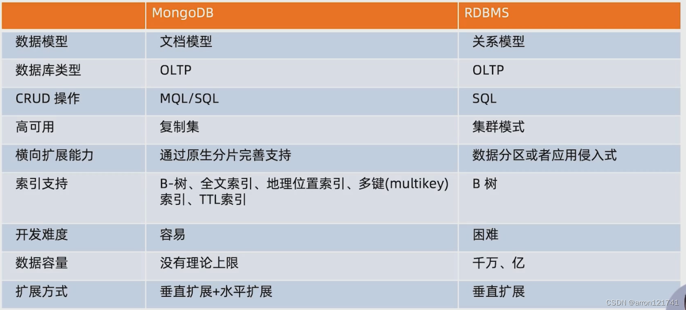
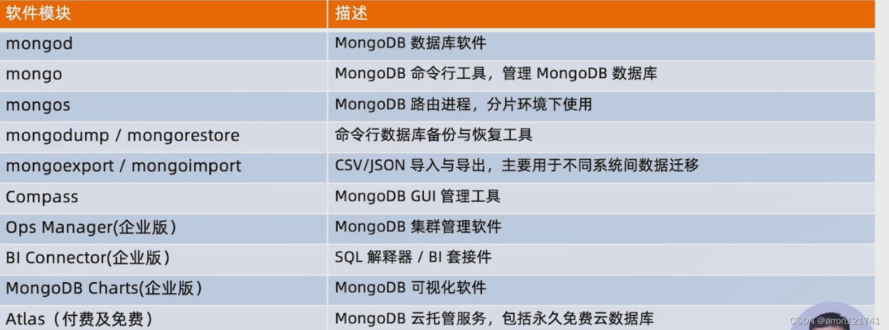
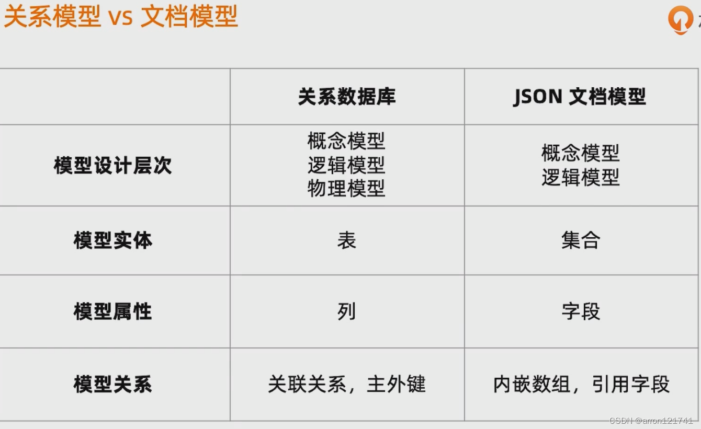
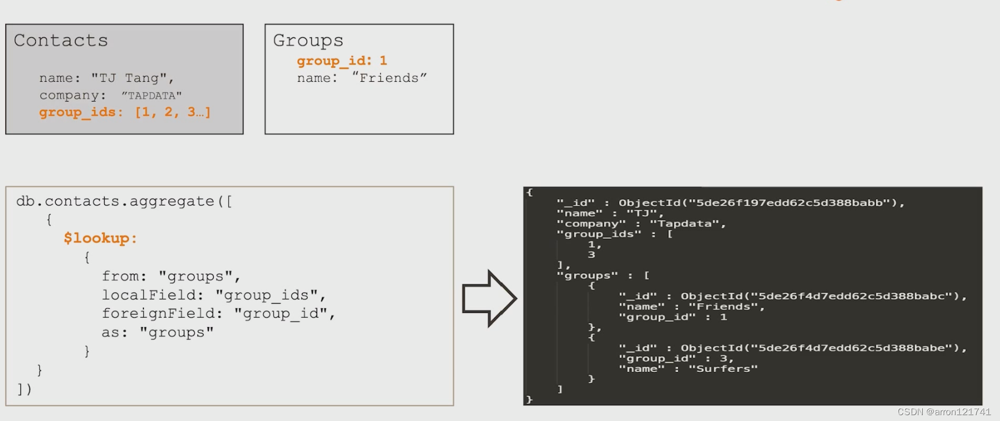
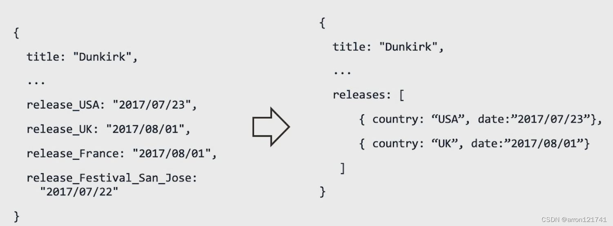
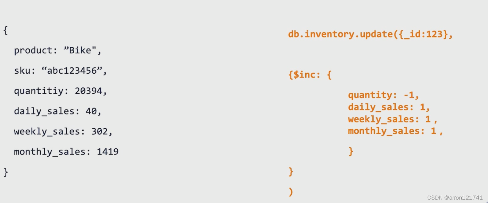
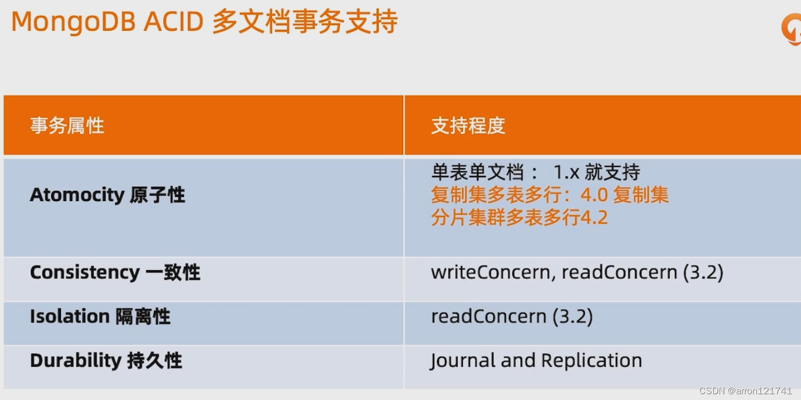
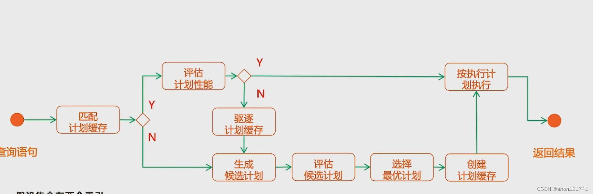
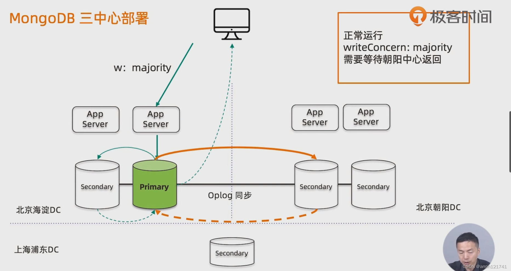
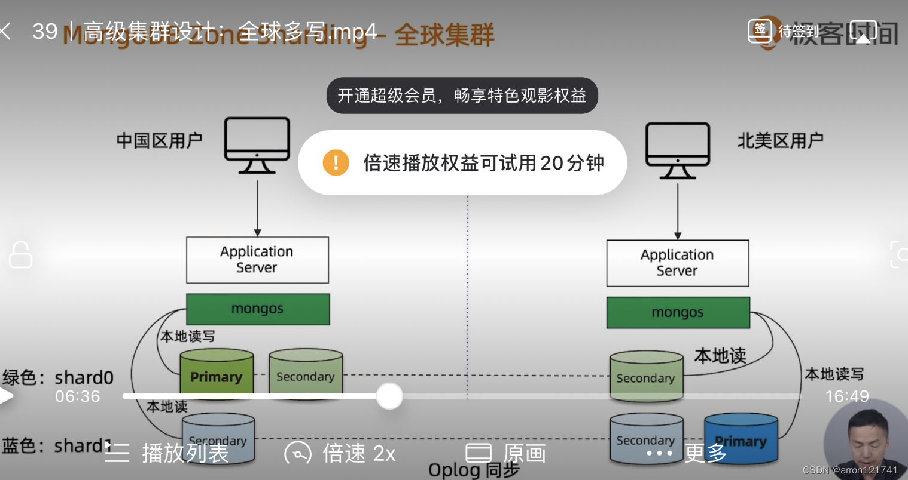

#  数据库简单分类

**数据库：**是`OLTP`（联机事务处理）应用的场景，其存储的主要是`与业务直接相关的数据`，强调`准确`、`低时延`、`高并发`，如果没有特别强调，基本上数据库里只会去`存储与业务相关`的数据。

**数据仓库：`OLAP`（联机分析处理）是数据仓库系统的主要应用，其支持的对象只要是`面向分析场景`的应用，提供`结构化`、`主题化`的数据提供给运营，做`业务反馈和辅助决策`，同时，有些场景下，也可以由`数据仓库`对业务进行支持。

# MongoBD

1. 一个以为`JSON`为数据模型的文档型数据库

2. `横向扩展`可以支撑很大数据量（`10TB`，`100TB`）和并发

   编辑

3. 快速响应业务变化

   1. `同一个集合`可以包含`不同字段的文档对象`
   2. 线上修改数据模式应用与数据库`无需下线`
   3. 支持使用`JSON SChema` 规范数据模式

## 技术优势

1. `JSON`结构和对象类似，代码量低
2. `JSON`的动态类型更容易响应新的业务需求
3. 复制集提供99.999%高可用
4. 分片架构支持海量数据和无缝扩容

## 安装过程

```
1.解压
tar -zxvf mongodb-linux-x86_64-rhel70-4.0.27.tgz

2.重命名
mv mongodb-linux-x86_64-rhel70-4.0.27 /usr/local/mongodb

3.创建文件夹（log，db，conf）
# 进入目录
cd /usr/local/mongodb/
# 创建三个文件夹
mkdir data data/db data/log
# 设置可读写权限
sudo chmod 777 data/db data/log/

4.mongodb 目录下新建配置文件 mongodb.conf
# 数据库数据存放目录
dbpath=/usr/local/mongodb/data/db
# 日志文件存放目录
logpath=/usr/local/mongodb/data/log/mongodb.log
# 日志追加方式
logappend=true
# 端口
port=27017
# 是否认证
auth=true
# 以守护进程方式在后台运行
fork=true
# 远程连接要指定ip，否则无法连接；0.0.0.0代表不限制ip访问
bind_ip=0.0.0.0

5.配置环境变量
export MONGODB_HOME=/usr/local/mongodb
export PATH=$PATH:$MONGODB_HOME/bin

6.开放 MongoDB 的端口 
# 开放27017端口
firewall-cmd --zone=public --add-port=27017/tcp --permanent
# 让配置生效
firewall-cmd --reload
# 查看开放的端口，验证是否成功
firewall-cmd --zone=public --list-ports

7.创建一个用户,赋予用户root权限
db.createUser(
    {
        user:"root",
        pwd:"123456",
        roles:[{role:"root",db:"admin"}]
    }
);
```

## 聚合查询

> 作用于多个集合，系列操作（OLAP、OLTP）

**提供可视化管道计算并生成对应的java代码**

$bucket

```
统计每个区间的数据条数
db.products.aggregate([
$bucket:{groupBy:"$price"boundaries: [0,10,20,30,40]default: "Other"
output:["count":{$sum:1))}}])

组合多个$bucket 
db.products.aggregate([{
$facet:(
price:$bucket:...)
year:$bucket:{...)}}}]}                    
```

## 复制集

### 高可用

1. 写入时候迅速复制到另一个独立节点
2. 写入节点故障自动选举
3. 数据区域复制，减少另一个区域读延迟
4. 不同类型压力在不同节点
5. 数据中心故障迅速切换到异地

### 结构

简单复制集：一个主节点（写和投票）和两个从节点（复制主节点数据、选举投票）

### 数据如何复制

1. 主节点记录oplog
2. 从节点维持一个游标在自己的数据上回放

### 选举如何完成故障恢复

> 增加节点并不能提供性能

1. 具有投票节点之间两两发送心跳（5次未收到则为失联）
2. 主节点失联，从节点进行选举（优先级高，oplog较新，能够与多个节点连接）；从节点（是否有投票权，优先级，隐藏【复制节点，但对程序不可见】，延迟）不会
3. `RAFT一致性算法`进行选举
4. 最多几点50个，参与选举7个

### 如何搭建

```
#创建数据目录
mkdir db1 db2 db3

#不同配置文件分别启动
mongod -f /data/install/mongodb/data/db1/mongodb.conf

#配置复制集
1. 随机进入一个节点执行初始化,然后回车让其变成主节点
rs.initiate()
2. 加入其他节点
 rs.add("MIRACLE:28019")
3. 允许从节点读
rs.slaveOk()
```

## 全家桶

编辑

### mongodump

```
mongodump -h 127.0.0.1:27017 -d test -c test
mongorestore -h 127.0.0.1:27017 -d test -c xxx.bson
```

### Atlas-公有云托管（Stitch：无服务器平台服务）

### BI Connector（转换sql和resultset）

### Ops Manager-集群管理平台

1. 集群部署，监控，告警，补丁，升级，在线扩容
2. k8s集成

### MongoDB Charts（拖拉拽创建图表）


# MongoBD模型设计

## 模型包括什么

### 实体

1. 描述业务的主要数据集合
2. 谁，什么，何时何地，为何

### 属性

1. 实体里边的单个信息

### 关系

1. 描述实体和实体之间的关系

## 模型设计过程

概念模型------》逻辑模型-----》物理模型

编辑

## JSON文档模型设计

### 性能和易用原则

编辑

### 设计方法论

1. 业务需求及逻辑模型
2. 技术需求，读写方式及数量
3. 经验学习

### 模型设计三部曲

#### 基础关系建模

##### 一对一建模

1. 内嵌子文档（不能超过16M）

##### 一对多建模

1. 内嵌子文档（不能超过16M）

##### 多对多建模

1. 内嵌数组（通过冗余实现）

#### 工况细化

1. 技术需求，读写比例，方式及数量

   - 引用来避免性能瓶颈

     - 场景：千万用户频繁变动分组

     - 用id或者唯一键关联，使用$lookup一次查询多表（不能用于分片表）

       编辑

     - 场景：头像高保真（很大）

     - 应用方式将数据放到另外一个集合

   - 冗余优化访问性能

   # 引用方式场景

   - 内嵌文档过大
   - 内嵌文档频繁修改
   - 内嵌文档元素持续增长

#### 套用模式设计

##### 场景1：物联网场景下的海量数据处理（10万架，1年数据，每分钟一条）

痛点：数据采集频繁，数据量太多

方案：文档内嵌数组

减少文档和索引数量

##### 场景2：某个电影在全国的上映时间（产品属性：多语言、多国家）

痛点：文档很多字段很多索引

方案：列转行

编辑

##### 场景3：管理文档不用版本

方案：新增版本字段

##### 场景4：统计网页点击流量

方案：近似计算

random（0,9）

##### 场景5：排名等精确统计

方案：预聚合

编辑


# MongoDB事务

## writeConcern（不同业务场景选择不同的数字）

场景：写入之后，主机宕机触发了自动选举

方案：majority：大多数上才算成功

## 读操作事务

### 控制读取哪个

#### readPreference（控制某一类）

1. **primary**：优先主节点
2. **primaryPrefered**: 优先主节点，不可用从节点
3. **secondary**：只选择从节点
4. **secondaryPrefered**：优先从节点，不可用主节点
5. **nearest**：最近的节点

场景1：

**下单后立马到详情页**--primary/primaryPrefered

**查询下过的订单**--secondary/secondaryPrefered

**报表**--secondary

**上传的图片分发到全世界**--nearest

#### Tag（控制到一个或者几个节点）

使用 purpose 属性打标签；指定读取（需要考虑故障，高可用问题）

### 控制这个节点上哪个数据是可读的

> 通过 mvcc机制来保存多个版本的数据

available：读取所有可用数据（可能本节点存在，其他节点不存在）

local：读取所有可用且属于当前分片的数据

majoity：读取大多数节点提交完成的数据

linearizable：可线性化读取文件

snapshot：读取最近快照中的数据

**majoity**存在的问题：

- 一次写操作在到达大多数节点前读取了写操作，因为故障回滚了，发生了`脏读`

如何实现安全的读写分离

`writeConcern + readConcern majoity` 对应关系数据库的 read committed

**linearizable**(单文档)存在的问题

- 在写操作自然发生时间之前的读，一定可以读到之前的写（去每个节点都确认下是最新数据）
- 读取非常慢，使用maxTimeMS

## 多文档事务

编辑

**可以通过事务来实现可重复度**（在事务内部）


# MongoDB分片集群

## 应用场景

- `总数据容量大`
- `并发`
- `单库容量大，恢复慢`
- `地理分布数据`

## 特点

- 应用全透明，无特殊处理
- `数据自动均衡`
- `动态扩容`，无须下线
- 提供三种分片方式
  - 基于范围（按照某几个字段）-----分布不均匀
  - 哈希（随机，数据分布均匀）----- 范围查询效率低
  - 自定义（地区）

## 分片设计

### 经验值

> （2TB：索引+数据）-

### 实际算法

> Max(A,B,C)

1. A = 总存储量 / 单服务器可挂载容量
2. B = 工作集大小 / 单服务器内存容量
3. C = 并发总数 / 单服务器并发量*0.7

其他需求：跨机房，容灾，高可用

### 选择合适的片键

```
id: ObjectId(),---基数大，不符合写分布和定向查询
user: 123
time: Date()
subject:";;;"
recipients:[]body:
attachments:[]
id---基数大，不符合写分布和定向查询
id哈希---基数大，符合写分布，不符合定向场景查询
user_id---基数小，符合写分布，符合定向场景查询
user_id + time ---基数大，符合写分布，符合定向场景查询
```

资源

mongos和config可以选择低规格虚拟机

shard服务器：内存配置充分

### 分片集群搭建

> 分片集群之间如何通信

搭建两分片集群（3台机器做复制集）

1. 准备分片目录

   config，mongos，shard1，shard2

2. 创建第一个分片用的复制集

   ```
   #三台机器分别执行
   mongod --bind ip 0.0.0.0 --replSet shard1 --dbpath /data/shard1 --logpath/data/shard1/mongod.log --port 27010 --fork --shardsvr --wiredTigerCacheSizeGB 1
   ```

3. 初始化shard复制集

   ```
   #mongo --host memberl.example.com:270Y9
   
   rs.initiate({id:"shard7""members":[
   {"id":0"host":"member1.example.com:27010"},
   {"id": 1,"host":"member3.example.com:27010"},
   {"id": 2,"host":"member5.example.com:27010"}
   ]});
   ```

4. 创建config server复制集

   ```
   #三台机器分别执行
   mongod --bind ip 0.0.0.0 --replSet config --dbpath /data/config --logpath/data/config/mongod.log --port 7019 --fork --configsvr --wiredTigerCacheSizeGB 1
   ```

5. 初始化config server复制集

   ```
   #mongo --host memberl.example.com:27019
   
   rs.initiate({id:"config""members":[
   {"id":0"host":"member1.example.com:27019"},
   {"id": 1,"host":"member3.example.com:27019"},
   {"id": 2,"host":"member5.example.com:27019"}
   ]});
   ```

6. 搭建 mongos

   ```
   #连接到mongos
   mongo --host member1.example.com:27017
   #添加分片
   mongos>sh.addShard("shard1/member1.example.com:27010,member3.example.com:27010,member5.example.com:27010");
   ```

7. 创建分片表，指定数据库和表名

   ```
   sh.status()
   sh.enableSharding("foo");
   sh.shardCollection("foo.bar",{id: hashed});
   sh.status();
   ```

# mongoDB性能指标

## serverStatus

- **connections:**关于连接数的信息
- locks: 关于MongoDB使用的锁情况;
- network:网络使用情况统计
- **opcounters**:CRUD的执行次数统计
- **tickets**：对wiredTiger 存储引擎的读/写令牌数量令牌数量，表示了**可以进入存储引擎的并发操作数量**。
- **replication lag**: 复制延迟
- **oplpg window:** 某节点在离线多久后仍能追上主节点（24小时以上）
- **query targeting**：扫描索引数量/返回文档数量 最好是1:1
- **Scan and Order(扫描和排序)**：每秒内存排序所占的比例
- **节点状态**：db.runCommand("isMaster")
- **数据大小和磁盘空间大小**
- wiredTiger:包含大量wirdTiger执行情况的信息
- block-manager:WT数据块的读写情况
- session:session使用数量;
- concurrentTransactions:Ticket使用情况
- mem:内存使用情况
- metrics:一系列性能指标统计信息

# mongoDB备份和恢复

> 最终推荐方案：dump+operlog

- **延迟节点备份**：丢失部分区间数据
- **全量备份+operlog**：可以得到任意时间点数据
  1. 先关闭节点（一般在从节点）
  2. 可能影响writeConcern投票
- **文件系统快照**
  1. 获取某一时刻镜像

> 恢复的时候可以通过dump+operlog进行恢复，还可以根据bejson分析后恢复到具体的时间点

如何避免各数据点时间不一致

定时停止均衡器，**均衡器（集群中发生数据不均衡时, \**[均衡器](https://mongoing.com/docs/core/sharding-balancing.html)\** 会自动在分片间进行数据迁移）**停止期间才能保证正确

## 索引机制

### B-Tree

### 索引执行计划

编辑

### 索引类型：后台创建

1. 单值
2. 组合
3. 多值：ESR原则（Equal +Sort+Range）---主要是为了避免内存排序
4. 地理位置：位置是一个二维坐标对
5. 全文索引：类似于一个简单的es
6. TTL
7. 部分索引：只对部分数据建立索引（版本字段，历史数据）
8. 哈希索引
9. 对于报表专用节点作为副本集单独创建索引

# 读写性能机制

## 问题

1. **获取连接排队等待-**----优化查询性能，加大连接数（考虑服务端性能）
2. **连接和认证**-----设置最小连接数用于登录认证
3. **数据库端-排队等待ticket**-----优化CRUD，IO跟不上
4. **数据库端-----执行请求**-----不能命中索引的搜索，内存排序
5. **数据库端-----执行请求**（写）-----定位数据（索引扫描，集合扫描），写缓存（写oplog，写索引，写数据）保证磁盘速度大于写入速度
6. **多片查询合并结果**-----减少带片键的查询，减少参与查询分别数

# mongostat关注指标

1. **dirty**：超过20%-----前台写入压力过大，刷盘来不及
2. **used**：超过80%------清除非常用，超过95%-----阻塞新请求
3. **qtw arw：**等待ticket，等待锁
4. conn:连接数

## mongotop关注指标

1. 定位哪个库上边的读写操作影响性能

## mongod日志

> 超过100ms的查询和执行计划

## mtools关注指标

1. 慢查询图表
2. 总结慢查询出现次数和耗时

# 集群设计（两地三中心）

## 容灾级别

1. **0**：无备源中心：只能本地进行数据备份
2. **1**：本地备份+异地保存（关键数据）
3. **2**：双中心主备模式（备机网络备份）
4. **3**：双中心双活（相互备份）
5. **4**：双中心双活+异地热备（本地两个相互备份+异地网络备份）

## 技术组件

1. 网络层：GSLB：全局负载均衡
2. 应用层：跨服务session共享和SLB本地负载均衡
3. 数据库：站点日志同步，基于存储镜像

## 如何构建

编辑

1. 节点：2+2+1
2. 主数据中心两个节点设置高一点优先级，减少跨中心换主节点
3. 同城双中心保持低延迟和频宽，满足writeConcern：Majority的写需求
4. 使用Retryable Writes and Retryable Reads 来保证零下线时间（4.2默认值不用设置）
5. 自行处理业务层双中心切换

## 搭建流程

1. 配置域名解析 3台都配置 ect host
2. 安装 MongoDB（搭建五个节点，住节点初始化复制集）
3. 配置复制集
   - 选举优先级（第一台两个调整为5和10）
4. 启动持续写脚本（以便后边测试）
5. 模拟故障

# 集群设计（全球多写）

1. 不同分片使用不同tags，实现本地读写

   编辑

2. 多数据中心，外部工具双向同步

# 上线准备工作

## 性能测试

1. 压测过程中各指标表现（CRUD，连接数）
2. 配置监控阈值
3. 调整硬件资源

## 环境检查

1. 禁用NUMA，否则在某些情况下会引起突发大量swap交换
2. 禁用Transparent Huge Page，否则会影响数据库效率;
3. tcp keepalive time调整为120秒，避免一些网络问题;
4. ulimit-n，避免打开文件句柄不足的情况:
5. 关闭atime，提高数据文件访问效率;

## 定期健康检查

日志和配置

# 应用场景和选型

# 关系型数据库迁移

> mongo支持sql套件，只支持select,不支持其他