 

------

初步认识MyBatis核心组件

## 前言

关于MyBatis的核心组件有多很多，本文仅针对SQL执行过程中，所涉及核心组件，结合源码地图进行解析。目的是让你能在短时内对MyBatis源码有一个初步的认识。

## JDBC执行流程回顾

MyBatis是一个基于JDBC的数据库访问组件。首先回顾一下JDBC执行流程：

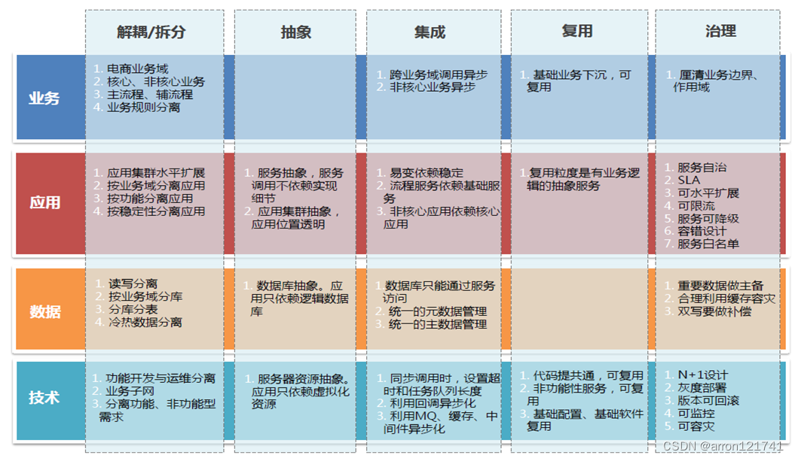编辑

**代码示例：**

```
/** 第一步： 获取连接 */
Connection connection = DriverManager
                .getConnection(JDBC.URL, JDBC.USERNAME, JDBC.PASSWORD);
/** 第二步： 预编译SQL */
PreparedStatement statement = connection
                .prepareStatement("select * from  users ");
/** 第三步： 执行查询 */
ResultSet resultSet = statement.executeQuery();
/** 第四步： 读取结果 */
readResultSet(resultSet);
```

## Mybats“修改”地图

通过一个"修改"用例来了解一下MyBatis是在哪里调用了上述代码。通过源码地图我们可以快速定位到。其分别对应图中节点：获取连接、构建Statement、设置参数、以及执行修改。等

找到了JDBC调用，并不代表就掌握了MyBatis源码。图中JDBC调用只是很小一部分，更多的节点我们还很陌生，接下来我们就一起来认识一下图中的其它核心节点。分别是：SQL会话、执行器、SQL声明处理器、参数处理器。

## 会话(SqlSession)

SqlSession 是myBatis的门面(采用门面模式设计)，核心作用是为用户提供API。API包括增、删、改、查以及提交、关闭等。其自身是没有能力处理这些请求的，所以内部会包含一个唯一的执行器 Executor，所有请求都会交给执行器来处理。如下图中SqlSession接收用户“修改”请求，然后转交给Executor。

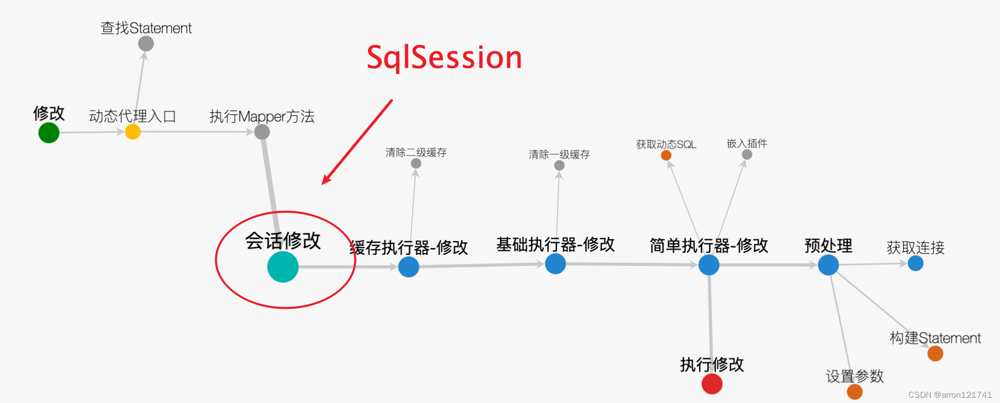编辑

## 执行器(Executor)

Executor是一个大管家，核心功能包括：缓存维护、获取动态SQL、获取连接、以及最终的JDBC调用等。在图中所有蓝色节点全部都是在Executor中完成。

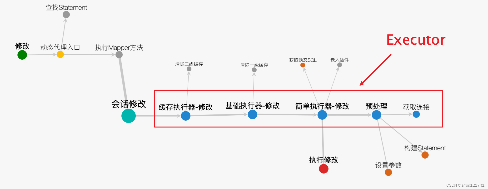编辑

这么多事情无法全部亲力亲为，就需要把任务分派下去。所以Executor内部还会包含若干个组件：

- 缓存维护：cache
- 获取连接：Transaction
- 获取动态sql：SqlSource
- 调用jdbc：StatementHandler

上述组件中前三个和Executor是1对1关系，只有StatementHandler是1对多。每执行一次SQL 就会构造一个新的StatementHandler。想必你也能猜出StatementHandler的作用就是专门和JDBC打交道，执行SQL的。

## SQL处理器(StatementHandler)

在JDBC中执行一次sql的步骤包括。预编译SQL、设置参数然后执行。StatementHandler就是用来处理这三步。同样它也需要两个助手分别是：

- 设置参数：ParameterHandler
- 读取结果：ResultSetHandler

另外的执行是由它自己完成。

## 总结：

总结一下myBatis的一次“修改”操作主要经过了如下组件：

- **SqlSession**:会话可以理解成你在肯德基用餐过程，你会点很多食物，并交给厨房制作，吃完了，用餐过程就结束了。同样会话会执行多个SQL、并交给Executor处理、所有SQL执行完，会话就结束了需要关闭。
- **Executor**:有点像是肯德基的后厨经理，大小事情都由他来管，并将任务分派给下属执行。Executor 要维护缓存、维护事物连接、执行等，而所有的操作都需要分派给对应的负责人。
- **StatementHandler**:专门和JDBC打交道，功能包括设置参数、执行、并读取结果。每执行一次SQLStatementHandler都会生一个唯的实例。

上述组件整个的协作流程如下图，希望你能有所理解。

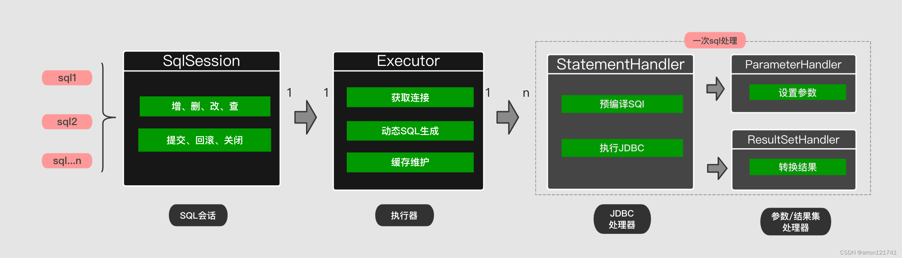编辑

上述组件只是讲了其接口以及作用流程。关于其具体实现，希望你能在源码地图中找到找到。为了帮助大家梳理，下图中标记了主要节点的实现。

# Mybatis sql执行过程解析

你选择来读MyBatis源码，那必定有两个前提，第一你知道MyBatis是干什么的，第二你用过MyBatis。（如果没有这两前提，建议还是从基础使用学起，网上基础教程一大把）

MyBatis是干什么的？抛开什么半ORM框架、DAO组件、跟Hibernate类似等不说。咱给个简单定义就是操作数据库的，执行SQL的。这就是它的本质，研究源码就是看本质。java中执行SQL都离不开 JDBC，myBatis也不例外。其关系如下图：

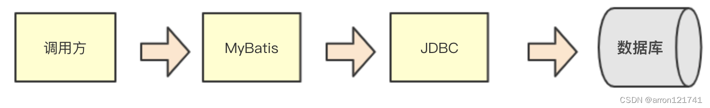编辑

现在来看看MyBatis 如何通过JDBC操作数据库的。先回顾下JDBC执行四步曲：


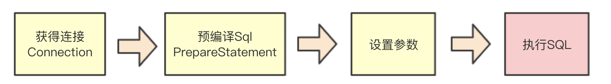

编辑

其执行过程堆栈如下图：

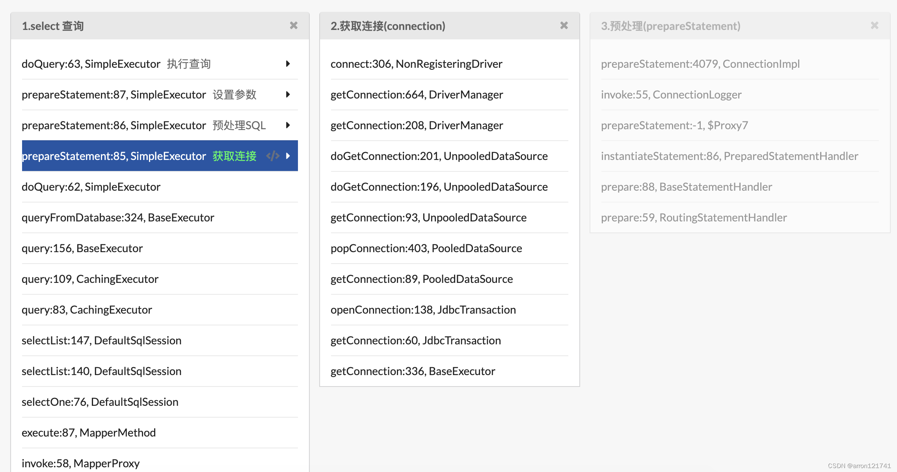编辑

堆栈的细节非常多，化繁为简得出以下流程：

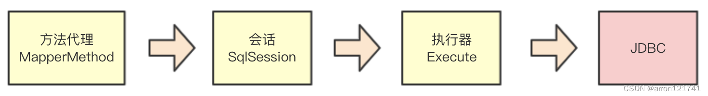编辑

- **方法代理**：与MyBatis交互的门面，存在的目的是为了方便调用，本身不会影响执行逻辑。（也就是说可以直接去掉，只是调用会麻烦些）
- **会话**：与MyBatis交互的门面，所有对数据库操作必须经过它，但它不会真正去执行业务逻辑，而是交给Execute。另外他不是线程安全的所以不能跨线程调用。
- **执行器**：真正执行业务逻辑的组件，其具体职能包括与JDBC交互，缓存管理、事物管理等。

> **以上过程可以类比成你去肯德基点餐。**
>
> !由服务员(SqlSession) 为你下单，然后交给后厨(Execute)制作，后厨他们分工合作职责分明，有做薯条的(SimpleExecutor)、有做汉堡(BaseExecutor)的、还有负责打包整理的(ResultHandler)。最后在由服务员交到你手上。服务员不能同时为两个顾客点单（SqlSession 不能同时为两个线程共用）。

最后这个方法代理MapperMethod 怎么表示呢？这就是叫外卖呀！太形像了。你的点餐过程被外卖公司代理了，但最终还是要由服务员接单，后厨制作。

当然里还有很多细节，但不用急于一时后续在慢慢展开研究。而你现需要记住的是执行过程即：方法代理==》会话==》执行器==》JDBC

最后把涉及到类标注在下表。

| 类名                     | 说明                                                         |
| ------------------------ | ------------------------------------------------------------ |
| MapperProxy              | 用于实现动态代理，是InvocationHandler接口的实现类。          |
| MapperMethod             | 主要作用是将我们定义的接口方法转换成MappedStatement对象。    |
| DefaultSqlSession        | 默认会话                                                     |
| CachingExecutor          | 二级缓存执行器（这里没有用到）                               |
| BaseExecutor             | 抽像类，基础执行器，包括一级缓存逻辑在此实现                 |
| SimpleExecutor           | 可以理解成默认执行器                                         |
| JdbcTransaction          | 事物管理器，会话当中的连接由它负责                           |
| PooledDataSource         | myBatis自带的默认连接池数据源                                |
| UnpooledDataSource       | 用于一次性获取连接的数据源                                   |
| StatementHandler         | SQL执行处理器                                                |
| RoutingStatementHandler  | 用于根据 MappedStatement 的执行类型确定使用哪种处理器：如STATEMENT（单次执行）、PREPARED(预处理)、CALLABLE（存储过程） |
| BaseStatementHandler     | StatementHandler基础类                                       |
| PreparedStatementHandler | Sql预处理执行器                                              |
| ConnectionLogger         | 用于记录Connection对像的方法调用日志。                       |
| DefaultParameterHandler  | 默认预处理器实现                                             |
| BaseTypeHandler          | java类型与JDBC类型映射处理基础类                             |
| IntegerTypeHandler       | Integer与JDBC类型映射处理                                    |
| PreparedStatementLogger  | 用于记录PreparedStatement对像方法调用日志。                  |

# mybatis 源码分析-KeyGenerator 详解

## 一、KeyGenerator 概述

在平时开发的时候经常会有这样的需求，插入数据返回主键，或者插入数据之前需要获取主键，这样的需求在 mybatis 中也是支持的，其中主要的逻辑部分就在 KeyGenerator 中，下面是他的类图：


其中：

- NoKeyGenerator：默认空实现，不需要对主键单独处理；
- Jdbc3KeyGenerator：主要用于数据库的自增主键，比如 MySQL、PostgreSQL；
- SelectKeyGenerator：主要用于数据库不支持自增主键的情况，比如 Oracle、DB2；

接口方法如下：

```
public interface KeyGenerator {
  void processBefore(Executor executor, MappedStatement ms, Statement stmt, Object parameter);
  void processAfter(Executor executor, MappedStatement ms, Statement stmt, Object parameter);
}
```

如代码所见 KeyGenerator 非常的简单，主要是通过两个拦截方法实现的：

- Jdbc3KeyGenerator：主要基于 java.sql.Statement.getGeneratedKeys 的主键返回接口实现的，所以他不需要 processBefore 方法，只需要在获取到结果后使用 processAfter 拦截，然后用反射将主键设置到参数中即可；
- SelectKeyGenerator：主要是通过 XML 配置或者注解设置 **selectKey** ，然后单独发出查询语句，在返回拦截方法中使用反射设置主键，其中两个拦截方法只能使用其一，在 **selectKey.order** 属性中设置 `AFTER|BEFORE` 来确定；

**拦截时机：**

processBefore 是在生成 StatementHandler 的时候；

```
protected BaseStatementHandler(Executor executor, MappedStatement mappedStatement, Object parameterObject, RowBounds rowBounds, ResultHandler resultHandler, BoundSql boundSql) {
  ...
  if (boundSql == null) { // issue #435, get the key before calculating the statement
    generateKeys(parameterObject);
    boundSql = mappedStatement.getBoundSql(parameterObject);
  }
  ...
}

protected void generateKeys(Object parameter) {
  KeyGenerator keyGenerator = mappedStatement.getKeyGenerator();
  ErrorContext.instance().store();
  keyGenerator.processBefore(executor, mappedStatement, null, parameter);
  ErrorContext.instance().recall();
}
```

processAfter 则是在完成插入返回结果之前，但是 PreparedStatementHandler、SimpleStatementHandler、CallableStatementHandler 的代码稍微有一点不同，但是位置是不变的，这里以 PreparedStatementHandler 举例：

```
@Override
public int update(Statement statement) throws SQLException {
  PreparedStatement ps = (PreparedStatement) statement;
  ps.execute();
  int rows = ps.getUpdateCount();
  Object parameterObject = boundSql.getParameterObject();
  KeyGenerator keyGenerator = mappedStatement.getKeyGenerator();
  keyGenerator.processAfter(executor, mappedStatement, ps, parameterObject);
  return rows;
}
```

## 二、Jdbc3KeyGenerator

上面也将了 Jdbc3KeyGenerator 是主要基于 java.sql.Statement.getGeneratedKeys 的主键返回接口实现的，但是 Statement 和 PreparedStatement 稍有不同，所以导致了 PreparedStatementHandler、SimpleStatementHandler 的 update 方法稍有不同：

```
// java.sql.Connection
PreparedStatement prepareStatement(String sql, int autoGeneratedKeys) throws SQLException;
PreparedStatement prepareStatement(String sql, String columnNames[]) throws SQLException;
PreparedStatement prepareStatement(String sql, int columnIndexes[]) throws SQLException;

// java.sql.Statement
boolean execute(String sql, int autoGeneratedKeys) throws SQLException;
boolean execute(String sql, int columnIndexes[]) throws SQLException;
boolean execute(String sql, String columnNames[]) throws SQLException;
// 其中 autoGenerateKeys - Statement.RETURN_GENERATED_KEYS、Statement.NO_GENERATED_KEYS
```

可以看到 PreparedStatement 是在实例化的时候就指定了，而 Statement 是在执行 sql 的时候才指定但实质是一样的，这里就以 PreparedStatement 举例：

```
public void testJDBC3() {
  try {
    String url = "jdbc:mysql://localhost:3306/mybatis?serverTimezone=GMT";
    String sql = "INSERT INTO user(username,password,address) VALUES (?,?,?)";
    Class.forName("com.mysql.jdbc.Driver");
    Connection conn = DriverManager.getConnection(url, "root", "root");
    String[] columnNames = {"ids", "name"};
    PreparedStatement stmt = conn.prepareStatement(sql, columnNames);
    stmt.setString(1, "test");
    stmt.setString(2, "123456");
    stmt.setString(3, "test");
    stmt.executeUpdate();
    ResultSet rs = stmt.getGeneratedKeys();
    int id = 0;
    if (rs.next()) {
      id = rs.getInt(1);
      System.out.println("----------" + id);
    }
  } catch (Exception e) {
    e.printStackTrace();
  }
}
```

这里的 User 表以 id 为主键，但是代码中我传的 columnNames 都不符合，而结果仍然可以正确的返回主键，主要是因为在 mybatis 的驱动中只要 columnNames.length > 1就可以了，所以在具体使用的时候还要注意不同数据库驱动实现不同所带来的影响；

上面将了 Statement 和 PreparedStatement 指定返回主键的位置不同，在下面就能很清楚的看到：

```
// org.apache.ibatis.executor.statement.SimpleStatementHandler
public int update(Statement statement) throws SQLException {
  String sql = boundSql.getSql();
  Object parameterObject = boundSql.getParameterObject();
  KeyGenerator keyGenerator = mappedStatement.getKeyGenerator();
  int rows;
  if (keyGenerator instanceof Jdbc3KeyGenerator) {
    statement.execute(sql, Statement.RETURN_GENERATED_KEYS);
    rows = statement.getUpdateCount();
    keyGenerator.processAfter(executor, mappedStatement, statement, parameterObject);
  } else if (keyGenerator instanceof SelectKeyGenerator) {
    statement.execute(sql);
    rows = statement.getUpdateCount();
    keyGenerator.processAfter(executor, mappedStatement, statement, parameterObject);
  } else {
    //如果没有keyGenerator,直接调用Statement.execute和Statement.getUpdateCount
    statement.execute(sql);
    rows = statement.getUpdateCount();
  }
  return rows;
}

// org.apache.ibatis.executor.statement.PreparedStatementHandler
protected Statement instantiateStatement(Connection connection) throws SQLException {
  String sql = boundSql.getSql();
  if (mappedStatement.getKeyGenerator() instanceof Jdbc3KeyGenerator) {
    String[] keyColumnNames = mappedStatement.getKeyColumns();
    if (keyColumnNames == null) {
      return connection.prepareStatement(sql, PreparedStatement.RETURN_GENERATED_KEYS);
    } else {
      return connection.prepareStatement(sql, keyColumnNames);
    }
  } else if (mappedStatement.getResultSetType() != null) {
    return connection.prepareStatement(sql, mappedStatement.getResultSetType().getValue(), ResultSet.CONCUR_READ_ONLY);
  } else {
    return connection.prepareStatement(sql);
  }
}
```

在完成初始化后，下面来看 Jdbc3KeyGenerator 中最主要的拦截方法：

```
public void processAfter(Executor executor, MappedStatement ms, Statement stmt, Object parameter) {
  List<Object> parameters = new ArrayList<Object>();
  parameters.add(parameter);
  processBatch(ms, stmt, parameters);
}

public void processBatch(MappedStatement ms, Statement stmt, List<Object> parameters) {
  ResultSet rs = null;
  try {
    //核心是使用JDBC3的Statement.getGeneratedKeys
    rs = stmt.getGeneratedKeys();
    final Configuration configuration = ms.getConfiguration();
    final TypeHandlerRegistry typeHandlerRegistry = configuration.getTypeHandlerRegistry();
    final String[] keyProperties = ms.getKeyProperties();
    final ResultSetMetaData rsmd = rs.getMetaData();
    TypeHandler<?>[] typeHandlers = null;
    if (keyProperties != null && rsmd.getColumnCount() >= keyProperties.length) {
      for (Object parameter : parameters) {
        // there should be one row for each statement (also one for each parameter)
        if (!rs.next()) {
          break;
        }
        final MetaObject metaParam = configuration.newMetaObject(parameter);
        if (typeHandlers == null) {
          //先取得类型处理器
          typeHandlers = getTypeHandlers(typeHandlerRegistry, metaParam, keyProperties);
        }
        //填充键值
        populateKeys(rs, metaParam, keyProperties, typeHandlers);
      }
    }
  } catch (Exception e) {
    ...
  }
}
```

这里就很清楚了，直接获取返回的主键，然后一次使用反射设置到参数中；

## 三、SelectKeyGenerator

上面也讲了 SelectKeyGenerator 主要是配置 selectKey 使用的，默认 使用 processBefore，但是可以配置 **order** 属性（AFTER|BEFORE）；

```
<insert id="insertUser2" parameterType="u" useGeneratedKeys="true" keyProperty="id">
  <selectKey keyProperty="id" resultType="long" order="BEFORE">
    SELECT if(max(id) is null,1,max(id)+2) as newId FROM user2
  </selectKey>
  INSERT INTO user2(id,username,password,address) VALUES (#{id},#{userName},#{password},#{address})
</insert>
```

这里直接看源码：

```
public void processBefore(Executor executor, MappedStatement ms, Statement stmt, Object parameter) {
  if (executeBefore) processGeneratedKeys(executor, ms, parameter);
}

public void processAfter(Executor executor, MappedStatement ms, Statement stmt, Object parameter) {
  if (!executeBefore) processGeneratedKeys(executor, ms, parameter);
}

private void processGeneratedKeys(Executor executor, MappedStatement ms, Object parameter) {
  try {
    if (parameter != null && keyStatement != null && keyStatement.getKeyProperties() != null) {
      String[] keyProperties = keyStatement.getKeyProperties();
      final Configuration configuration = ms.getConfiguration();
      final MetaObject metaParam = configuration.newMetaObject(parameter);
      if (keyProperties != null) {
        // Do not close keyExecutor.
        // The transaction will be closed by parent executor.
        Executor keyExecutor = configuration.newExecutor(executor.getTransaction(), ExecutorType.SIMPLE);
        List<Object> values = keyExecutor.query(keyStatement, parameter, RowBounds.DEFAULT, Executor.NO_RESULT_HANDLER);
        if (values.size() == 0) {
          throw new ExecutorException("SelectKey returned no data.");            
        } else if (values.size() > 1) {
          throw new ExecutorException("SelectKey returned more than one value.");
        } else {
          MetaObject metaResult = configuration.newMetaObject(values.get(0));
          if (keyProperties.length == 1) {
            if (metaResult.hasGetter(keyProperties[0])) {
              setValue(metaParam, keyProperties[0], metaResult.getValue(keyProperties[0]));
            } else {
              // no getter for the property - maybe just a single value object
              // so try that
              setValue(metaParam, keyProperties[0], values.get(0));
            }
          } else {
            handleMultipleProperties(keyProperties, metaParam, metaResult);
          }
        }
      }
    }
  } catch (ExecutorException e) {
    ...
  }
}
```

这里代码也很简单，就是用一个新的 Executor 再发一条 SQL，然后反射设置参数即可；

# Executor 执行器解析

## 概念

执行器用于连接 SqlSession与JDBC，所有与JDBC相关的操作都要通过它。图中展示了Executor在核心对象中所处位置。

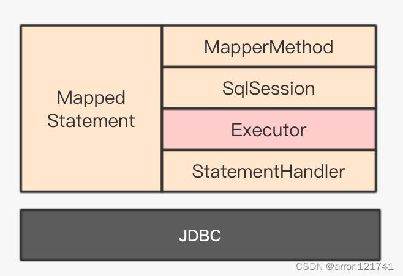编辑

即然它是和JDBC打交道，那看一下它的几个核心方法。

```
public interface Executor {
  int update(); // 更新
  List query(); // 查询
  queryCursor(); // 查询游标
  void commit();// 提交 
  void rollback(); // 回滚
  Transaction getTransaction();//获取事物
  void close();// 关闭执行器，释放连接
}
```

相信即使没有注释大家明白核心方法的意思。接下来看看其实现类如下图：

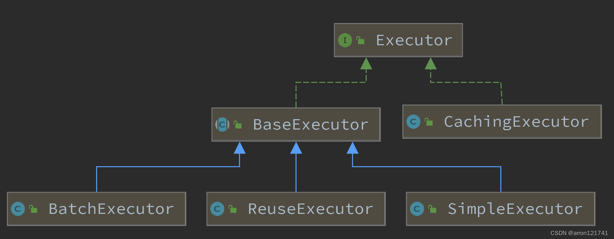编辑

1. BaseExecutor：执行器基类，基础方法都放置在此。
2. SimpleExecutor：默认执行器
3. ReuseExecutor：重用执行器，相同sql的statement 将会被缓存已重复利用
4. BatchExecutor：批处理执行器，基于 JDBC 的 `addBatch、executeBatch` 功能，并且在当前 sql 和上一条 sql 完全一样的时候，重用 Statement，在调用 `doFlushStatements` 的时候，将数据刷新到数据库
5. CachingExecutor：缓存执行器，装饰器模式，在开启二级缓存的时候。会在上面三种执行器的外面包上 CachingExecutor

## 执行过程

Executor执行的时候并不一直接拿着JDBC的API一顿操作，而是由它的两个小弟带操作，分别是 StatementHandler 与ResultSetHandler。

### StatementHandler

用于获取预处理器，共有三种类型。通过statementType=`"STATEMENT|PREPARED|CALLABLE"` 可分别进行指定。

- PreparedStatementHandler：带预处理的执行器
- CallableStatementHandler：存储过程执行器
- SimpleStatementHandler：基于Sql执行器

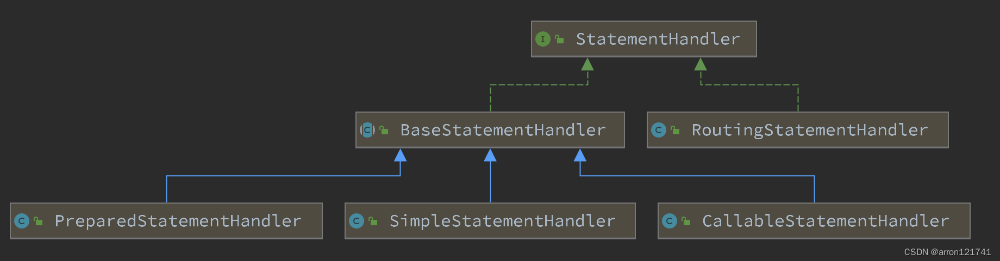编辑

### ResultSetHandler

用于处理和封装返回结果。可在SqlSession中查询时自行定义ResultSetHandler

### 执行时序

Executor、StatementHandler、ResultSetHandler他们是如何交互的呢？通过以下时序图便可以看出。

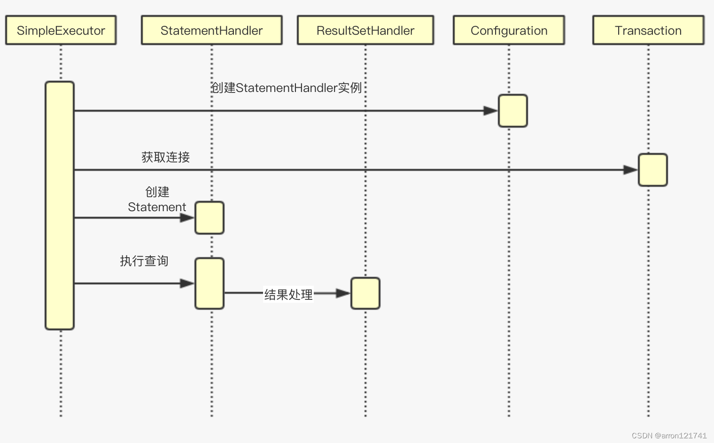编辑

说明：

1. 通过Configuration获取StatementHandler实例（由statementType 决定）。
2. 通过事务获取连接
3. 创建JDBC Statement对像
4. 执行 JDBC Statement execute
5. 处理返回结果

# mybatis 源码分析（五）Interceptor 详解

本篇博客将主要讲解 mybatis 插件的主要流程，其中主要包括动态代理和责任链的使用；

## 一、mybatis 拦截器主体结构

在编写 mybatis 插件的时候，首先要实现 **Interceptor** 接口，然后在 mybatis-conf.xml 中添加插件，

```
<configuration>
  <plugins>
    <plugin interceptor="***.interceptor1"/>
    <plugin interceptor="***.interceptor2"/>
  </plugins>
</configuration>
```

这里需要注意的是，添加的插件是有顺序的，因为在解析的时候是依次放入 ArrayList 里面，而调用的时候其顺序为：**2 > 1 > target > 1 > 2** ；（插件的顺序可能会影响执行的流程）更加细致的讲解可以参考 [QueryInterceptor 规范](https://pagehelper.github.io/docs/interceptor/) ;

然后当插件初始化完成之后，添加插件的流程如下：

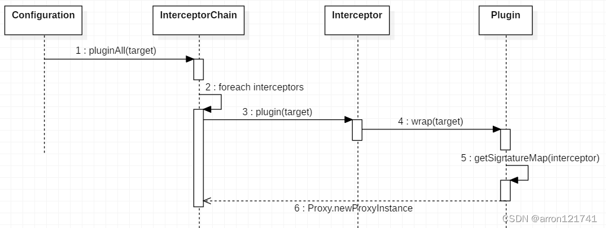编辑

首先要注意的是，mybatis 插件的拦截目标有四个，Executor、StatementHandler、ParameterHandler、ResultSetHandler：

```
public ParameterHandler newParameterHandler(MappedStatement mappedStatement, Object parameterObject, BoundSql boundSql) {
  ParameterHandler parameterHandler = mappedStatement.getLang().createParameterHandler(mappedStatement, parameterObject, boundSql);
  parameterHandler = (ParameterHandler) interceptorChain.pluginAll(parameterHandler);
  return parameterHandler;
}

public ResultSetHandler newResultSetHandler(Executor executor, MappedStatement mappedStatement, RowBounds rowBounds, ParameterHandler parameterHandler,
    ResultHandler resultHandler, BoundSql boundSql) {
  ResultSetHandler resultSetHandler = new DefaultResultSetHandler(executor, mappedStatement, parameterHandler, resultHandler, boundSql, rowBounds);
  resultSetHandler = (ResultSetHandler) interceptorChain.pluginAll(resultSetHandler);
  return resultSetHandler;
}

public StatementHandler newStatementHandler(Executor executor, MappedStatement mappedStatement, Object parameterObject, RowBounds rowBounds, ResultHandler resultHandler, BoundSql boundSql) {
  StatementHandler statementHandler = new RoutingStatementHandler(executor, mappedStatement, parameterObject, rowBounds, resultHandler, boundSql);
  statementHandler = (StatementHandler) interceptorChain.pluginAll(statementHandler);
  return statementHandler;
}

public Executor newExecutor(Transaction transaction, ExecutorType executorType) {
  executorType = executorType == null ? defaultExecutorType : executorType;
  executorType = executorType == null ? ExecutorType.SIMPLE : executorType;
  Executor executor;
  if (ExecutorType.BATCH == executorType) {
    executor = new BatchExecutor(this, transaction);
  } else if (ExecutorType.REUSE == executorType) {
    executor = new ReuseExecutor(this, transaction);
  } else {
    executor = new SimpleExecutor(this, transaction);
  }
  if (cacheEnabled) {
    executor = new CachingExecutor(executor);
  }
  executor = (Executor) interceptorChain.pluginAll(executor);
  return executor;
}
```

**这里使用的时候都是用动态代理将多个插件用责任链的方式添加的，最后返回的是一个代理对象；** 其责任链的添加过程如下：

```
public Object pluginAll(Object target) {
  for (Interceptor interceptor : interceptors) {
    target = interceptor.plugin(target);
  }
  return target;
}
```

最终动态代理生成和调用的过程都在 Plugin 类中：

```
public static Object wrap(Object target, Interceptor interceptor) {
  Map<Class<?>, Set<Method>> signatureMap = getSignatureMap(interceptor); // 获取签名Map
  Class<?> type = target.getClass(); // 拦截目标 (ParameterHandler|ResultSetHandler|StatementHandler|Executor)
  Class<?>[] interfaces = getAllInterfaces(type, signatureMap);  // 获取目标接口
  if (interfaces.length > 0) {
    return Proxy.newProxyInstance(  // 生成代理
        type.getClassLoader(),
        interfaces,
        new Plugin(target, interceptor, signatureMap));
  }
  return target;
}
```

这里所说的签名是指在编写插件的时候，指定的目标接口和方法，例如：

```
@Intercepts({
  @Signature(type = Executor.class, method = "update", args = {MappedStatement.class, Object.class}),
  @Signature(type = Executor.class, method = "query", args = {MappedStatement.class, Object.class, RowBounds.class, ResultHandler.class})
})
public class ExamplePlugin implements Interceptor {
  public Object intercept(Invocation invocation) throws Throwable {
    ...
  }
}
```

这里就指定了拦截 Executor 的具有相应方法的 update、query 方法；注解的代码很简单，大家可以自行查看；然后通过 getSignatureMap 方法反射取出对应的 Method 对象，在通过 getAllInterfaces 方法判断，目标对象是否有对应的方法，有就生成代理对象，没有就直接反对目标对象；

在调用的时候：

```
public Object invoke(Object proxy, Method method, Object[] args) throws Throwable {
  try {
    Set<Method> methods = signatureMap.get(method.getDeclaringClass());  // 取出拦截的目标方法
    if (methods != null && methods.contains(method)) { // 判断这个调用的方法是否在拦截范围内
      return interceptor.intercept(new Invocation(target, method, args)); // 在目标范围内就拦截
    }
    return method.invoke(target, args); // 不在目标范围内就直接调用方法本身
  } catch (Exception e) {
    throw ExceptionUtil.unwrapThrowable(e);
  }
}
```

## 二、PageHelper 拦截器分析

mybatis 插件我们平时使用最多的就是分页插件了，这里以 PageHelper 为例，其使用方法可以查看相应的文档 [如何使用分页插件](https://pagehelper.github.io/docs/howtouse/)，因为官方文档讲解的很详细了，我这里就简单补充分页插件需要做哪几件事情；

**使用：**

```
PageHelper.startPage(1, 2);
List<User> list = userMapper1.getAll();
```

PageHelper 还有很多中使用方式，这是最常用的一种，他其实就是在 ThreadLocal 中设置了 Page 对象，能取到就代表需要分页，在分页完成后在移除，这样就不会导致其他方法分页；（PageHelper 使用的其他方法，也是围绕 Page 对象的设置进行的）

```
protected static final ThreadLocal<Page> LOCAL_PAGE = new ThreadLocal<Page>();
public static <E> Page<E> startPage(int pageNum, int pageSize, boolean count, Boolean reasonable, Boolean pageSizeZero) {
  Page<E> page = new Page<E>(pageNum, pageSize, count);
  page.setReasonable(reasonable);
  page.setPageSizeZero(pageSizeZero);
  //当已经执行过orderBy的时候
  Page<E> oldPage = getLocalPage();
  if (oldPage != null && oldPage.isOrderByOnly()) {
    page.setOrderBy(oldPage.getOrderBy());
  }
  setLocalPage(page);
  return page;
}
```

**主要实现：**

```
@Intercepts({
  @Signature(type = Executor.class, method = "query", args = {MappedStatement.class, Object.class, RowBounds.class, ResultHandler.class}),
  @Signature(type = Executor.class, method = "query", args = {MappedStatement.class, Object.class, RowBounds.class, ResultHandler.class, CacheKey.class, BoundSql.class}),
})
public class PageInterceptor implements Interceptor {

  @Override
  public Object intercept(Invocation invocation) throws Throwable {
    try {
      Object[] args = invocation.getArgs();
      MappedStatement ms = (MappedStatement) args[0];
      Object parameter = args[1];
      RowBounds rowBounds = (RowBounds) args[2];
      ResultHandler resultHandler = (ResultHandler) args[3];
      Executor executor = (Executor) invocation.getTarget();
      CacheKey cacheKey;
      BoundSql boundSql;
      //由于逻辑关系，只会进入一次
      if (args.length == 4) {
        //4 个参数时
        boundSql = ms.getBoundSql(parameter);
        cacheKey = executor.createCacheKey(ms, parameter, rowBounds, boundSql);
      } else {
        //6 个参数时
        cacheKey = (CacheKey) args[4];
        boundSql = (BoundSql) args[5];
      }
      checkDialectExists();

      List resultList;
      //调用方法判断是否需要进行分页，如果不需要，直接返回结果
      if (!dialect.skip(ms, parameter, rowBounds)) {
        //判断是否需要进行 count 查询
        if (dialect.beforeCount(ms, parameter, rowBounds)) {
          //查询总数
          Long count = count(executor, ms, parameter, rowBounds, resultHandler, boundSql);
          //处理查询总数，返回 true 时继续分页查询，false 时直接返回
          if (!dialect.afterCount(count, parameter, rowBounds)) {
            //当查询总数为 0 时，直接返回空的结果
            return dialect.afterPage(new ArrayList(), parameter, rowBounds);
          }
        }
        resultList = ExecutorUtil.pageQuery(dialect, executor,
            ms, parameter, rowBounds, resultHandler, boundSql, cacheKey);
      } else {
        //rowBounds用参数值，不使用分页插件处理时，仍然支持默认的内存分页
        resultList = executor.query(ms, parameter, rowBounds, resultHandler, cacheKey, boundSql);
      }
      return dialect.afterPage(resultList, parameter, rowBounds);
    } finally {
      if(dialect != null){
        dialect.afterAll();
      }
    }
  }
}
```

- 首先可以看到拦截的是 Executor 的两个 query 方法（这里的两个方法具体拦截到哪一个受插件顺序影响，最终影响到 cacheKey 和 boundSql 的初始化）；
- 然后使用 checkDialectExists 判断是否支持对应的数据库；
- 在分页之前需要查询总数，这里会生成相应的 sql 语句以及对应的 MappedStatement 对象，并缓存；
- 然后拼接分页查询语句，并生成相应的 MappedStatement 对象，同时缓存；
- 最后查询，查询完成后使用 dialect.afterPage 移除 Page对象

# MyBatis深入理解Executor执行器

> 理解MyBatis整体执行流程，并且理解Executor在整个流程当中的意义。

源码阅读网内部资料，转载前请联系作者。

## JDBC执行过程回顾

MyBatis是一个Dao层映射框架，底层还是用的JDBC来访问数据库，在学习MyBatis之前有必要先回顾一下JDBC的执行过程：

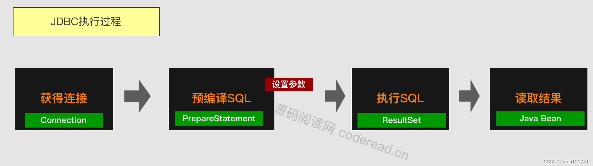编辑

具体代码我就不贴了，不懂的自行百度。

这里重点说一下预编译器 Statement，通过该组件来发送对应的SQL与参数。它有三种类型：分别是简单Statement，预处理Statement和存储过程Statement。后者继承自前者，也就是说简单执行器的所有功能，预处理执行器和存储过程执行器都有。

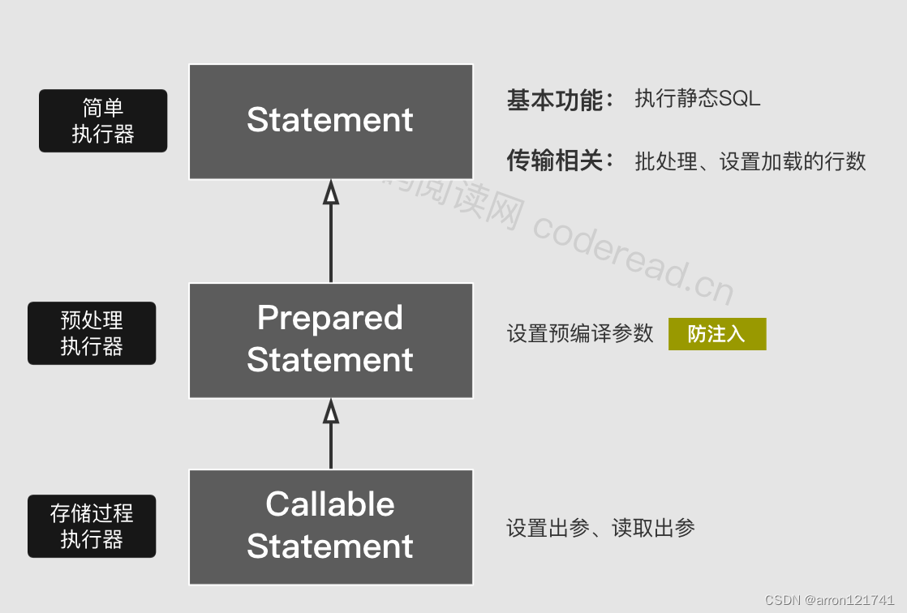编辑

> 这里把Statement叫做执行器，只是一种说法，有些文章里也会叫做SQL处理器，但实质是一个东西

介绍一下Statement 中非常规方法，因为后续在MyBatis中源码会有体现。

1. addBatch: 批处理操作，将多个SQL合并在一起，最后调用executeBatch 一起发送至数据库执行
2. setFetchSize:设置从数据库每次读取的数量单位。该举措是为了防止一次性从数据库加载数据过多，导致内存溢出。

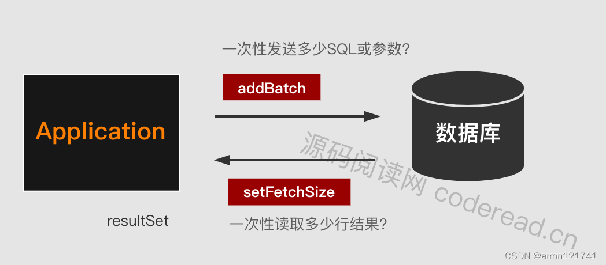编辑

## MyBatis执行过程

回顾完JDBC，我们在回到MyBatis的执行流程。这时很多同学都急如去翻找MyBatis调用JDBC相关代码，我不太建议先这么做，一是翻起来比较麻烦，二是没那个必要，因为就算翻到了也不能说明你弄了MyBatis框架。如果你硬要去翻推荐大家可以用源码地图来翻。[点击访问](http://www.coderead.cn/p/mybatis/map/file/修改.map)

> 小贴士: 选中节点按F3可直接查看源码

很多人初次见到这个图会有点懵，里面每个节点注释都能看懂，但为什么要这么做不懂。图中流程 我们可以拆分成四个阶段分别是：接口代理、SQL会话、执行器、JDBC处理器。

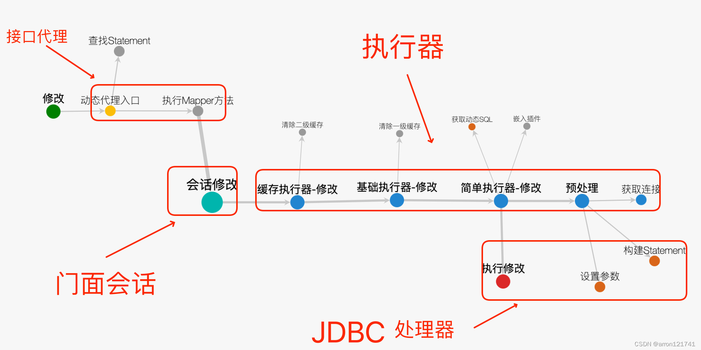编辑

分别说下各个组件的作用

1. **接口代理:** 其目的是简化对MyBatis使用，底层使用动态代理实现。
2. **Sql会话:** 提供增删改查API，其本身不作任何业务逻辑的处理，所有处理都交给执行器。这是一个典型的门面模式设计。
3. **执行器:** 核心作用是处理SQL请求、事物管理、维护缓存以及批处理等 。执行器在的角色更像是一个管理员，接收SQL请求，然后根据缓存、批处理等逻辑来决定如何执行这个SQL请求。并交给JDBC处理器执行具体SQL。
4. JDBC处理器：他的作用就是用于通过JDBC具体处理SQL和参数的。在会话中每调用一次CRUD，JDBC处理器就会生成一个实例与之对应（命中缓存除外）。

> 请注意在一次SQL会话过程当中四个组件的实例比值分别是 1:1:1:n 。

各个组件关系可以通过下面这张图了解。一个SQL请求通过会话到达执行器，然后交给对应的JDBC处理器进行处理。另外所有的组件都不是线程安全的，不能跨线程使用。

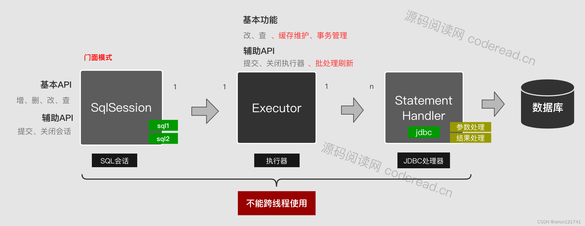编辑

## Executor 执行器组件

Executor是MyBatis执行者接口，我们在次确认一下，执行器的功能包括：

- 基本功能：改、查，没有增删的原因是，所有的增删操作都可以归结到改。
- 缓存维护：这里的缓存主要是为一级缓存服务，功能包括创建缓存Key、清理缓存、判断缓存是否存在。
- 事物管理：提交、回滚、关闭、批处理刷新。

对于这个接口MyBatis是有三个实现子类。分别是：SimpleExecutor(简单执行器)、ReuseExecutor(重用执行器)、BatchExecutor(批处理执行器)。

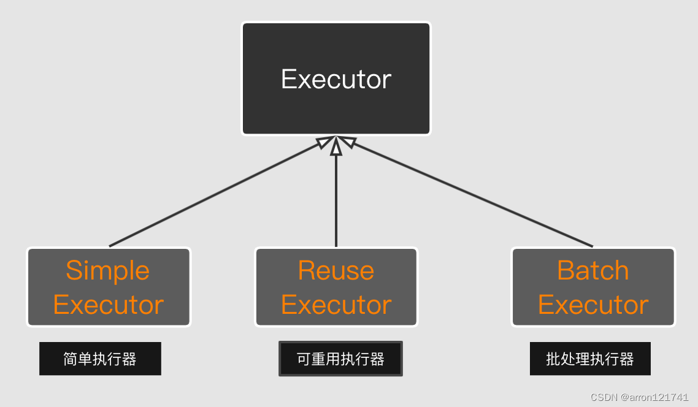编辑

### 简单执行器

SimpleExecutor是默认执行器，它的行为是每处理一次会话当中的SQl请求都会通过对应的StatementHandler 构建一个新个Statement，这就会导致即使是相同SQL语句也无法重用Statement,所以就有了（ReuseExecutor）可重用执行器

### 可重用执行器

ReuseExecutor 区别在于他会将在会话期间内的Statement进行缓存，并使用SQL语句作为Key。所以当执行下一请求的时候，不在重复构建Statement，而是从缓存中取出并设置参数，然后执行。

> 这也说明为啥执行器不能跨线程调用，这会导致两个线程给同一个Statement 设置不同场景参数。

### 批处理执行器

BatchExecutor 顾名思议，它就是用来作批处理的。但会将所 有SQL请求集中起来，最后调用Executor.flushStatements() 方法时一次性将所有请求发送至数据库。

这里它是利用了Statement中的addBath 机制吗？不一定，因为只有连续相同的SQL语句并且相同的SQL映射声明，才会重用Statement，并利用其批处理功能。否则会构建一个新的Satement然后在flushStatements() 时一次执行。这么做的原因是它要保证执行顺序。跟调用顺序一至。

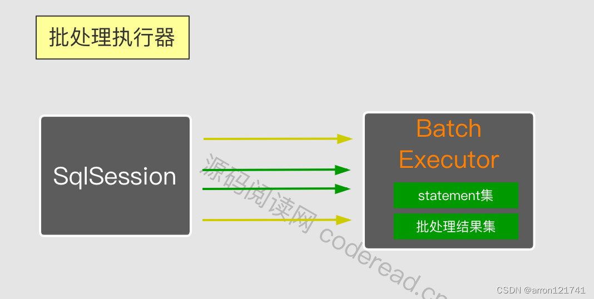编辑

假设上图中相同的线条颜色，就是相同的SQL语句。为了保证执行顺序只有绿色线条合并成一个Statement而两条黄线不能，否则就会导致，后面的黄线先于中间的绿线执行，有违调用顺序。

前面我们所说Executor其中有一个职责是负责缓存维护，以及事物管理。这三执行器并没有涉及，这部分逻辑去哪了呢？别急，缓存和事物无论采用哪种执行器，都会涉及，这属于公共逻辑。所以就完全有必要三个类之上抽象出一个基础执行器用来处理公共逻辑。

### 基础执行器

BaseExecutor 基础执行器主要是用于维护缓存和事物。事物是通过会话中调用commit、rollback进行管理。重点在于缓存这块它是如何处理的? ( 这里的缓存是指一级缓存）,它实现了Executor中的Query与update方法。会话中SQL请求，正是调用的这两个方法。Query方法中处理一级缓存逻辑，即根据SQL及参数判断缓存中是否存在数据，有就走缓存。否则就会调用子类的doQuery() 方法去查询数据库,然后在设置缓存。在doUpdate() 中主要是用于清空缓存。

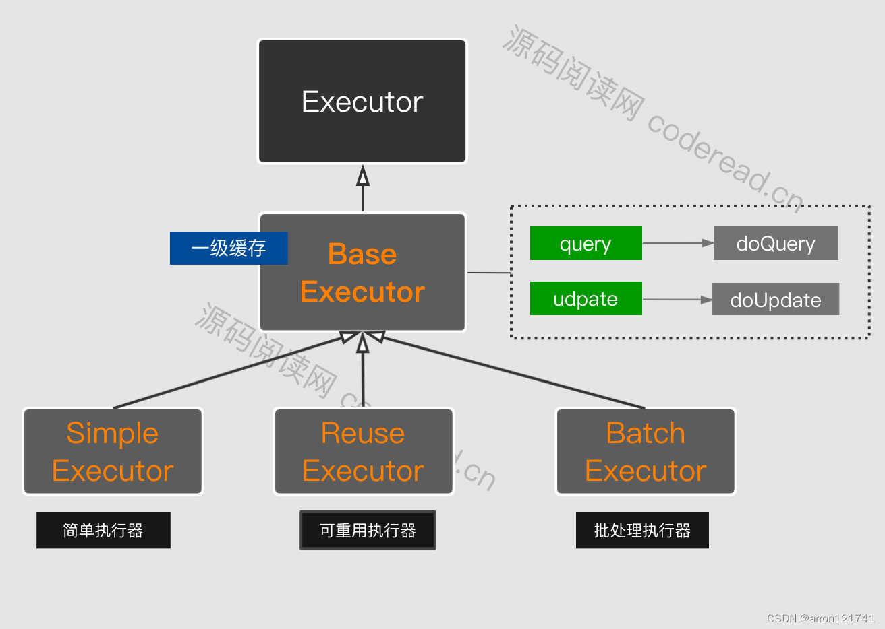编辑

当添加BaseExecutor 结构如上图。

### 缓存执行器

查看Executor 的子类还有一个CachingExecutor,这是用于处理二级缓存的。为什么不把它和一级缓存一起处理呢？因为二级缓存和一级缓存相对独立的逻辑，而且二级缓存可以通过参数控制关闭，而一级缓存是不可以的。综上原因把二级缓存单独抽出来处理。抽取的方式采用了装饰者设计模式，即在CachingExecutor 对原有的执行器进行包装，处理完二级缓存逻辑之后，把SQL执行相关的逻辑交给实至的Executor处理。

当把CachingExecutor加进来之后整体结构如下图所示。

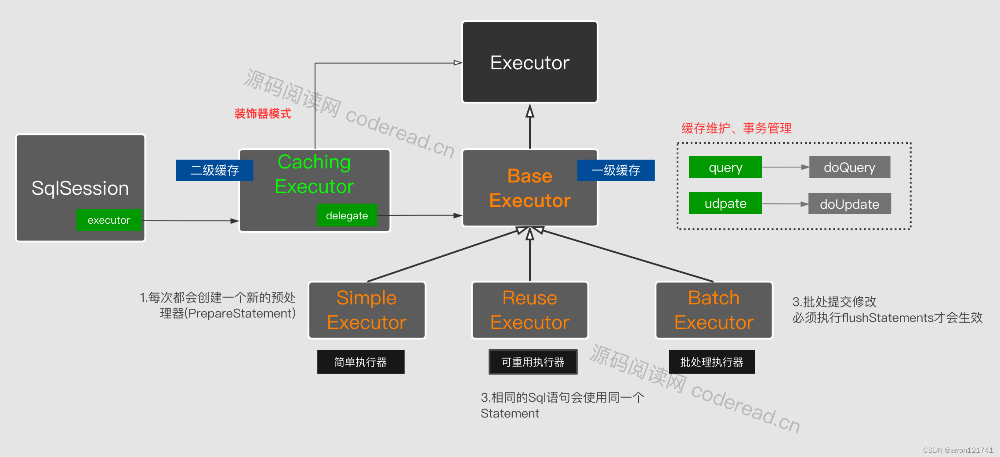编辑

## 执行器总结

执行器的种类有：基础执行器、简单执行器、重用执行器和批处理执行器，此外通过装饰器形式添加了一个缓存执行器。对应功能包括缓存处理、事物处理、重用处理以及批处理，这些是多个SQL执行中有**共性**地方。执行器存在的意义就是去处理这些共性。 如果说每个SQL调用是独立的，不需要缓存，不需要事物也不需集中在一起进行批处理的话，Executor也就没有存在的必要。但事实上这些都是MyBatis中不可或缺的特性。所以才设计出Executor这个组件。

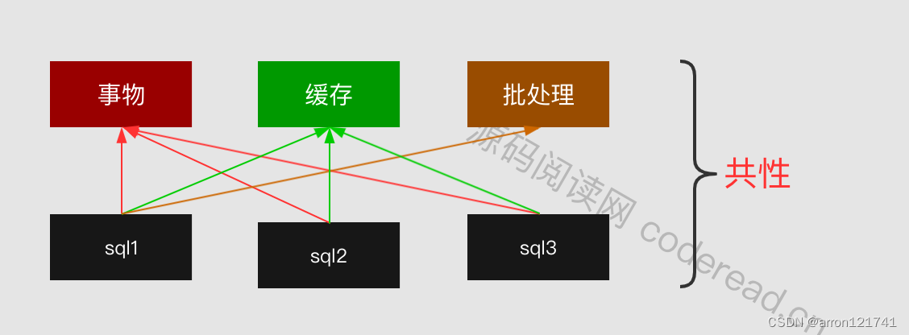编辑

# MyBatis一级缓存源码解析

> 探讨一级缓存命中场景，一级缓存源码实现

## MyBatis缓存概述

myBatis中存在两个缓存，一级缓存和二级缓存。

- 一级缓存：也叫做会话级缓存，生命周期仅存在于当前会话，不可以直接关关闭。但可以通过flushCache和localCacheScope对其做相应控制。
- 二级缓存：也叫应用级性缓存，缓存对象存在于整个应用周期，而且可以跨线程使用。

关于二级缓存将在后续章节，详细说明。文本先聚焦一级缓存。首先来看如何才能命中一级缓存。

### 一级缓存的命中场景

关于一级缓存的命中可大致分为两个场景，满足特定命中参数，第二不触发清空方法。

#### 缓存命中参数：

1. SQL与参数相同：
2. 同一个会话：
3. 相同的MapperStatement ID：
4. RowBounds行范围相同：

#### 触发清空缓存

1. 手动调用clearCache
2. 执行提交回滚
3. 执行update
4. 配置flushCache=true
5. 缓存作用域为Statement

## 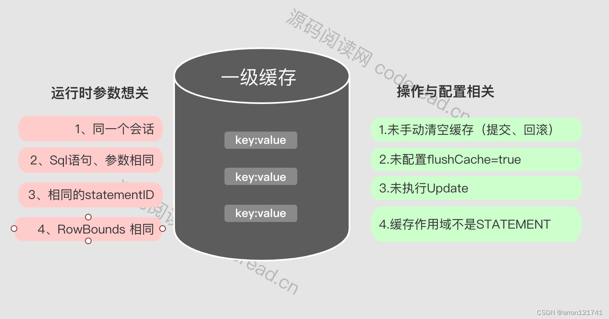编辑

## 一级缓存源码解析

回顾上节课内容，MyBatis执行过程如下图：

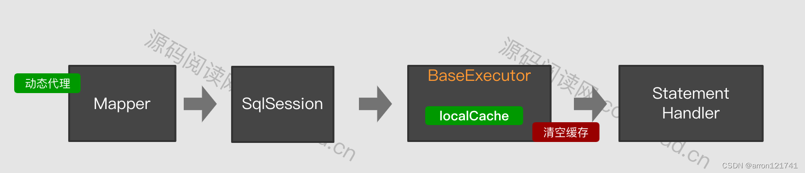编辑

本文所要论述的一级缓存逻辑就存在于 BaseExecutor (基础执行器)里面。当会话接收到查询请求之后，会交给执行器的Query方法，在这里会通过 Sql、参数、分页条件等参数创建一个缓存key，在基于这个key去 PerpetualCache中查找对应的缓存值，如果有主直接返回。没有就会查询数据库，然后在填充缓存。

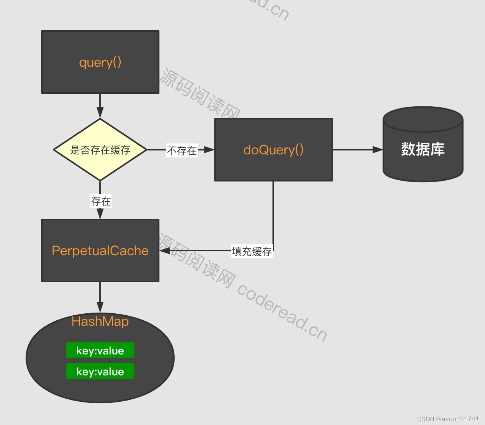编辑

另外通过上图你也看了，最终缓存的实现非常简单，就是一个HashMap。

#### 一级缓存的清空

缓存的清空对应BaseExecutor中的 clearLocalCache.方法。只要找到调用该方法地方，就知道哪些场景中会清空缓存了。

- update: 执行任意增删改
- select：查询又分为两种情况清空，一前置清空，即配置了flushCache=true。2后置清空，配置了缓存作用域为statement 查询结束合会清空缓存。
- commit：提交前清空
- Rolback：回滚前清空

> 注意：clearLocalCache 不是清空某条具体数据，而清当前会话下所有一级缓存数据。

## MyBatis集成Spring后一级缓存失效的问题？

很多人发现，集成一级缓存后会话失效了，以为是spring Bug ，真正原因是Spring 对SqlSession进行了封装，通过SqlSessionTemplae ，使得每次调用Sql，都会重新构建一个SqlSession，具体参见SqlSessionInterceptor。而根据前面所学，一级缓存必须是同一会话才能命中,所以在这些场景当中不能命中。

怎么解决呢？给Spring 添加事物 即可。添加事物之后，SqlSessionInterceptor(会话拦截器)就会去判断两次请求是否在同一事物当中，如果是就会共用同一个SqlSession会话来解决。

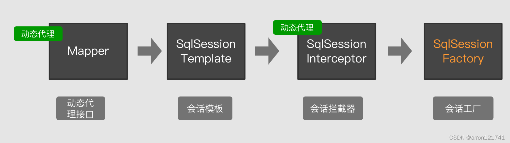编辑

# MyBatis二级缓存源码解析

> 掌握二级缓存的使用场景、熟悉其执行结构、以及执行过程源码

## 二级缓存概述

二级缓存也称作是应用级缓存，与一级缓存不同的，是它的作用范围是整个应用，而且可以跨线程使用。所以二级缓存有更高的命中率，适合缓存一些修改较少的数据。在流程上是先访问二级缓存，在访问一级缓存。

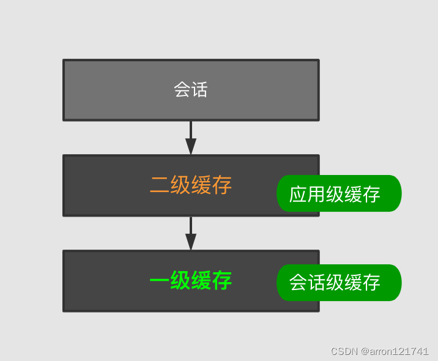编辑

## 二缓存需求

二级缓存是一个完整的缓存解决方案，那应该包含哪些功能呢？这里我们分为核心功能和非核心功能两类：

#### 存储【核心功能】

即缓存数据库存储在哪里？常用的方案如下：

1. 内存：最简单就是在内存当中，不仅实现简单，而且速度快。内存弊端就是不能持久化，且容易有限。
2. 硬盘：可以持久化，容量大。但访问速度不如内存，一般会结合内存一起使用。
3. 第三方集成：在分布式情况，如果想和其它节点共享缓存，只能第三方软件进行集成。比如Redis.

#### 溢出淘汰【核心功能】

无论哪种存储都必须有一个容易，当容量满的时候就要进行清除，清除的算法即溢出淘汰机制。常见算法如下：

1. FIFO：先进先出
2. LRU：最近最少使用
3. WeakReference: 弱引用，将缓存对象进行弱引用包装，当Java进行gc的时候，不论当前的内存空间是否足够，这个对象都会被回收
4. SoftReference：软件引用，基机与弱引用类似，不同在于只有当空间不足时GC才才回收软引用对象。

#### 其它功能

1. 过期清理：指清理存放数据过久的数据
2. 线程安全：保证缓存可以被多个线程同时使用
3. 写安全：当拿到缓存数据后，可对其进行修改，而不影响原本的缓存数据。通常采取做法是对缓存对象进行深拷贝。

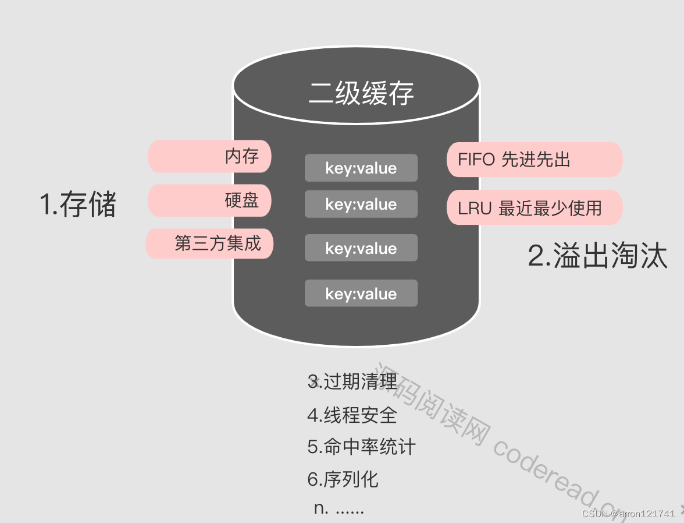编辑

## 二级缓存责任链设计

这么多的功能，如何才能简单的实现，并保证它的灵活性与扩展性呢？这里MyBatis抽像出Cache接口，其只定义了缓存中最基本的功能方法：

- 设置缓存
- 获取缓存
- 清除缓存
- 获取缓存数量

然后上述中每一个功能都会对应一个组件类，并基于装饰者加责任链的模式，将各个组件进行串联。在执行缓存的基本功能时，其它的缓存逻辑会沿着这个责任链依次往下传递。

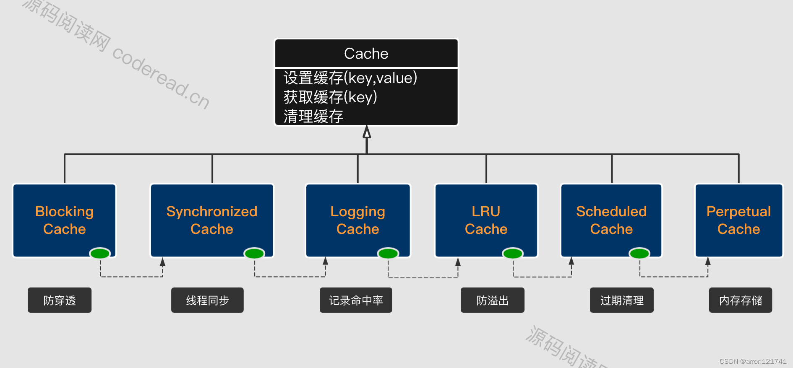编辑

这样设计有以下优点：

1. 职责单一：各个节点只负责自己的逻辑，不需要关心其它节点。
2. 扩展性强：可根据需要扩展节点、删除节点，还可以调换顺序保证灵活性。
3. 松耦合：各节点之间不没强制依赖其它节点。而是通过顶层的Cache接口进行间接依赖。

## 二级缓存的使用

### 缓存空间声明

二级默认缓存默认是不开启的，需要为其声明缓存空间才可以使用，通过@CacheNamespace 或 为指定的MappedStatement声明。声明之后该缓存为该Mapper所独有，其它Mapper不能访问。如需要多个Mapper共享一个缓存空间可通过@CacheNamespaceRef 或进行引用同一个缓存空间。@CacheNamespace 详细配置见下表：

| 配置           | 说明                                                     |
| -------------- | -------------------------------------------------------- |
| implementation | 指定缓存的存储实现类，默认是用HashMap存储在内存当中      |
| eviction       | 指定缓存溢出淘汰实现类，默认LRU ，清除最少使用           |
| flushInterval  | 设置缓存定时全部清空时间，默认不清空。                   |
| size           | 指定缓存容量，超出后就会按eviction指定算法进行淘汰       |
| readWrite      | true即通过序列化复制，来保证缓存对象是可读写的，默认true |
| blocking       | 为每个Key的访问添加阻塞锁，防止缓存击穿                  |
| properties     | 为上述组件，配置额外参数，key对应组件中的字段名。        |
|                |                                                          |

> 注：Cache中责任链条的组成即通过@CacheNamespace 指导生成。具体逻辑详兔崽子CacheBuilder

### 缓存其它配置

除@CacheNamespace 还可以通过其它参数来控制二缓存

| 字段         | 配置域                           | 说明                                                         |
| ------------ | -------------------------------- | ------------------------------------------------------------ |
| cacheEnabled |                                  | 二级缓存全局开关，默认开启                                   |
| useCache     | <select\|update\|insert\|delete> | 指定的statement是否开启，默认开启                            |
| flushCache   | <select\|update\|insert\|delete> | 执行sql前是否清空当前二级缓存空间，update默认true。query默认false |

### 二级缓存的命中条件

二级缓存的命中场景与一级缓存类似，不同在于二级可以跨会放使用，还有就是二级缓存的更新，必须是在会话提交之后。

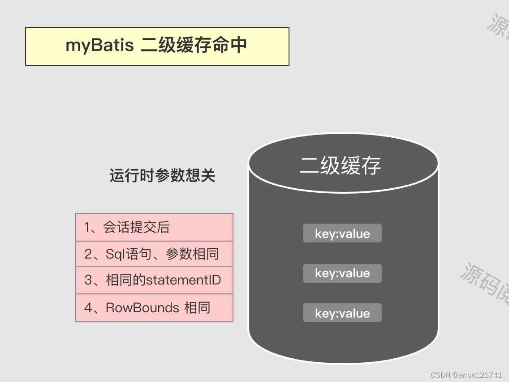编辑

**为什么要提交之后才能命中缓存?**

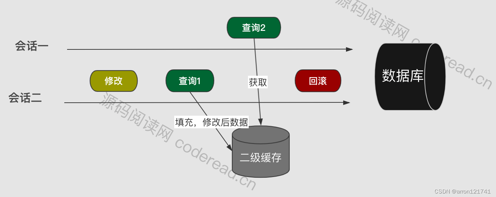编辑

如上图两个会话在修改同一数据，当会话二修改后，在将其查询出来，假如它实时填充到二级缓存，而会话一就能过缓存获取修改之后的数据，但实质是修改的数据回滚了，并没真正的提交到数据库。

所以为了保证数据一至性，二级缓存必须是会话提交之才会真正填充，包括对缓存的清空，也必须是会话正常提交之后才生效。

## 二级缓存结构

为了实现会话提交之后才变更二级缓存，MyBatis为每个会话设立了若干个暂存区，当前会话对指定缓存空间的变更，都存放在对应的暂存区，当会话提交之后才会提交到每个暂存区对应的缓存空间。为了统一管理这些暂存区，每个会话都一个唯一的事物缓存管理 器。所以这里暂存区也可叫做事物缓存。

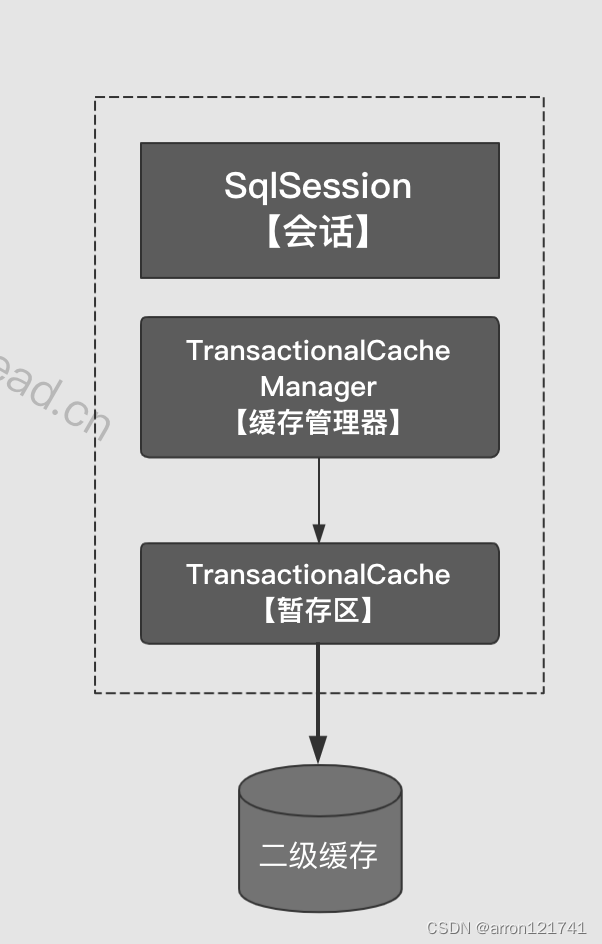编辑

最后我们通过下图来了解会话、暂存区、二级缓存空间的关系：

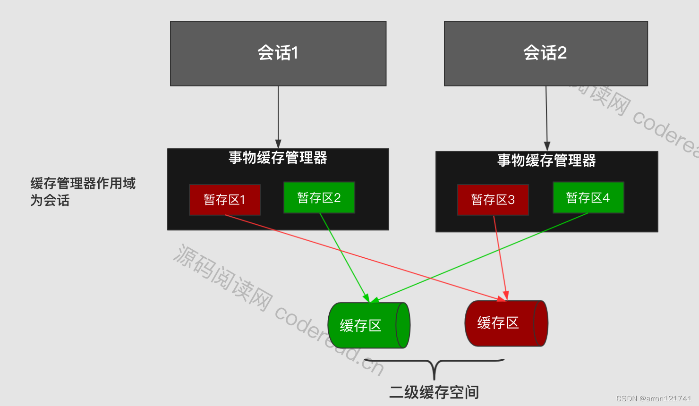编辑

## 二级缓存执行流程

原本会话是通过Executor实现SQL调用，这里基于装饰器模式使用CachingExecutor对SQL调用逻辑进行拦截。以嵌入二级缓存相关逻辑。

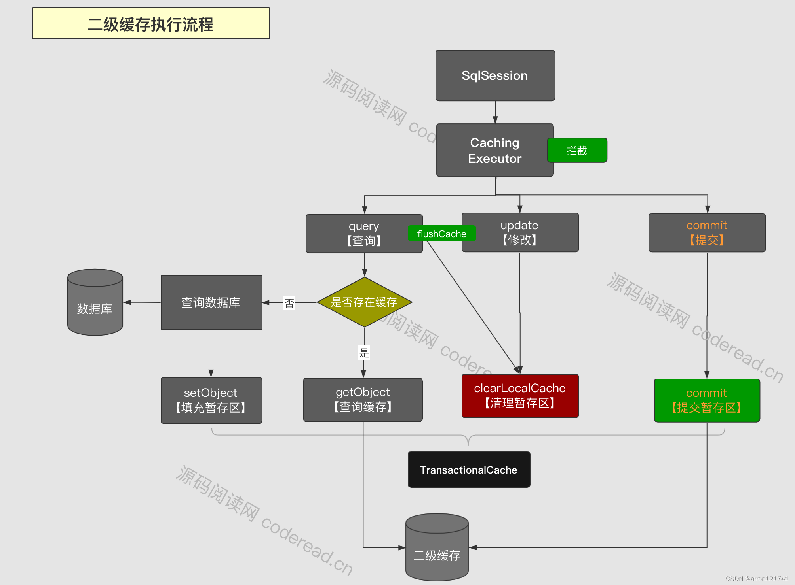编辑

### 查询操作query

当会话调用query() 时，会基于查询语句、参数等数据组成缓存Key，然后尝试从二级缓存中读取数据。读到就直接返回，没有就调用被装饰的Executor去查询数据库，然后在填充至对应的暂存区。

> 请注意，这里的查询是实时从缓存空间读取的，而变更，只会记录在暂存区

### 更新操作update

当执行update操作时，同样会基于查询的语句和参数组成缓存KEY，然后在执行update之前清空缓存。这里清空只针对暂存区，同时记录清空的标记，以便当会话提交之时，依据该标记去清空二级缓存空间。

> 如果在查询操作中配置了flushCache=true ，也会执行相同的操作。

### 提交操作commit

当会话执行commit操作后，会将该会话下所有暂存区的变更，更新到对应二级缓存空间去。

# MyBatis Jdbc处理器StatementHandler解析

## StatementHandler概要

MyBatis一个基于JDBC的Dao框架，但前面我们所学的会话、执行器半点没有提到jdbc，原因是MyBatis把所有跟JDBC相关的操作全部都放到了StatementHandler中。

一个SQL请求会经过会话，然后是执行器，最由StatementHandler执行jdbc最终到达数据库。其关系如下图：

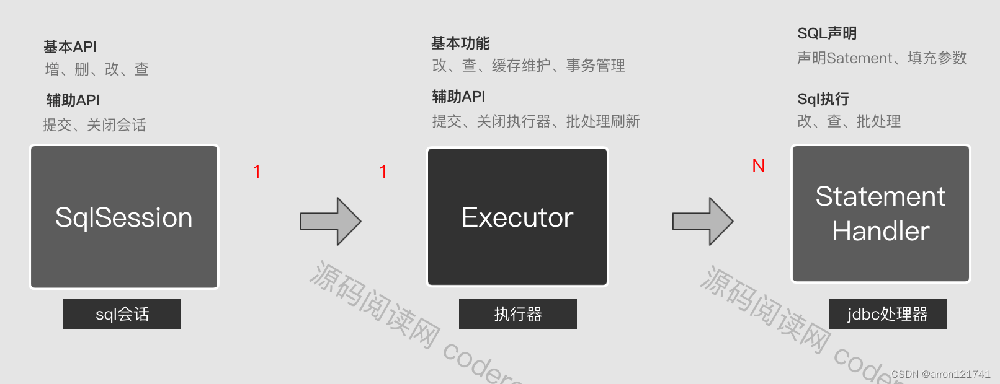编辑

这里要注意这三者之间比例是1：1：n。也就是说多个SQL操作对应一个会话，和唯一的执行器以及N个StatementHandler。这里的N取决于通过会话调用了多少次Sql（命中缓存除外）。

**StatementHandler定义**

JDBC处理器，基于JDBC构建JDBC Statement,并设置参数，然后执行Sql。每调用会话当中一次SQl，都会有与之相对应的且唯一的Statement实例。

## StatementHandler结构

StatementHandler接口定义了JDBC操作的相关方法如下：

```
// 基于JDBC 声明Statement
Statement prepare(Connection connection, Integer transactionTimeout)
    throws SQLException;
// 为Statement 设置方法
void parameterize(Statement statement)
    throws SQLException;
// 添加批处理（并非执行）
void batch(Statement statement)
    throws SQLException;
// 执行update操作
int update(Statement statement)
    throws SQLException;
// 执行query操作
<E> List<E> query(Statement statement, ResultHandler resultHandler)
    throws SQLException;
```

StatementHandler 有三个子类SimpleStatementHandler、PreparedStatementHandler、CallableStatementHandler，分别对应JDBC中的Statement、PreparedStatement、CallableStatement。

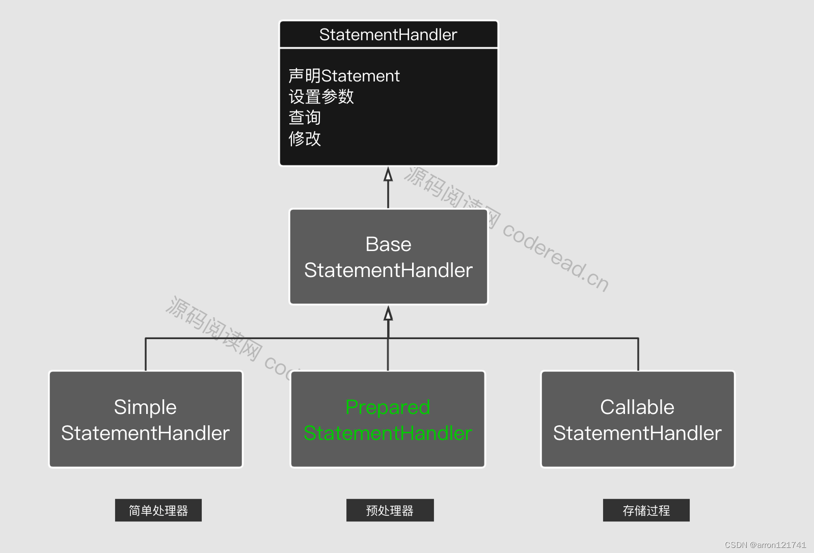编辑

大部分情况下都是预处理器，所以接下我们就针对PreparedStatementHandler来讲解其实现过程。

## 处理流程解析

### 总体流程

接下来了解statementHandler完整执行流程。如下时序图：

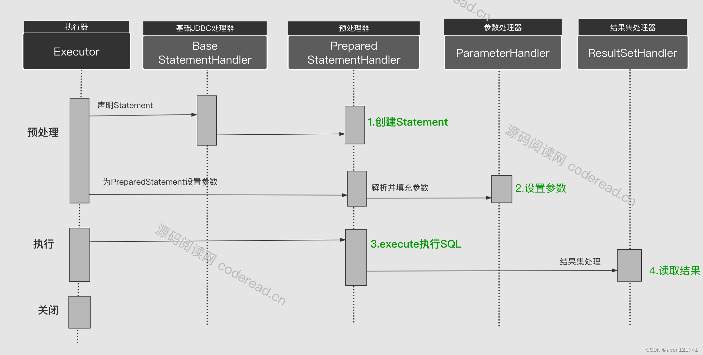编辑

总共执行过程分为三个阶段：

1. 预处理：这里预处理不仅仅是通过Connection创建Statement，还包括设置参数。
2. 执行：包含执行SQL和处理结果映射两部分。
3. 关闭：直接关闭Statement。

参数处理和结果集封装，涉及数据库字段和JavaBean之间的相互映射，相对复杂。所以分别使用ParameterHandler与ResultSetHandler两个专门的组件实现。接下来就一起了解一下参数处理与结果集封装的处理流程。

### 参数处理

参数处理即将Java Bean转换成数据类型。总共要经历过三个步骤，参数转换、参数映射、参数赋值。

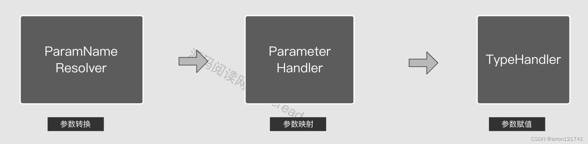编辑

**参数转换**

即将JAVA 方法中的普通参数，封装转换成Map，以便map中的key和sql的参数引用相对应。

```
@Select({"select * from users where name=#{name} or age=#{user.age}"})
@Options
User selectByNameOrAge(@Param("name") String name, @Param("user") User user);
```

- 单个参数的情况下且没有设置@param注解会直接转换，勿略SQL中的引用名称。
- 多个参数情况：优先采用@Param中设置的名称，如果没有则用参数序号代替 即"param1、parm2...."
- 如果javac编译时设置了 -parameters 编译参数，也可以直接获取源码中的变量名称作为key

> 以上所有转换逻辑均在ParamNameResolver中实现。

**参数映射**

映射是指Map中的key如何与SQL中绑定的参数相对应。以下这几种情况

- **单个原始类型**：直接映射，勿略SQL中引用名称
- **Map类型**：基于Map key映射
- **Object**：基于属性名称映射,支持嵌套对象属性访问

> 在Object类型中，支持通过“.”方式映射属中的属性。如:user.age

**参数赋值**

通过TypeHandler 为PrepareStatement设置值，通常情况下一般的数据类型MyBatis都有与之相对应的TypeHandler

### 结果集封装

指读取ResultSet数据，并将每一行转换成相对应的对象。用户可在转换的过程当中可以通过ResultContext来控制是否要继续转换。转换后的对象都会暂存在ResultHandler中最后统一封装成list返回给调用方

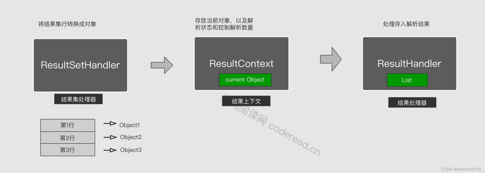编辑

结果集转换中99%的逻辑DefaultResultSetHandler 中实现。整个流程可大致分为以下阶段：

1. 读取结果集
2. 遍历结果集当中的行
3. 创建对象
4. 填充属性

整个过程有点繁长，我们用源码地图可以很好的去追踪其中的流程：

# 结果集映射体系一

## 前言

> MetaObject的使用与原理，以及嵌套子查询原理，包括子查询当中的循环依赖

## 映射工具MetaObject

所谓映射是指结果集中的列填充至JAVA Bean属性。这就必须用到反射，而Bean的属性 多种多样的有普通属性、对象、集合、Map都有可能。为了更加方便的操作Bean的属性，MyBatis提供了MeataObject 工具类，其简化了对象属性的操作。其具体功能如下：

1. **查找属性**：勿略大小写，支持驼峰、支持子属性 如：“blog.comment.user_name”

2. 获取属性

   1. 基于点获取子属性 “user.name”
   2. 基于索引获取列表值 “users[1].id”
   3. 基于key获取map值 “user[name]”

3. 设置属性

   ：

   1. 可设置子属性值
   2. 支持自动创建子属性(必须带有空参构造方法，且不能是集合)

为了实现上述功能，MetaObject 相继依赖了**BeanWrapper**、**MetaClass**、**Reflector**。这四个对象关系如下：

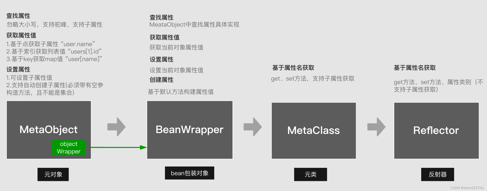编辑

- **BeanWrapper**: 功能与MeataObject类似，不同点是BeanWrapper只针对单个当前对象属性进行操作，不能操作子属性。
- **MetaClass** ：类的反射功能支持，获能获取整完整类的属性，包括属性的属性。
- **Reflector** ：类的反射功能支持，仅支持当前类的属性。

### Meata获取属性流程：

对象结构如下图：

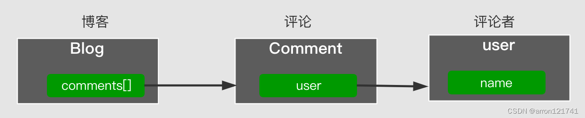编辑

获取博客的第一个评论者的名称，其获取表达示是：

```
"comments[0].user.name"
```

MetaObjbt 解析获取流程如下图：

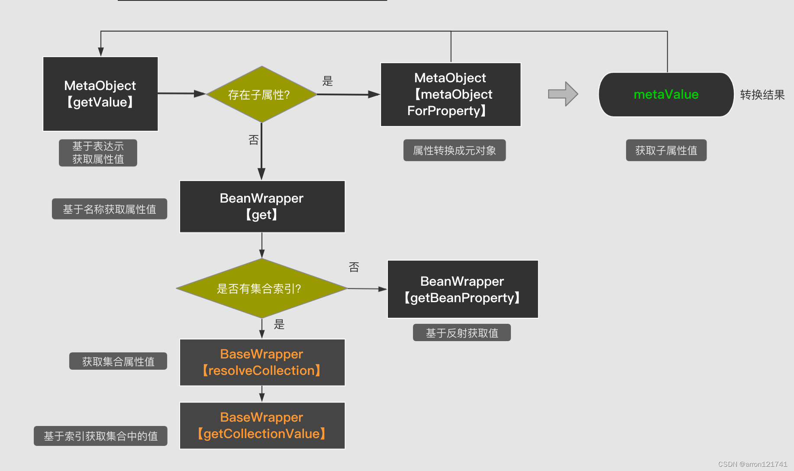编辑

流程中方法说明：

**MeataObject.getValue()**

获取值的入品，首先根据属性名"comments[0].user.name" 解析成PropertyTokenizer，并基于属性中的“.” 来判断是否为子属性值，如果是就递归调用getValue() 获取子属性对象。然后在递归调用getValue()获取子属性下的属性。直到最后的name属性获。

**MeataObject.setValue()**

流程与getValue()类似，不同在于如果子属性不存在，则会尝试创建子属性。

## ResultMap结果集映射

映射是指返回的ResultSet列与Java Bean 属性之间的对应关系。通过ResultMapping进行映射描述，在用ResultMap封装成一个整体。

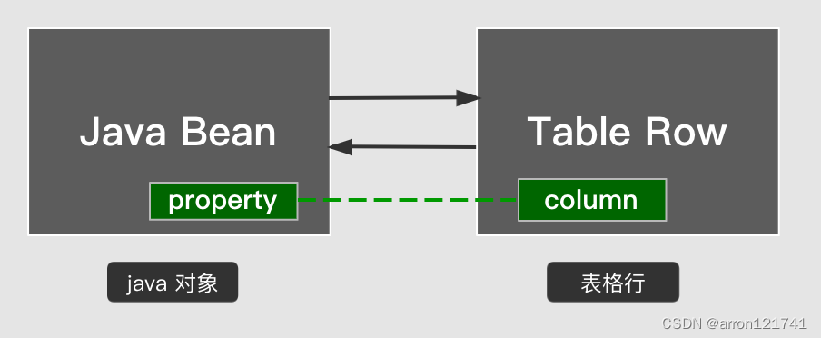编辑

### 映射设置

一个ResultMap 中包含多个ResultMapping 表示一个具体的JAVA属性到列的映射，其主要值如下：

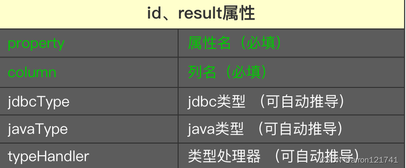编辑

ResultMapping 有多种表现形式如下：

1. constructor:构建参数字段
2. id：ID字段
3. result：普通结构集字段
4. association：1对1关联字段
5. Collection：1对多集合关联字段

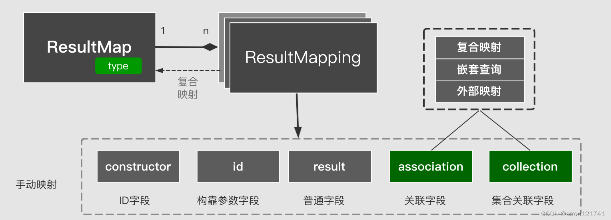编辑

### 自动映射

当前列名和属性名相同的情况下，可使用自动映射


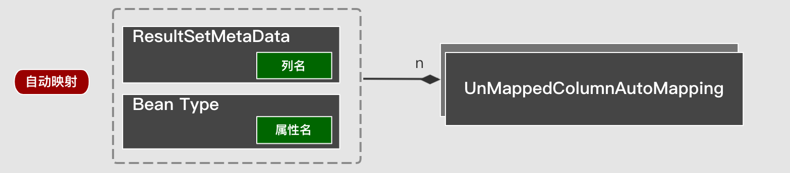

编辑

**自动映射条件**

1. 列名和属性名同时存在（勿略大小写）
2. 当前列未手动设置映射
3. 属性类别存在TypeHandler
4. 开启autoMapping （默认开启）

## 嵌套子查询

但很多时候对象结构， 是树级程现的。即对象中包含对象。可以通过子查询获取子对象属性。


当依次解析Blog中的属性时，会先解析填充普通属性，当解析到复合对象时，就会触发对子查询。


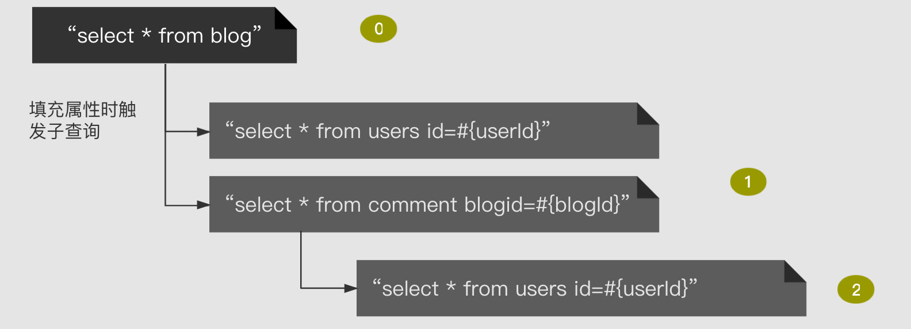

编辑

# 懒加载&嵌套映射

## 前言：

> 基于动态代理实现懒加载，在使用过程中，如果会话关闭、跨线程、序列化等情况下，是否能够继续加载？

## 懒加载

懒加载是为改善，解析对象属性时大量的嵌套子查询的并发问题。设置懒加载后，只有在使用指定属性时才会加载，从而分散SQL请求。

```
<resultMap id="blogMap" type="blog" autoMapping="true">
    <id column="id" property="id"></id>
    <association property="comments" column="id" select="selectCommentsByBlog" fetchType="lazy"/>
</resultMap>
```

在嵌套子查询中指定 fetchType="lazy" 即可设置懒加载。在调用getComments时才会真正加载。此外调用："equals", "clone", "hashCode", "toString" 均会触发当前对象所有未执行的懒加载。通过设置全局参数aggressiveLazyLoading=true ，也可指定调用对象任意方法触发所有懒加载。

| 参数                  | 描述                                     |
| --------------------- | ---------------------------------------- |
| lazyLoadingEnabled    | 全局懒加载开关 默认false                 |
| aggressiveLazyLoading | 任意方法触发加载 默认false。             |
| fetchType             | 加载方式 eager实时 lazy懒加载。默认eager |

#### set覆盖 &序列化

当调用setXXX方法手动设置属性之后，对应的属性懒加载将会被移除，不会覆盖手动设置的值。

当对象经过序列化和反序列化之后，默认不在支持懒加载。但如果在全局参数中设置了configurationFactory类，而且采用JAVA原生序列化是可以正常执行懒加载的。其原理是将懒加载所需参数以及配置一起进行序列化，反序列化后在通过configurationFactory获取configuration构建执行环境。

> configurationFactory 是一个包含 getConfiguration 静态方法的类

```
public static class ConfigurationFactory {
        public static Configuration getConfiguration() {
        return configuration;
    }
}
```

### 原理

通过对Bean的动态代理，重写所有属性的getXxx方法。在获取属性前先判断属性是否加载？然后加载之。

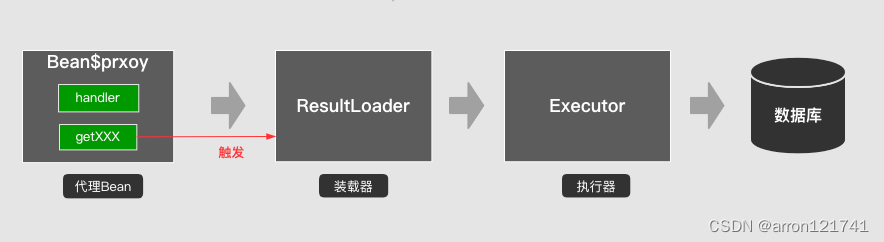编辑

代理之后Bean会包含一个MethodHandler，内部在包含一个Map用于存放待执行懒加载，执行前懒加载前会移除。LoadPair用于针对反序列化的Bean准备执行环境。ResultLoader用于执行加载操作，执行前如果原执行器关闭会创建一个新的。

> 特定属性如果加载失败，不会在进行二次加载。

### Bean代理过程

代理过程发生在结果集解析 交创建对象之后(DefaultResultSetHandler.createResultObject)，如果对应的属性设置了懒加载，则会通过ProxyFactory 创建代理对象，该对象继承自原对象,然后将对象的值全部拷贝到代理对像。并设置相应MethodHandler（原对象直接抛弃）

## 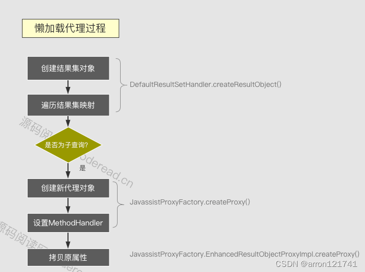编辑

## 联合查询&嵌套映射

## 映射说明

映射是指返回的ResultSet列与Java Bean 属性之间的对应关系。通过ResultMapping进行映射描述，在用ResultMap封装成一个整体。映射分为简单映射与复合嵌套映射。

**简单映射**：即返回的结果集列与对象属性是1对1的关系，这种情况下ResultHandler 会依次遍历结果集中的行，并给每一行创建一个对象，然后在遍历结果集列填充至对象的映射属性。

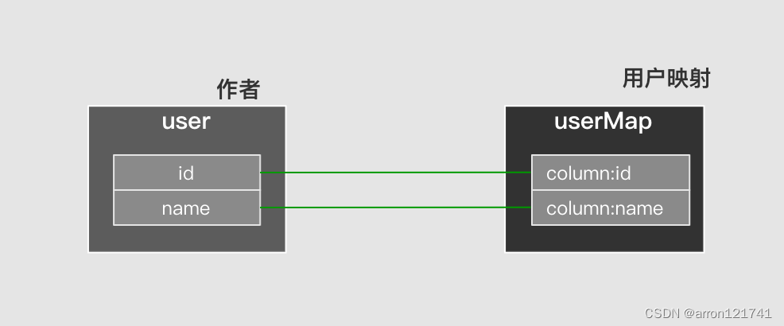编辑

**嵌套映射**：但很多时候对象结构， 是树级程现的。即对象中包含对象。与之对应映射也是这种嵌套结构。

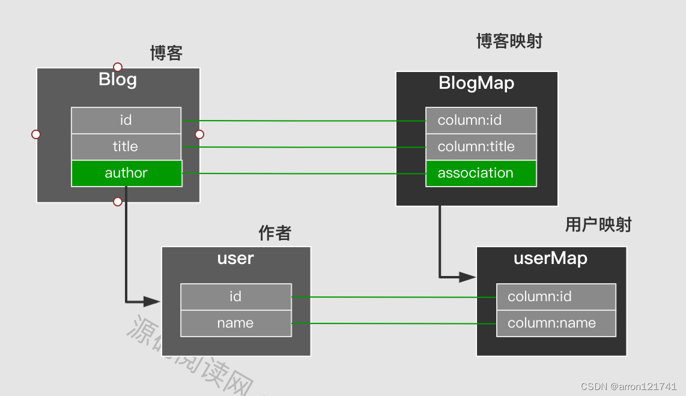编辑

在配置方式上可以直接配置子映射，也以引入外部映射和自动映射。共有两类嵌套结构分别是一对多 与多对多 。

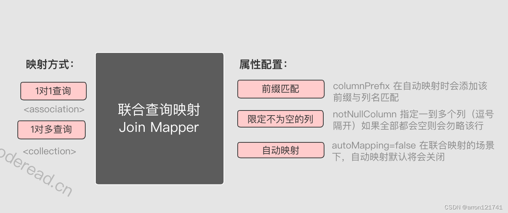编辑

关于映射的使用方式，官网有非常详细的文档。这里就不在赘述。接下来分析一下，嵌套映射结果集填充过程。

## 联合查询

有了映射之后如何获取结果？普通的单表查询是无法获取复合映射所需结果，这就必须用到联合查询。然后在将联合查询返回的数据列，拆分给不同的对象属性。1对1与1对多拆分和创建的方式是一样的。

### 1对1查询映射

```
select a.id,
       a.title,
       b.id as user_id,
       b.name as user_name
from blog a
         left join users b on a.author_id=b.id
where a.id = 1;
```

通过上述语句联合查询语句，可以得出下表中结果。结果中前两字段对应Blog，后两个字段对应User。然后在将User作为author属性填充至Blog对象。

上述两个例子中，每一行都会产生两个对象，一个Blog父对象，一个User子对象。

### 1对多查询

sql语句

```
select a.id,a.title,
       c.id as comment_id,
       c.body as comment_body
from blog a
         left join comment c on a.id=c.blog_id
where a.id = 1;
```

上述语句可得出三条结果，前两个字段对应Blog，后两个字段对应Comment(评论)。与1对1不同的是，三行指向的是同一Blog。因为它ID都是一样的。


### 结果集解析流程

*TODO:待补充源码地图*

这里直接采用1对多的情况进行解析，因为1对1就是1对多的简化版。查询的结果如下表：

其整个解析流程如下图：

所有映射流程的解析都是在DefaultResultSetHandler当中完成。主要方法如下：

**handleRowValuesForNestedResultMap()**

嵌套结果集解析入口，在这里会遍历结果集中所有行。并为每一行创建一个RowKey对象。然后调用getRowValue()获取解析结果对象。最后保存至ResultHandler中。

> 注：调用getRowValue前会基于RowKey获取已解析的对象，然后作为partialObject参数发给getRowValue

**getRowValue()**

该方法最终会基于当前行生成一个解析好对象。具体职责包括，1.创建对象、2.填充普通属性和3.填充嵌套属性。在解析嵌套属性时会以递归的方式在调用getRowValue获取子对象。最后一步4.基于RowKey 暂存当前解析对象。

> 如果partialObject参数不为空 只会执行 第3步。因为1、2已经执行过了。

**applyNestedResultMappings()**

解析并填充嵌套结果集映射，遍历所有嵌套映射,然后获取其嵌套ResultMap。接着创建RowKey 去获取暂存区的值。然后调用getRowValue 获取属性对象。最后填充至父对象。

> 如果通过RowKey能获取到属性对象，它还是会去调用getRowsValue，因为有可能属下还存在未解析的属性。

## 循环引用

两个对象之间互相引用即循环引用，如下图就是一个例子：

对应ResultMap如下：

这种情况会导致解析死循环吗？答案是不会。DefaultResultSetHandler 在解析复合映射之前都会在上下文中填充当前解析对象（使用resultMapId做为Key）。如果子属性又映射引用了父映射ID，就可以直接获取不需要在去解析父对象。具体流程如下：

具体代码：

- if
- choose (when, otherwise)
- trim (where, set)
- foreach

### if

```
<if test="title != null">
    AND title like #{title}
</if>
```

在if元素中通过test接受一个OGNL逻辑表达示，可作常规的逻辑计算如：判空、大小、and、or 以及针对子属性的计算。

### choose(when、otherwise)

choose 用于在多个条件当中选择其中一个，如果都不满足就使用otherwise中的值。类似java当中的switch。当然这种逻辑用if也能实现只是逻辑表达示相对复杂一些。还有就是if元素中是没有else元素相对应的。

### trim（where、set）

trim 用于解决在拼装SQL 后，SQL语句会多出的问题 如下面的例子：

```
<select id="findBlog"
     resultType="Blog">
  SELECT * FROM BLOG
  WHERE
  <if test="state != null">
   AND state = #{state}
  </if>
</select>
```

如果if 条件满足则最终生成一个SQL，语法上多了一个AND 字符

```
SELECT * FROM BLOG  WHERE  AND state = #{state}
```

而不满足，SQL也会错误 ，语法上多了一个 WHERE

```
  SELECT * FROM BLOG  WHERE 
```

where 元素只会在子元素返回任何内容的情况下才插入 “WHERE” 子句。而且，若子句的开头为 “AND” 或 “OR”，where 元素也会将它们去除。where 元素等价于以下trim元素

```
<trim prefix="WHERE" prefixOverrides="AND |OR ">
  ...
</trim>
```

Set 元素用于在修改多个字段时多出的逗号问题，其等价于以下trim元素

```
<trim prefix="SET" suffixOverrides=",">
  ...
</trim>
```

### foreach

该元素用于对集合值进行遍历，比如构建in的多个条件，或者进行批处理新增修改等。它允许你指定一个集合，声明可以在元素体内使用的集合项（item）和索引（index）变量。

### OGNL表达示

OGNL全称是对象导航图语言（Object Graph Navigation Language）是一种JAVA表达示语言，可以方便的存取对象属和方法，已用于逻辑判断。其支持以下特性：

1. 获取属性属性值，以及子属性值进行逻辑计算

   ```
   id!=null||autho.name!=null
   ```

2. 表达示中可直接调用方法，（如果是无参方法，可以省略括号）

   `!comments.isEmpty&&comments.get(0)!=null`

3. 通过下标访问数组或集合

   `comments[0].id!=null`

4. 遍历集合

   ```
   Iterable<?> comments = evaluator.evaluateIterable("comments", blog);
   ```

   ## 动态SQL脚本

前面所说动态SQL xml元素最终都会被解成一个可执行的脚本。而MyBatis 正是通过为这个脚本传递参数，并执行脚本计算来生成动态SQL。脚本在MyBatis中体现即**SqlNode** 。

每个动态元素都会有一个与之对应的脚本类。如`if` 对应`ifSqlNode`、`forEarch`对应`ForEachSqlNode` 以此类推下去。这里要注意下面三个脚本

- `StaticTextSqlNode` 表示一段纯静态文本如： `select * from user`
- `TextSqlNode` 表示一个通过参数拼装的文本如：`select * from ${user}`
- `MixedSqlNode` 表示多个节点的集合

脚本之间是呈现嵌套关系的。比如`if`元素中会包含一个`MixedSqlNode` ，而`MixedSqlNode` 下又会包含1至1至多个其它节点。最后组成一课脚本语法树。如下面左边的SQL元素组成右边的语法树。在节点最底层一定是一个`StaticTextNode`或 `TextNode`

#### 动态脚本执行

SqlNode的接口非常简单，就只有一个apply方法，方法的作用就是执行当前脚本节点逻辑，并把结果应用到`DynamicContext`当中去。

```
public interface SqlNode {
  boolean apply(DynamicContext context);
}
```

如`IfSqlNode`当中执行 apply时先计算If逻辑，如果通过就会继续去访问它的子节点。直到最后访问到`TextNode` 时把SQL文本添加至 `DynamicContext`。 通过这种类似递归方式Context就会访问到所有的的节点，并把最后最终符合条件的的SQL文本追加到 Context中。

```
//IfSqlNode
public boolean apply(DynamicContext context) {//计算if表达示
  if (evaluator.evaluateBoolean(test, context.getBindings())) {
    contents.apply(context);
    return true;
  }
  return false;
}
//StaticTextSqlNode
public boolean apply(DynamicContext context) {
  context.appendSql(text);
  return true;
}
```

看源码从动态SQL到BoundSql 过程中，中间还经过了一次StaticSqlSource 生成？为什么要这么做呢，以及从XML中解析出的SqlNode集存储在哪？这里又要有一个新的概念`SqlSource` SQL源。

## SqlSource（SQL数据源）

在上层定义上每个Sql映射（MappedStatement）中都会包含一个SqlSource 用来获取可执行Sql（`BoundSql`）。SqlSource又分为原生SQL源与动态SQL源，以及第三方源。其关系如下图：

### SqlSource解析过程

SqlSource 是基于XML解析而来，解析的底层是使用Dom4j 把XML解析成一个个子节点，在通过 **XMLScriptBuilder** 遍历这些子节点最后生成对应的Sql源。其解析流程如下图：

从图中可以看出这是一种递归式的访问 所有节点，如果是文本节点就会直接创建TextNode 或StaticSqlNode。否则就会创建动态脚本节点如IfSqlNode等。这里每种动态节点都会对应的处理器(`NodeHandler`) 来创建。创建好之后又会继续访问子节点，让递归继续下去。当然子节点所创建的SqNode 也会作为当前所创建的元素的子节点而存在。

# Configuration配置体系

## Configuration概述

Configuration 是整个MyBatis的配置体系集中管理中心，前面所学Executor、StatementHandler、Cache、MappedStatement...等绝大部分组件都是由它直接或间接的创建和管理。此外影响这些组件行为的属性配置也是由它进行保存和维护。如cacheEnabled、lazyLoadingEnabled ... 等。所以说它MyBatis的大管家很形象。

### 核心作用总结

总结一下Configuration主要作用如下：

- 存储全局配置信息，其来源于settings（设置）
- 初始化并维护全局基础组件
  - typeAliases（类型别名）
  - typeHandlers（类型处理器）
  - plugins（插件）
  - environments（环境配置）
  - cache(二级缓存空间)
- 初始化并维护MappedStatement
- 组件构造器,并基于插件进行增强
  - newExecutor（执行器）
  - newStatementHandler（JDBC处理器）
  - newResultSetHandler（结果集处理器）
  - newParameterHandler（参数处理器）

## 配置来源

Configuration 配置来源有三项：

1. Mybatis-config.xml 启动文件，全局配置、全局组件都是来源于此。
2. Mapper.xml SQL映射(MappedStatement) \结果集映射(ResultMapper)都来源于此。
3. @Annotation SQL映射与结果集映射的另一种表达形式。

关于各配置的使用请参见官网给出文档：https://mybatis.org/mybatis-3/zh/configuration.html#properties

## 元素承载

无论是xml 还是我注解这些配置元素最弱都要被转换成JAVA配置属性或对象组件来承载。其对应关系如下：

1. 全配置(config.xml) 由Configuration对像属性承载
2. sql映射<select|insert...> 或@Select 等由MappedStatement对象承载
3. 缓存<cache..> 或@CacheNamespace 由Cache对象承载
4. 结果集映射 由ResultMap 对象承载

## 配置文件解析

配置文件解析需要我们分开讨论，首先来分析XML解析过程。xml配置解析其底层使用dom4j先解析成一棵节点树，然后根据不同的节点类型与去匹配不同的解析器。最终解析成特定组件。

解析器的基类是BaseBuilder 其内部包含全局的configuration 对象，这么做的用意是所有要解析的组件最后都要集中归属至configuration。接下来了解一下每个解析器的作用：

- XMLConfigBuilder :解析config.xml文件，会直接创建一个configuration对象，用于解析全局配置 。
- XMLMapperBuilder ：解析Mapper.xml文件，内容包含 等
- MapperBuilderAssistant：Mapper.xml解析辅助，在一个Mapper.xml中Cache是对Statement（sql声明）共享的，共享组件的分配即由该解析实现。
- XMLStatementBuilder：SQL映射解析 即<select|update|insert|delete> 元素解析成MapperStatement。
- SqlSourceBuilder：Sql数据源解析,将声明的SQL解析可执行的SQL。
- XMLScriptBuilder：解析动态SQL数据源当中所设置 SqlNode脚本集。

### 注解配置解析

注解解析底层实现是通过反射获取Mapper接口当中注解元素实现。有两种方式一种是直接指定接口名，一种是指定包名然后自动扫描包下所有的接口类。这些逻辑均由Mapper注册器(MapperRegistry) 实现。其接收一个接口类参数，并基于该参数创建针对该接口的动态代理工厂，然后解析内部方法注解生成每个MapperStatement 最后添加至Configuration 完成解析。

# 插件体系

## 概述

插件机制是为了对MyBatis现有体系进行扩展 而提供的入口。底层通过动态代理实现。可供代理拦截的接口有四个：

1. Executor：执行器
2. StatementHandler：JDBC处理器
3. ParameterHandler：参数处理器
4. ResultSetHandler：结果集处理器

这四个接口已经涵盖从发起接口调用到SQl声明、参数处理、结果集处理的全部流程。接口中任何一个方法都可以进行拦截改变方法原有属性和行为。不过这是一个非常危险的行为，稍不注意就会破坏MyBatis核心逻辑还不自知。所以在在使用插件之前一定要非常清晰MyBatis内部机制。

创建一个插件在MyBatis当中是一件非常简单的事情 ，只需实现 Interceptor 接口，并指定想要拦截的方法签名即可。

```
@Intercepts({@Signature(
  type= Executor.class,
  method = "update",
  args = {MappedStatement.class,Object.class})})
public class ExamplePlugin implements Interceptor {
        // 当执行目标方法时会被方法拦截
    public Object intercept(Invocation invocation) throws Throwable {
      long begin = System.currentTimeMillis();
        try {
            return invocation.proceed();// 继续执行原逻辑;
        } finally {
            System.out.println("执行时间："+(System.currentTimeMillis() - begin));
        }
    }
        // 生成代理对象，可自定义生成代理对象，这样就无需配置@Intercepts注解。另外需要自行判断是否为拦截目标接口。
    public Object plugin(Object target) {
        return Plugin.wrap(target,this);// 调用通用插件代理生成机器
    }
}
```

在config.xml 中添加插件配置

```
<plugins>
  <plugin interceptor="org.mybatis.example.ExamplePlugin"/>
</plugins>
```

通过上述配置即可以监控 在执行过修改过程当中，所耗费的时间。

注：只有从外部类调用拦截目标时 拦截才会生效，如果在内部调用代理逻辑会生效。如在Executor中有两个Query 方法，第一个会调用第二个query。如果你拦截的是第二个Query 则不会成功。

Configuration 中有一个InterceptorChain(拦截链)保存了所有拦截器，当创建四大对象之后就会调用拦截链，对目标对象进行拦截代理。

对于这个插件拦截实现类似Spring AOP 但其实现要简单很多。代理很轻量清晰，连注释都显得多余。

接下来通过一个自动分页插件全面掌握插件的用法

## 自动分页插件

自动分页是指查询时，指定页码和大小 等参数，插件就自动进行分页查询，并返回总数量。这个插件设计需要满足以下目特性：

1. **易用性**：不需要额外配置，参数中带上 Page 即可. Page尽可能简单
2. **不对使用场景作假设**：不限制用户使用方式，如接口调用，还是会话调。又或是对Executor 以及StatementHandler的选择等。不能影响缓存业务
3. **友好性**：当不符合分页情况下，作出友好的用户提示。如在修改操作中付入分页参数。或用户本身已在查询语句已自带分页语句 ，这种情况应作出提示。

### 拦截目标

接下来要解决的问题，是插件的入口写在哪里？去拦截的目标有哪些？

参数处理器 和结果集处理器显然不合适，而Executor.query() 又需要额外考虑 一、二级缓存逻辑。最后还是选定StatementHandler. 并拦截其prepare 方法。

```
@Intercepts(@Signature(type = StatementHandler.class,
        method = "prepare", args = {Connection.class,
        Integer.class}))
```

### 分页插件原理

首先设定一个Page类，其包含total、size、index 3个属性，在Mapper接口中声明该参数即表示需要执行自动分页逻辑。

总体实现步骤包含3个：

1. 检测是否满足分页条件
2. 自动求出当前查询的总行数
3. 修改原有的SQL语句 ，添加 limit offset 关键字。

#### 1.检测是否满足分页条件

分页条件是 1.是否为查询方法，2.查询参数中是否带上Page参数。在intercept 方法中可直接获得拦截目标StatementHandler ，通过它又可以获得BoundSql 里面就包含了SQL 和参数。遍历参数即可获得Page。

```
// 带上分页参数
StatementHandler target = (StatementHandler) invocation.getTarget();
// SQL包 sql、参数、参数映射
BoundSql boundSql = target.getBoundSql();
Object parameterObject = boundSql.getParameterObject();
Page page = null;
if (parameterObject instanceof Page) {
    page = (Page) parameterObject;
} else if (parameterObject instanceof Map) {
    page = (Page) ((Map) parameterObject).values().stream().filter(v -> v instanceof Page).findFirst().orElse(null);
}
```

#### 2.查询总行数

实现逻辑是 将原查询SQL作为子查询进行包装成子查询，然后用原有参数，还是能过原来的参数处理器进行赋值。关于执行是采用JDBC 原生API实现。MyBatis执行器，从而绕开了一二级缓存。

```
private int selectCount(Invocation invocation) throws SQLException {
    int count = 0;
    StatementHandler target = (StatementHandler) invocation.getTarget();
    // SQL包 sql、参数、参数映射
    String countSql = String.format("select count(*) from (%s) as _page", target.getBoundSql().getSql());
    // JDBC
    Connection connection = (Connection) invocation.getArgs()[0];
    PreparedStatement preparedStatement = connection.prepareStatement(countSql);
    target.getParameterHandler().setParameters(preparedStatement);
    ResultSet resultSet = preparedStatement.executeQuery();
    if (resultSet.next()) {
        count = resultSet.getInt(1);
    }
    resultSet.close();
    preparedStatement.close();

    return count;
}
```

#### 3.修改原SQL

最后一项就是修改原来的SQL,前面我是可以拿到BoundSql 的，但它没有提供修改SQL的方法，这里可以采用反射强行为SQL属性赋值。也可以采用MyBatis提供的工具类SystemMetaObject 来 赋值

```
String newSql= String.format("%s limit %s offset %s", boundSql.getSql(),page.getSize(),page.getOffset());
SystemMetaObject.forObject(boundSql).setValue("sql",newSql);
```