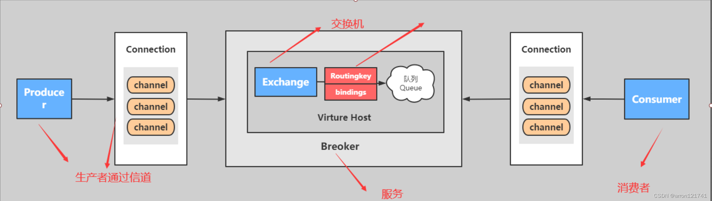
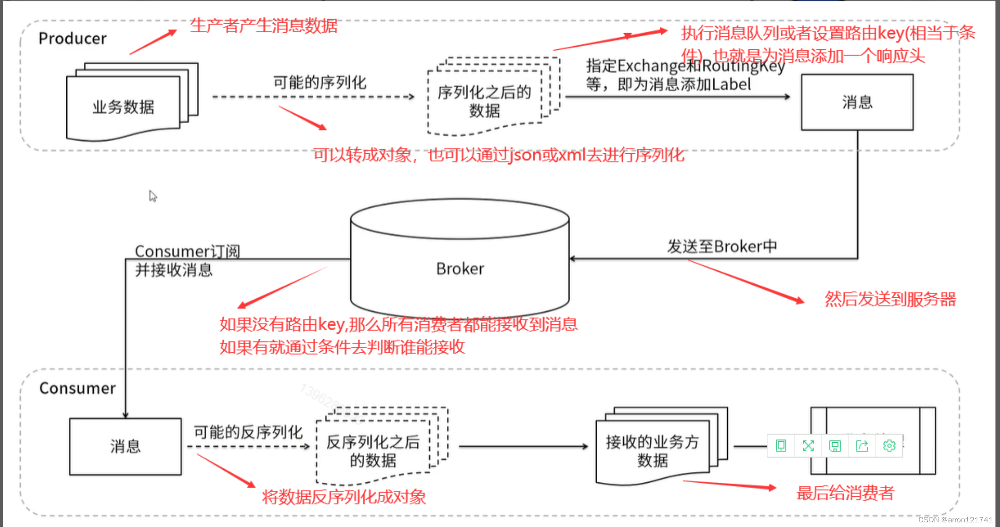

 

# RabbitMQ的基本概念和主要组件

编辑

- **Connection**：连接，**应用程序与Broker**的网络连接 TCP/IP/ 三次握手和四次挥手
- **Channel**：网络信道，几乎所有的操作都在Channel中进行，Channel是进行消息读写的通道，客户端可以建立对各Channel，**每个Channel代表一个会话任务**。
- **Message** :消息：服务与应用程序之间传送的数据，由Properties和body组成，Properties可是对消息进行修饰，比如消息的优先级，延迟等高级特性，Body则就是消息体的内容。
- **Exchange**：交换机，接受消息，根据路由键发送消息到绑定的队列。(不具备消息存储的能力)
- **Routing key**：是一个路由规则，虚拟机可以用它来确定如何路由一个特定消息。
- **Queue**：队列：也成为Message Queue,消息队列，保存消息并将它们转发给消费者。

编辑

# RabbitMQ支持消息的模式

1. **基本消息模型（单生产单消费模型）**：也称为简单消费模型，即生产者将消息发送到队列，消费者从队列中获取消息，完成**基本的一对一**消息转发。
2. **工作队列模型（Work Queues）**：**多个消费者**监听**同一个队列**，消息会均匀地分配给多个消费者处理。这种模式适用于需要多个消费者共同处理消息的场景。
3. **发布/订阅模型（Fanout）**：【**多个消费者多个队列**】生产者将消息发送到交换机，交换机再将消息转发到所有绑定的队列中，每个消费者从自己的队列中取消息。这种模式实现了消息的广播功能。
4. **路由模型（Direct）**：【**多个消费者多个队列**,**增加消息筛选**】在发布/订阅模型的基础上增加了routingKey，生产者发布消息时附带routingKey，交换机根据routingKey将消息路由到对应的队列中。这种模式可以实现有选择性的接收消息。
5. **主题模型（Topic）**：【**多个消费者多个队列**，**增加消息筛选**，**增加模糊匹配**】在路由模型的基础上对routingKey增加了**模糊匹配**的功能，使得交换机能够根据routingKey的匹配规则将消息路由到多个队列中。这种模式适用于更复杂的消息路由需求。
6. **RPC模式**：RabbitMQ还支持双向同步的RPC机制，允许客户端发送请求并等待服务器的响应。这种模式适用于需要远程过程调用的场景

# 为什么选择RabbitMQ不选择其他

- **RocketMQ**主要服务于阿里巴巴内部业务，其社区和文档可能不如RabbitMQ和Kafka完善
- **Kafka**的配置和管理可能更为复杂，Kafka主要关注于**流处理和批量数据传输**，对于某些简单的**点对点通信**场景可能不是最佳选择
- 提供了丰富的**API和插件**
- 灵活的**路由和队列模型，支持多种消息传递模式**

# 在项目中用到了哪些场景

- **异步处理**：
  1. 用户提交订单后，系统可能需要发送确认邮件或短信通知用户。这些操作并不需要立即完成
  2. 在一些大规模下单场景下，**给用户返回类似“抢购请求发送成功”的结果。而在消息队列中，我们将收到的下订单请求一个个的写入数据库中**；消费给完成后进行异步通知
- **服务解耦**
  1. 当用户提交订单后，**订单系统会将订单信息发送到消息中间件**中。库存系统订阅了该**消息中间件中的订单消息**，当收到订单消息后，会进行库存扣减操作并返回结果给消息中间件。同样地，支付系统和物流系统也会根据收到的订单消息执行相应的支付和物流操作。在这个过程中，**订单系统只需要关注订单的生成和状态更新**，而**不需要关心其他系统的具体实现和运行情况**，从而实现了服务间的解耦
- **流量削峰**
  1. **缓冲**，将请求暂时存储在队列中，再由后端服务按照处理能力逐步处理。
  2. 消息队列的**优先级**设置，还可以对紧急订单或重要订单进行优先处理
  3. **支持消费者端的限流控制**。消费者可以设置每次处理的消息数量和处理速度，从而避免在高峰期因过多的并发请求而导致系统崩溃

# RabbitMQ 遇到的挑战和解决方案

## 消息丢失

- **避免发送端消息丢失**：**开启消息确认模式**，只有收到确认后才认为消息发送成功
- **确保重启不会丢失**：将消息和队列都**设置为持久化**
- **生产者重试机制**：当生产者**发送消息失败时设置合理的重试间隔和重试次数**
- **消费者异常处理**：为消费者添加异常处理机制，确保在处理消息时出现异常时，将消息重新放回队列
- **网络问题监控**

## 消费能力不足

- **扩展消费节点**：增加更多的消费者来处理消息，提升消费能力
- **批量取出消息进行处理**：减少与RabbitMQ的交互次数

## 消息重复

- **处理操作**设计为幂等性操作
- **消费者端实现去重机制**：如使用Redis等数据结构来记录已处理过的**消息ID和数据状态**

## 网络问题

- **心跳机制**：可以定期检查连接状态

## 集群模式

- **普通队列**是RabbitMQ默认的队列类型，其消息实体**仅存在于其中一个节点上**。在消费数据时，如果消费者**连接的节点上没有所需数据，集群会临时在节点间传递消息**。而镜像队列则是RabbitMQ的高可用方案，它将队列变为镜像队列，存在于多个节点，消息实体会**主动在节点之间同步**。设计使得**任何一个节点失效时，queue能自动地切换到镜像中的另一个节点以保证服务的可用性**