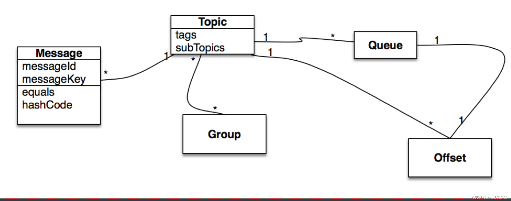

#  RocketMQ简介

RocketMQ是⼀个纯Java、分布式、队列模型的开源消息中间件，前身是MetaQ，是阿⾥参考

Kafka特点研发的⼀个队列模型的消息中间件，后开源给apache基⾦会成为了apache的顶级

# 拥有的功能

- 发布/订阅消息传递模型
- 财务级交易消息
- 各种跨语⾔客户端，例如Java，C / C ++，Python，Go
- 可插拔的传输协议，例如TCP，SSL，AIO
- 内置的消息跟踪功能，还⽀持开放式跟踪
- 多功能的⼤数据和流⽣态系统集成
- 按时间或偏移量追溯消息
- 可靠的FIFO和严格的有序消息传递在同⼀队列中
- ⾼效的推拉消费模型
- 单个队列中的百万级消息累积容量
- 多种消息传递协议，例如JMS和OpenMessaging‘
- 灵活的分布式横向扩展部署架构
- 快如闪电的批量消息交换系统
- 各种消息过滤器机制，例如SQL和Tag
- ⽤于隔离测试和云隔离群集的Docker映像
- 功能丰富的管理仪表板，⽤于配置，指标和监视
- 认证与授权**他的项⽬结构组成是怎么样⼦的？**

# 核⼼模块

- rocketmq-broker：接受⽣产者发来的消息并存储（通过调⽤rocketmq-store），消费者从这⾥取得消息
- rocketmq-client：提供发送、接受消息的客户端API。
- rocketmq-namesrv：NameServer，类似于Zookeeper，这⾥保存着消息的TopicName，队列等运⾏时的元信息。
- rocketmq-common：通⽤的⼀些类，⽅法，数据结构等。
- rocketmq-remoting：基于Netty4的client/server + fastjson序列化 + ⾃定义⼆进制协议。
- rocketmq-store：消息、索引存储等。
- rocketmq-filtersrv：消息过滤器Server，需要注意的是，要实现这种过滤，需要上传代码到MQ！（⼀般⽽⾔，我们利⽤Tag⾜以满⾜⼤部分的过滤需求，如果更灵活更复杂的过滤需求，可以考虑filtersrv组件）。
- rocketmq-tools：命令⾏⼯具。

# 架构组成

> 主要有四⼤核⼼组成部分：**NameServer**、**Broker**、**Producer**以及**Consumer**四部分。

## NameServer

> 主要负责对于源数据的管理，包括了对于**Topic**和路由信息的管理。**NameServer**是⼀个功能⻬全的服务器，其⻆⾊类似Dubbo中的Zookeeper，但NameServer与Zookeeper相⽐更轻量。主要是因为每个NameServer节点互相之间是独⽴的，没有任何信息交互。

**NameServer**压⼒不会太⼤，平时主要开销是在维持⼼跳和提供Topic-Broker的关系数据。

但有⼀点需要注意，Broker向NameServer发⼼跳时， 会带上当前⾃⼰所负责的所有**Topic**信息，如果

**Topic**个数太多（万级别），会导致⼀次⼼跳中，就Topic的数据就⼏⼗M，⽹络情况差的话， ⽹络传输

失败，⼼跳失败，导致NameServer误认为Broker⼼跳失败。

**NameServer** 被设计成⼏乎⽆状态的，可以横向扩展，节点之间相互之间⽆通信，通过部署多台机器来

标记⾃⼰是⼀个伪集群。

每个 Broker 在启动的时候会到 NameServer 注册，Producer 在发送消息前会根据 Topic 到

**NameServer** 获取到 Broker 的路由信息，Consumer 也会定时获取 Topic 的路由信息。

所以从功能上看NameServer应该是和 ZooKeeper 差不多，据说 RocketMQ 的早期版本确实是使⽤的

ZooKeeper ，后来改为了⾃⼰实现的 NameServer 。

## **Producer**

> 消息⽣产者，负责产⽣消息，⼀般由业务系统负责产⽣消息。

**Producer**由⽤户进⾏分布式部署，消息由**Producer**通过多种负载均衡模式发送到**Broker**集群，发

送低延时，⽀持快速失败。

**RocketMQ** 提供了三种⽅式发送消息：同步、异步和单向

**同步发送**：同步发送指消息发送⽅发出数据后会在收到接收⽅发回响应之后才发下⼀个数据

包。⼀般⽤于重要通知消息，例如重要通知邮件、营销短信。

**异步发送**：异步发送指发送⽅发出数据后，不等接收⽅发回响应，接着发送下个数据包，⼀般

⽤于可能链路耗时较⻓⽽对响应时间敏感的业务场景，例如⽤户视频上传后通知启动转码服

务。

**单向发送**：单向发送是指只负责发送消息⽽不等待服务器回应且没有回调函数触发，适⽤于某

些耗时⾮常短但对可靠性要求并不⾼的场景，例如⽇志收集。

## **Broker**

> 消息中转⻆⾊，负责**存储消息**，转发消息。

**Broker**是具体提供业务的服务器，单个Broker节点与所有的NameServer节点保持⻓连接及⼼跳，

并会定时将**Topic**信息注册到NameServer，顺带⼀提底层的通信和连接都是**基于\****Netty实现**的。

**Broker**负责消息存储，以Topic为纬度⽀持轻量级的队列，单机可以⽀撑上万队列规模，⽀持消息

推拉模型。

官⽹上有数据显示：具有**上亿级消息堆积能⼒**，同时可**严格保证消息的有序性**。

## **Consumer**

> 消息消费者，负责消费消息，⼀般是后台系统负责异步消费。

**Consumer**也由⽤户部署，⽀持PUSH和PULL两种消费模式，⽀持**集群消费**和**⼴播消息**，提供**实时**

**的消息订阅机制**。

**Pull**：拉取型消费者（Pull Consumer）主动从消息服务器拉取信息，只要批量拉取到消息，⽤

户应⽤就会启动消费过程，所以 Pull 称为主动消费型。

**Push**：推送型消费者（Push Consumer）封装了消息的拉取、消费进度和其他的内部维护⼯作，

将消息到达时执⾏的回调接⼝留给⽤户应⽤程序来实现。所以 Push 称为被动消费类型，但从实现

上看还是从消息服务器中拉取消息，不同于 Pull 的是 Push ⾸先要注册消费监听器，当监听器处触

发后才开始消费消息。

# 消息领域模型

编辑编辑编辑

## **Message**（消息）

> 要传输的信息

⼀条消息必须有⼀个主题（Topic），主题可以看做是你的信件要邮寄的地址。

⼀条消息也可以拥有⼀个可选的标签（Tag）和额处的键值对，它们可以⽤于设置⼀个业务 Key 并在

Broker 上查找此消息以便在开发期间查找问题。

## Topic

**Topic**（主题）可以看做消息的规类，它是消息的第⼀级类型。⽐如⼀个电商系统可以分为：交易消

息、物流消息等，⼀条消息必须有⼀个 Topic 。

**Topic** 与⽣产者和消费者的关系⾮常松散，⼀个 Topic 可以有0个、1个、多个⽣产者向其发送消息，⼀

个⽣产者也可以同时向不同的 Topic 发送消息。

⼀个 Topic 也可以被 0个、1个、多个消费者订阅。

## Tag

**Tag**（标签）可以看作⼦主题，它是消息的第⼆级类型，⽤于为⽤户提供额外的灵活性。使⽤标签，同

⼀业务模块不同⽬的的消息就可以⽤相同 Topic ⽽不同的 **Tag** 来标识。⽐如交易消息⼜可以分为：交易

创建消息、交易完成消息等，⼀条消息可以没有 **Tag** 。

标签有助于保持您的代码⼲净和连贯，并且还可以为 **RocketMQ** 提供的查询系统提供帮助。

## Group

分组，⼀个组可以订阅多个Topic。

分为ProducerGroup，ConsumerGroup，代表某⼀类的⽣产者和消费者，⼀般来说同⼀个服务可以作为

Group，同⼀个Group⼀般来说发送和消费的消息都是⼀样的

## Queue

在**Kafka**中叫Partition，每个Queue内部是有序的，在**RocketMQ**中分为读和写两种队列，⼀般来说读

写队列数量⼀致，如果不⼀致就会出现很多问题。

## Message Queue

**Message Queue**（消息队列），主题被划分为⼀个或多个⼦主题，即消息队列。

⼀个 Topic 下可以设置多个消息队列，发送消息时执⾏该消息的 Topic ，RocketMQ 会轮询该 Topic 下

的所有队列将消息发出去。

消息的物理管理单位。⼀个Topic下可以有多个Queue，Queue的引⼊使得消息的存储可以分布式集群

化，具有了⽔平扩展能⼒。

## Offset

在**RocketMQ** 中，所有消息队列都是持久化，⻓度⽆限的数据结构，所谓⻓度⽆限是指队列中的每个存

储单元都是定⻓，访问其中的存储单元使⽤Offset 来访问，Offset 为 java long 类型，64 位，理论上在

100年内不会溢出，所以认为是⻓度⽆限。

也可以认为 Message Queue 是⼀个⻓度⽆限的数组，**Offset** 就是下标。

## 消息消费模式

消息消费模式有两种：**Clustering**（集群消费）和**Broadcasting**（⼴播消费）。

默认情况下就是集群消费，该模式下⼀个消费者集群共同消费⼀个主题的多个队列，⼀个队列只会被⼀

个消费者消费，如果某个消费者挂掉，分组内其它消费者会接替挂掉的消费者继续消费。

⽽⼴播消费消息会发给消费者组中的每⼀个消费者进⾏消费。

## Message Order

**Message Order**（消息顺序）有两种：**Orderly**（顺序消费）和**Concurrently**（并⾏消费）。

顺序消费表示消息消费的顺序同⽣产者为每个消息队列发送的顺序⼀致，所以如果正在处理全局顺序是

强制性的场景，需要确保使⽤的主题只有⼀个消息队列。

并⾏消费不再保证消息顺序，消费的最⼤并⾏数量受每个消费者客户端指定的线程池限制。

# **⼀次完整的通信流程是怎样的**

Producer 与 NameServer集群中的其中⼀个节点（随机选择）建⽴⻓连接，定期从 NameServer 获取**Topic** 路由信息，并向提供 Topic 服务的 **Broker Master** 建⽴⻓连接，且定时向 **Broker** 发送⼼跳。

**Producer** 只能将消息发送到 Broker master，但是 **Consumer** 则不⼀样，它同时和提供 Topic 服务的Master 和 Slave建⽴⻓连接，既可以从 Broker Master 订阅消息，也可以从 Broker Slave 订阅消息。具体如下图：

编辑编辑编辑

我上⾯说过他跟**Dubbo**像不是我瞎说的，就连他的注册过程都很像**Dubbo**的服务暴露过程。

是不是觉得很简单，但是你同时也产⽣了好奇⼼，每⼀步是怎么初始化启动的呢？

帅丙呀就知道⼤家都是**求知欲极强的⼈才**，这不我都准备好了，我们⼀步步分析⼀下。

主要是⼈才群⾥的仔要求我写出来。。。(⽂末有进群⽅式)

## NameService启动流程

在org.apache.rocketmq.namesrv⽬录下的**NamesrvStartup**这个启动类基本上描述了他的启动过程我

们可以看⼀下代码：

第⼀步是初始化配置

创建**NamesrvController**实例，并开启两个定时任务：

每隔10s扫描⼀次**Broker**，移除处于不激活的**Broker**；

编辑编辑编辑

每隔10s打印⼀次KV配置。第三步注册钩⼦函数，启动服务器并监听Broker。

## Producer

编辑编辑编辑

**Producer**是消息发送⽅，那他怎么发送的呢？通过轮训，**Producer**轮训某个**Topic**下⾯的所有队列实现发送⽅的负载均衡

编辑编辑编辑

## Broker

**Broker**在RocketMQ中是进⾏处理Producer发送消息请求，Consumer消费消息的请求，并且进⾏消息

的持久化，以及HA策略和服务端过滤，就是集群中很重的⼯作都是交给了**Broker**进⾏处理。

**Broker**模块是通过BrokerStartup进⾏启动的，会实例化BrokerController，并且调⽤其初始化⽅法

编辑编辑编辑

⼤家去看**Broker**的源码的话会发现，他的**初始化流程很冗⻓**，会根据配置创建很多线程池主要⽤来**发送消息**、**拉取消息**、**查询消息**、**客户端管理**和**消费者管理**，也有很多**定时任务**，同时也注册了很多**请求处理器**，⽤来发送拉取消息查询消息的。

## Consumer

编辑编辑编辑

**Consumer**是消息接受，那他怎么接收消息的呢？

编辑

消费端会通过**RebalanceService**线程，10秒钟做⼀次基于**Topic**下的所有队列负载。

# **⾯试常⻅问题分析**

## **优缺点是啥**

RocketMQ优点：

单机吞吐量：⼗万级

可⽤性：⾮常⾼，分布式架构

消息可靠性：经过参数优化配置，消息可以做到0丢失功能⽀持：MQ功能较为完善，还是分布式的，扩展性好

⽀持10亿级别的消息堆积，不会因为堆积导致性能下降

源码是java，我们可以⾃⼰阅读源码，定制⾃⼰公司的MQ，可以掌控

天⽣为⾦融互联⽹领域⽽⽣，对于可靠性要求很⾼的场景，尤其是电商⾥⾯的订单扣款，以及业务

削峰，在⼤量交易涌⼊时，后端可能⽆法及时处理的情况

**RoketMQ**在稳定性上可能更值得信赖，这些业务场景在阿⾥双11已经经历了多次考验，如果你的

业务有上述并发场景，建议可以选择**RocketMQ**

RocketMQ缺点：

⽀持的客户端语⾔不多，⽬前是java及c++，其中c++不成熟

社区活跃度不是特别活跃那种

没有在 mq 核⼼中去实现**JMS**等接⼝，有些系统要迁移需要修改⼤量代码

## **消息去重**

去重原则：使⽤业务端逻辑保持幂等性

**幂等性**：就是⽤户对于同⼀操作发起的⼀次请求或者多次请求的结果是⼀致的，不会因为多次点击⽽产

⽣了副作⽤，数据库的结果都是唯⼀的，不可变的。

只要保持幂等性，不管来多少条重复消息，最后处理的结果都⼀样，需要业务端来实现。

**去重策略**：保证每条消息都有唯⼀编号(**⽐如唯⼀流⽔号\****)**，且保证消息处理成功与去重表的⽇志同时出

现。

建⽴⼀个消息表，拿到这个消息做数据库的insert操作。给这个消息做⼀个唯⼀主键（primary key）或

者唯⼀约束，那么就算出现重复消费的情况，就会导致主键冲突，那么就不再处理这条消息。

## **消息重复**

消息领域有⼀个对消息投递的QoS定义，分为：

最多⼀次（At most once）

⾄少⼀次（At least once）

仅⼀次（ Exactly once）

QoS：Quality of Service，服务质量

⼏乎所有的MQ产品都声称⾃⼰做到了**At least once**。

既然是⾄少⼀次，那避免不了消息重复，尤其是在分布式⽹络环境下。

⽐如：⽹络原因闪断，ACK返回失败等等故障，确认信息没有传送到消息队列，导致消息队列不知道⾃

⼰已经消费过该消息了，再次将该消息分发给其他的消费者。不同的消息队列发送的确认信息形式不同，例如**RabbitMQ**是发送⼀个ACK确认消息，**RocketMQ**是返

回⼀个CONSUME_SUCCESS成功标志，**Kafka**实际上有个offset的概念。

**RocketMQ**没有内置消息去重的解决⽅案，最新版本是否⽀持还需确认。

## **消息的可⽤性**

当我们选择好了集群模式之后，那么我们需要关⼼的就是怎么去存储和复制这个数据，**RocketMQ**对消

息的刷盘提供了同步和异步的策略来满⾜我们的，当我们选择同步刷盘之后，如果刷盘超时会给返回

FLUSH_DISK_TIMEOUT，如果是异步刷盘不会返回刷盘相关信息，选择同步刷盘可以尽最⼤程度满⾜

我们的消息不会丢失。

除了存储有选择之后，我们的主从同步提供了同步和异步两种模式来进⾏复制，当然选择同步可以提升

可⽤性，但是消息的发送RT时间会下降10%左右。

**RocketMQ**采⽤的是混合型的存储结构，即为**Broker**单个实例下所有的队列共⽤⼀个⽇志数据⽂件（即

为CommitLog）来存储。

⽽**Kafka**采⽤的是独⽴型的存储结构，每个队列⼀个⽂件。

这⾥帅丙认为，**RocketMQ**采⽤混合型存储结构的缺点在于，会存在较多的随机读操作，因此读的效率

偏低。同时消费消息需要依赖**ConsumeQueue**，构建该逻辑消费队列需要⼀定开销。

## **RocketMQ** **刷盘实现**

**Broker** 在消息的存取时直接操作的是内存（内存映射⽂件），这可以提供系统的吞吐量，但是⽆法避

免机器掉电时数据丢失，所以需要持久化到磁盘中。

刷盘的最终实现都是使⽤**NIO**中的 MappedByteBuffer.force() 将映射区的数据写⼊到磁盘，如果是同步

刷盘的话，在**Broker**把消息写到**CommitLog**映射区后，就会等待写⼊完成。

异步⽽⾔，只是唤醒对应的线程，不保证执⾏的时机，流程如图所示。**顺序消息：**

我简单的说⼀下我们使⽤的**RocketMQ**⾥⾯的⼀个简单实现吧。

**Tip**：为啥⽤**RocketMQ**举例呢，这玩意是阿⾥开源的，我问了下身边的朋友很多公司都有使⽤，所以

读者⼤概率是这个的话我就⽤这个举例吧，具体的细节我后⾯会在**RocketMQ**和**Kafka**各⾃章节说到。

⽣产者消费者⼀般需要保证顺序消息的话，可能就是⼀个业务场景下的，⽐如订单的创建、⽀付、发

货、收货。

那这些东⻄是不是⼀个订单号呢？⼀个订单的肯定是⼀个订单号的说，那简单了呀。

**⼀个\****topic下有多个队列**，为了保证发送有序，**RocketMQ**提供了**MessageQueueSelector**队列选择机

制，他有三种实现:我们可使⽤**Hash\****取模法**，让同⼀个订单发送到同⼀个队列中，再使⽤同步发送，只有同个订单的创建

消息发送成功，再发送⽀付消息。这样，我们保证了发送有序。

**RocketMQ**的topic内的队列机制,可以保证存储满⾜**FIFO**（First Input First Output 简单说就是指先进先

出）,剩下的只需要消费者顺序消费即可。

**RocketMQ**仅保证顺序发送，顺序消费由消费者业务保证!!!

这⾥很好理解，⼀个订单你发送的时候放到⼀个队列⾥⾯去，你同⼀个的订单号Hash⼀下是不是还是⼀

样的结果，那肯定是⼀个消费者消费，那顺序是不是就保证了？

真正的顺序消费不同的中间件都有⾃⼰的不同实现我这⾥就举个例⼦，⼤家思路理解下。

## 分布式事务

### Half Message(半消息)

**是指暂不能被\****Consumer消费的消息**。Producer 已经把消息成功发送到了 Broker 端，但此消息被标记

为 暂不能投递 状态，处于该种状态下的消息称为半消息。需要 Producer

对消息的 ⼆次确认 后，Consumer才能去消费它。

### 消息回查

由于⽹络闪段，⽣产者应⽤重启等原因。导致 **Producer** 端⼀直没有对 **Half Message(\****半消息)** 进⾏ **⼆**

**次确认**。这是**Brock**服务器会定时扫描 ⻓期处于半消息的消息 ，会主动询问 **Producer**端 该消息的最终状态(**Commit\****或者Rollback**),该消息即为** 消息回查**。

编辑编辑编辑

- A服务先发送个Half Message给Brock端，消息中携带 B服务 即将要+100元的信息。
- 当A服务知道Half Message发送成功后，那么开始第3步执⾏本地事务。
- 执⾏本地事务(会有三种情况1、执⾏成功。2、执⾏失败。3、⽹络等原因导致没有响应)
- 如果本地事务成功，那么Product像Brock服务器发送Commit,这样B服务就可以消费该message。
- 如果本地事务失败，那么Product像Brock服务器发送Rollback,那么就会直接删除上⾯这条半消息。
- 如果因为⽹络等原因迟迟没有返回失败还是成功，那么会执⾏RocketMQ的回调接⼝,来进⾏事务的回查。

## 消息过滤

**Broker**端消息过滤在**Broker**中，按照**Consumer**的要求做过滤，优点是减少了对于

**Consumer**⽆⽤消息的⽹络传输。缺点是增加了Broker的负担，实现相对复杂。

**Consumer**端消息过滤 这种过滤⽅式可由应⽤完全⾃定义实现，但是缺点是很多⽆⽤的消息要传输到**Consumer**端。

## **Broker**的Buffer问题

Broker的**Buffer**通常指的是Broker中⼀个队列的内存Buffer⼤⼩，这类**Buffer**通常⼤⼩有限。

另外，RocketMQ没有内存**Buffer**概念，RocketMQ的队列都是持久化磁盘，数据定期清除。

RocketMQ同其他MQ有⾮常显著的区别，RocketMQ的内存**Buffer**抽象成⼀个⽆限⻓度的队列，不管有多少数据进来都能装得下，这个⽆限是有前提的，Broker会定期删除过期的数据。

例如Broker只保存3天的消息，那么这个**Buffer**虽然⻓度⽆限，但是3天前的数据会被从队尾删除。

## **回溯消费**

回溯消费是指Consumer已经消费成功的消息，由于业务上的需求需要重新消费，要⽀持此功能，Broker在向Consumer投递成功消息后，消息仍然需要保留。并且重新消费⼀般是按照时间维度。

例如由于Consumer系统故障，恢复后需要重新消费1⼩时前的数据，那么Broker要提供⼀种机制，可以按照时间维度来回退消费进度。

**RocketMQ**⽀持按照时间回溯消费，时间维度精确到毫秒，可以向前回溯，也可以向后回溯。

## 消息堆积

消息中间件的主要功能是异步解耦，还有个重要功能是挡住前端的数据洪峰，保证后端系统的稳定性，这就要求消息中间件具有⼀定的消息堆积能⼒，消息堆积分以下两种情况：

- 消息堆积在内存**Buffer**，⼀旦超过内存**Buffer**，可以根据⼀定的丢弃策略来丢弃消息，如CORBANotification规范中描述。适合能容忍丢弃消息的业务，这种情况消息的堆积能⼒主要在于内存**Buffer**⼤⼩，⽽且消息堆积后，性能下降不会太⼤，因为内存中数据多少对于对外提供的访问能⼒影响有限。

- 消息堆积到持久化存储系统中，例如DB，KV存储，⽂件记录形式。 当消息不能在内存Cache命中时，要不可避免的访问磁盘，会产⽣⼤量读IO，读IO的吞吐量直接决定了消息堆积后的访问能⼒。评估消息堆积能⼒主要有以下四点：
  - 消息能堆积多少条，多少字节？即消息的堆积容量。
  - 消息堆积后，发消息的吞吐量⼤⼩，是否会受堆积影响？
  - 消息堆积后，正常消费的Consumer是否会受影响？
  - 消息堆积后，访问堆积在磁盘的消息时，吞吐量有多⼤？**定时消息**

## 定时消息

是指消息发到**Broker**后，不能⽴刻被**Consumer**消费，要到特定的时间点或者等待特定的时间后才能被消费。

如果要⽀持任意的时间精度，在**Broker**层⾯，必须要做消息排序，如果再涉及到持久化，那么消息排序要不可避免的产⽣巨⼤性能开销。**RocketMQ**⽀持定时消息，但是不⽀持任意时间精度，⽀持特定的level，例如定时5s，10s，1m等。