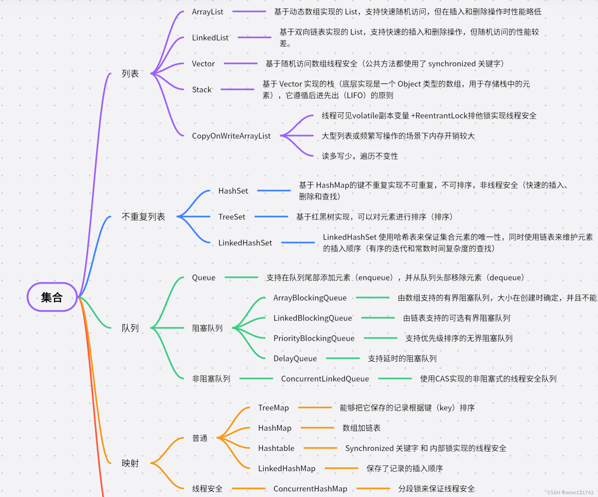

面试-java基础

## 集合-高频面试题



### HashMap 在JDK1.7 和JDK1.8 中差别

1. 数据结构
   - **JDK 1.7**：HashMap在JDK 1.7中是基于数组和链表的实现。当发生哈希冲突时，会使用链表头插来解决冲突。
   - **JDK 1.8**：HashMap在JDK 1.8中引入了红黑树（Red-Black Tree）来优化链表。当链表长度超过一定阈值（默认为8，并且数组长度大于64，否则会先扩容）时，链表会转换为红黑树，以提供更快的查找、插入和删除操作。
2. 插入和扩容时的顺序
   - **JDK 1.7**：在插入新元素或扩容时，HashMap会重新计算元素的hash值，并根据新的hash值重新定位元素在数组中的位置。这个过程可能导致元素的顺序发生变化，尤其是在并发环境下，可能导致链表成环的问题。
   - **JDK 1.8**：JDK 1.8优化了插入和扩容时的顺序问题。扩容时，HashMap会尽量保持原有链表的顺序（倒数第五位的值是0，下标不变，倒数第五位的值是1，原来下标的2倍），并且新插入的元素会被放到链表的尾部，从而避免了链表成环的问题。
3. hash值的计算
   - **JDK 1.7**：hash值的计算采用了9次扰动（4次位运算+5次异或运算），并且hash值在插入后不可改变。
   - **JDK 1.8**：hash值的计算采用了2次扰动（1次位运算+1次异或运算），并且hash值在插入后不可改变（final修饰）。这种变化**减少了hash计算的复杂性**，提高了性能。
4. 扩容策略
   - **JDK 1.7**：HashMap在扩容时会先创建一个新的数组，然后将原数组中的元素重新计算hash值并插入到新数组中。这个过程可能导致大量的数据迁移和重定位。
   - **JDK 1.8**：HashMap**在扩容时**采用了更优化的策略。如果原数组容量未达到64，则直接扩容2倍；如果原数组容量超过64，且链表长度大于8，则将链表转换为红黑树；如果红黑树中的元素个数小于6，则红黑树会还原为链表。这种策略在保持性能的同时，减少了数据迁移和重定位的开销。
5. 并发控制
   - **JDK 1.7**：HashMap本身不是线程安全的，需要外部同步措施来确保线程安全。
   - **JDK 1.8**：虽然HashMap在JDK 1.8中仍然不是线程安全的，但由于其内部结构的优化和扩容策略的改变，它在并发场景下的性能得到了提升。

### HashMap 的长度为什么是2的幂次方

可以用`(length - 1)&hash`这种**位运算来代替%取余**的操作进而提高性能。

### 为什么树化的临界值为8

当桶中结点个数为8时，出现的几率是亿分之6的，因此常见的情况是桶中个数小于8的情况，此时链表的查询性能和红黑树相差不多

### ConcurrentHashMap 在JDK1.7 和JDK1.8 中差别

**在 HashMap基础上增加了线程安全的设置**

在JDK 1.7中，锁住整个Segment段

ConcurrentHashMap主要由Segment数组、HashEntry数组以及ReentrantLock组成。每个Segment都是一个ReentrantLock，可以锁住一段哈希表结构，从而实现分段锁。整个ConcurrentHashMap基于分段锁实现，提高了并发性能。然而，当HashEntry链表过大时，查询效率可能会降低。

而在JDK 1.8中，**synchronized只锁定当前链表或者红黑树的首节点**

ConcurrentHashMap进行了重大改进，摒弃了Segment，采用了synchronized+CAS+红黑树实现的数据结构。锁的粒度也从段锁缩小为结点锁，进一步提高了并发性能。此外，JDK 1.8还优化了put()方法的执行流程，只需要一次定位，并采用CAS+synchronized的机制进行加锁，降低了锁资源的争夺。当链表长度超过一定阈值时，链表会转换为红黑树，以提供更快的查找、插入和删除操作，从而解决了JDK 1.7中查询效率较低的问题

## 并发编程-高频面试

### **线程与进程的区别？**

进程是**资源分配**的最小单位，它包含执行代码、系统资源和线程。线程是**CPU调度的最小单位**，共享进程资源，更轻量。**进程间不共享内存，线程间共享内存空间**。进程间通信需要进程间通信(IPC)机制，而线程间可以直接读写共享内存进行通信。

### **什么是线程的上下文切换？**

线程的上下文切换是指CPU从一个线程切换到另一个线程时需要保存当前线程的状态（如程序计数器、栈指针等），并恢复下一个要执行线程的状态的过程。

### **Java中的线程有几种创建方式？**

Java中创建线程主要有三种方式：

- 继承Thread类并重写run()方法。
- 实现Runnable接口并重写run()方法，然后将Runnable对象作为参数传递给Thread类的构造函数。
- 实现Callable接口并使用FutureTask包装，通过线程池执行。

### **什么是线程的生命周期？**

线程的生命周期通常包括新建（New）、就绪（Runnable）、阻塞（Blocked）、运行（Running）、终止（Terminated）几个状态。

### **JMM内存模型**

> Java内存模型（JMM）通过一系列规则和机制来保证可见性、原子性和有序性（现代处理器改**变代码中指令的执行顺序**，但不会改变程序的最终结果）

**定义了主内存和工作内存：**

- 主内存是所有线程共享的内存区域，包含所有的共享变量。
- 每个线程都有自己的工作内存，用于保存该线程使用到的变量的副本
- 通过如下来保证了并发编程中的 通过一系列规则和机制来保证可见性、原子性和有序性

1. volatile、synchronized 、 Lock保证了可见性
2. synchronized 或 Lock 、原子类 保证了操作的**原子性**
3. happens-before 规则来保证有序性，比如**程序顺序规则**：一个线程中的每个操作，`happens-before`于该线程中的任意后续操作；**volatile变量规则**：对一个`volatile`变量的写，`happens-before`于任意后续对这个`volatile`变量的读

### 线程和进程间如何通信

> 线程是在同一个进程内部运行的多个执行单元，它们共享进程的地址空间和其他资源，通信**主要依靠于共享内存**

1. **共享内存**：线程之间可以直接读写共享内存中的变量来实现通信。这种方式简单直接，但需要注意同步问题，以避免数据竞争和不一致。
2. **消息传递**：线程可以使用消息队列、条件变量、信号量等机制来传递消息。这种方式可以实现异步通信，但需要注意消息的格式和同步问题。
3. **原子操作**：对于简单的数据交换，可以使用原子操作来确保线程安全。例如，使用`atomic_flag`或`std::atomic`等原子类型

> 进程是操作系统分配资源的基本单位

1. **管道（Pipe）**：管道是一种最基本的IPC机制，它**允许一个进程和另一个有亲缘关系的进程进行通信**。管道是半双工的，数据**只能单向流动**，且只能在有共同祖先的进程间使用。
2. **命名管道（Named Pipe）**：命名管道也是管道的一种，但是它有一个名字，使得**无亲缘关系进程间也可以通信**。
3. **信号（Signal）**：信号是一种比较复杂的通信方式，用于通知接收进程某个事件已经发生。
4. **消息队列（Message Queue）**：消息队列是消息的链接列表，存放在内核中并由消息队列标识符标识。它是消息的集合，每个消息都有一个特定的类型，进程可以按类型读写队列中的消息。
5. **套接字（Socket）**：套接字是最常用的进程间通信方式之一，它是网络通信的基础，不仅可用于本地进程间的通信，还可以通过网络进行不同机器间的通信

### 解决线程安全问题

- 破坏多线程条件：同一时刻，一条线程对共享资源进行非原子性操作，不会产生线程安全问题（**Synchronized与ReetrantLock**）
- 破坏共享资源条件：同一时刻多条线程对局部资源进行非原子性操作，也不会产生线程安全问题（**ThreadLocal**）
- 破坏非原子性条件：同一时刻多条线程对共享资源进行原子性操作，也不会产生线程安全问题（**CAS**）

#### java的不同的几种锁（JVM级别，破坏多线程条件）


##### volatile关键字

- 保证变量有序和可见性
- `volatile` 通常用于标识状态变量

##### **synchronized 关键字**

> jvm层面，内部由JVM完成

- **原理**：依赖于 Java 对象头中的锁标记位和 Monitor 对象，1.6之前
  - **Java 对象头**：Java 对象在内存中的布局可以分为三个部分：对象头、实例数据和对齐填充。其中，对象头包含了关于对象的元数据信息，如哈希码、GC 分代年龄、锁状态标志、线程持有的锁、偏向线程 ID 等。`synchronized` 锁的状态就是保存在对象头中的。
  - **Monitor 对象**：Monitor 是线程同步的工具，通常可以认为是一个对象。每个 Java 对象都有一个与之关联的 Monitor。Monitor 中包含了两个队列：一个是 Entry List（进入列表），用于存放等待获取锁的线程；另一个是 Wait Set（等待集合），用于存放已经获取到锁但又需要等待某个条件的线程
  - **存在问题**：线程阻塞和上下文切换（调用底层的线程挂起和唤醒）
- **锁在后期不同版本的优化**：
  - **无锁状态**：多个线程可以同时访问临界区，没有互斥操作
  - **偏向锁**：只有一个线程访问临界区时，JVM 将该锁偏向于该线程，避免重复获取锁的开销。如果其他线程尝试获取锁，则撤销偏向锁
  - **轻量级锁**：一旦有第二个线程参与竞争，就会立即膨胀为轻量级锁。企图抢占的线程一开始会使用自旋，超过自旋次数就省纪委重量级锁，（1.7 之后，引入了**适应性自旋**。简单来说就是：这次自旋获取到锁了，自旋的次数就会增加;这次自旋没拿到锁，自旋的次数就会减少）
  - **重量级锁**：膨胀成重量级锁后，其他竞争的线程进来就不会自旋了，而是直接阻塞等待，并且 Mark Word 中的内容会变成一个监视器(monitor)对象，用来统一管理排队的线程
- **特点**：隐式锁，自动释放锁，保证了互斥性和可见性。
- **适用场景**：**适用于简单的同步场景，对于代码块或方法级别的同步控制**。
- **性能比较**：性能一般，在低并发情况下性能表现良好，但高并发时性能相对较差。

##### AQS同步器

1. 它维护了一个**共享资源state**（由volatile修饰）以及一个双向链表结构的同步队列和一个单链表结构的条件队列。AQS通过控制state变量的值来判断锁的状态，并利用CAS机制保证操作的原子性

2. 公平锁的实现方式就是，线程在竞争锁资源的时候**判断 AQS 同步队列里面有没有等待的线程**。如果**有，就加入到队列的尾部等待**。

   而非公平锁的实现方式，就是**不管队列里面有没有线程等待，它都会先去尝试抢占锁资源**，如果抢不到，再加入到AQS 同步队列等待

##### CAS

- 比较并设置
- 缺点：
  1. 循环时间长开销很大，如果CAS失败，会一直进行尝试。如果CAS长时间一直不成功，可能会给CPu带来很大的开销
  2. ABA问题（版本号，带有时间戳的原子引用）

##### 为什么默认都是非公平锁

> 如果按照公平的策略去阻塞等待，同时 AQS 再把等待队列里面的线程唤醒，这里会涉及到内核态的切换，对性能的影响比较大

##### ReentrantLock（重入锁）

**原理**：

- 基于AQS实现的可重入锁（**state就用来表示加锁的次数。0标识无锁，每加一次锁state就加一，释放锁state就减一**）。

- 允许线程重复获取已经持有的锁，而不会死锁。

- 支持**公平锁和非公平锁**策略

  ReentrantLock 内部使用了 **AQS** 来实现锁资源的竞争，

  编辑编辑编辑

  公平锁的实现方式就是，线程在竞争锁资源的时候**判断 AQS 同步队列里面有没有等待的线程**。

  如果**有，就加入到队列的尾部等待**。

  而非公平锁的实现方式，就是**不管队列里面有没有线程等待，**

  **它都会先去尝试抢占锁资源**，如果抢不到，再加入到AQS 同步队列等待

**特点**：

- 提供了比`synchronized`更灵活的锁获取和释放机制。
- **不会阻塞线程**。
- **支持响应中断**。
- **允许设置锁是否公平**。

**场景**：

- 需要更高的灵活性，比如需要中断等待锁的线程或尝试获取锁的场景。
- 需要实现公平锁的场景。

**性能**：

- 在高竞争环境下，性能通常与`synchronized`相当或略好，取决于JVM和具体的使用场景。

##### ReentrantReadWriteLock（排它锁）

**原理**：

- 基于**内部类 `ReadLock` 和 `WriteLock`**，它们分别实现了 `Lock` 接口，用于提供读锁和写锁的功能，**state分为高16和低16位来标识锁状态**
- **公平性策略**：
  - `ReentrantReadWriteLock` 可以配置为公平的或非公平的
  - 在公平模式下，等待时间最长的线程将获得锁。如果当前没有写锁，那么等待时间最长的读线程将获得读锁；如果有一个或多个线程在等待写锁，那么等待时间最长的写线程将获得写锁。
  - 在非公平模式下，锁的获取顺序是不确定的，可能会导致“饥饿”现象
- 允许多个线程同时读，但只允许一个线程写。
- 写锁是独占的，写时不能读。

**特点**：

- 提高了并发性能，因为多个读线程可以并行。
- 提供了读锁和写锁的分离，使得读写操作更加灵活。

**场景**：

- 数据结构在大部分时间是读操作，写操作较少时。
- 需要对读操作进行优化以提高并发性的场景。

**性能**：

- 在读多写少的场景下性能优越。
- 写密集型场景下性能可能不如独占锁。

#### **原子变量**及其使用场景（破坏非原子性条件）

- `AtomicInteger`，`AtomicLong`、`AtomicReference`、`AtomicBoolean`等
- 无锁机制，它通过使用CAS操作来避免线程间的阻塞，因此通常具有更高的性能
- 经常用于计数器、状态标志、缓存管理等场景。例如，在高并发环境下，你可能需要一个线程安全的计数器来追踪某些事件的数量。使用`AtomicInteger`可以确保多个线程在同时更新计数器时不会导致数据不一致

#### ThreadLocal（破坏共享资源条件）

- 为每条线程开辟一块自己的存储空间。所以如果`ThreadLocal.set()`的**对象如果是共享的，多线程情况下也会造成线程安全问题**
- 每个线程新建一个
- 线程池情况下可能会产生脏数据
- ThreadLocal可能会造成内存泄露

### 解决线程协作问题

#### CountDownLatch

当线程**调用CountDownLatch的await()方法时**，**如果CountDownLatch的count值不为0，那么该线程会被阻塞**，加入到AQS队列中等待。其他线程可以调用CountDownLatch的countDown()方法来对count值进行减1操作，**当count值减到0时，表示所有需要等待的线程都已经等待完成，此时在AQS队列中等待的线程会被唤醒，可以继续执行后续的任务**。

#### Semaphore

Semaphore**内部维护了一个计数器**，表示当前可用的许可证数量。当线**程调用acquire()方法获取许可证时，如果计数器值大于0，则将该值减1，并允许线程继续执行。如果计数器值为0，则线程会被阻塞**，加入到AQS队列中等待。其他线程可以通过release()方法释放许可证，当释放许可证后，会唤醒AQS队列中等待的线程，让其继续执行。Semaphore可以**用来控制对共享资源的访问，确保同一时刻只有指定数量的线程可以访问该资源**

#### CyclicBerrier

> 让一组线程互相等待，直到所有线程都到达某个公共屏障点

##### 应用场景

- 并行计算：例如，在分布式计算框架中，将一个大任务划分为多个小任务，每个线程处理一个小任务，然后使用 CyclicBarrier 等待所有线程完成。
- 多线程游戏或模拟：在需要所有玩家或模拟实体同时达到某个状态的游戏或模拟中，可以使用 CyclicBarrier。
- 多阶段任务：需要将任务划分为多个阶段，每个阶段的所有任务完成后才能进入下一个阶段

##### 与 CountDownLatch 的区别

- CountDownLatch 的计数器只能使用一次，而 CyclicBarrier 的计数器可以使用 `reset()` 方法重置，因此它可以处理更复杂的业务场景。
- CountDownLatch 主要用于一个线程等待多个线程完成任务的场景，而 CyclicBarrier 用于一组线程互相等待的场景。
- 使用 CyclicBarrier 时，需要注意线程安全和异常处理，避免因为某个线程的错误导致整个系统挂起或崩溃

### 线程池

#### 线程池作用

- 重复利用已创建的线程来降低线程创建和销毁的开销
- 提前创建线程，提高响应速度
- 避免占用大量资源，性能调优

#### 线程池分类


#### 线程池调优

> 所有参数动态配置到动态的配置中心


### 处理异步任务

#### Future

> 可以在一个线程中提交一个任务，并在另一个线程中获取任务的结果

#### ForkJoin

- 用于解决分而治之（Divide and Conquer）类型的问题，将大任务拆分成小任务并行执行，最后合并结果
- **ForkJoinPool** 是 ForkJoin 框架的核心类，它可以自动管理工作线程的创建和销毁，实现任务的分配和合并
- **ForkJoinTask** 是 ForkJoin 框架中表示任务的抽象类，可以通过继承它来实现自定义的任务

#### Callback

> 回调函数（Callback）是一种常用的机制，用于在异步操作完成后通知应用程序并传递结果，不阻塞当前线程运行

```
     public static void main(String[] args) {
         RemoteService.fetchData(new Callback() {
             @Override
             public void onSuccess(String result) {
                 System.out.println("Got result: " + result);
             }
 
             @Override
             public void onFailure(Exception e) {
                 System.out.println("Failed to get result: " + e.getMessage());
             }
         });
 
         System.out.println("Waiting for result...");
     }
```

#### CompletableFuture

- 用于处理异步操作和构建异步数据流。它提供了丰富的 API，支持链式调用、组合多个 CompletableFuture 等操作。
- CompletableFuture 可以通过 thenApply、thenAccept、thenCompose 等方法来处理异步操作的结果，并支持**异常处理、超时设置**等功能。
- CompletableFuture 还提供了一些静态方法，如 CompletableFuture.supplyAsync、CompletableFuture.runAsync 等，用于创建异步任务。
- CompletableFuture 是基于 Future 接口的扩展，在 Future 的基础上增加了更多的功能和灵活性

### 分布式锁实现方式

#### 基于数据库

> 很难做到通过事件监听机制来获取到释放锁的事件，所以程序只能轮询地去尝试获取锁，类似自旋锁的阻塞方式，**对数据库资源消耗极大**

#### 基于Redis

- SET key value NX PX|EX time，非原子性操作，**设置过期时间防止线程崩溃锁一直占有**；非原子性操作并发的时候会存在问题
- lua脚本，原子操作
- 单点Redis锁失效如何解决
  - **AOF持久化机制**，每秒钟同步一次，可能恢复之后少了某个锁的数据，其他使用者就可以获取到这个锁，导致状态错乱；设置为Always，就是每个操作都要同步，这样的话会严重降低Redis的性能
  - **主从高可用，将单点变成多点模式**来解决单点故障的，主从复制它是异步的，所以这种方式也会存在数据丢失的风险。主从高可用机制发现主节点不可用，到完成主从切换也是需要一定时间的，这个时间跟锁的过期时间需要平衡好，否则当从节点接受之后，这个锁的状态及正确性是不可控的

#### RedLock

- **多个完全独立**的Redis节点组成，不是主从关系或者集群关系，一般**要求分开机器部署**的
- 系统中**大多数存活即可用**的原则来保证锁的高可用

##### 获取锁

- 顺序地向节点发起命令，满足多数原则
- 向每个节点尝试获取锁的时候，有一个超时时间限制，而且这个时间远小于锁的有效期（防止单节点故障）

##### 释放锁

- 向所有节点发起释放锁的操作，不管这些节点有没有成功设置过

##### 存在问题

- **性能开销**：由于RedLock算法需要向多个Redis节点发送请求并等待响应，这会增加网络开销和延迟。在高并发环境下，这可能会成为性能瓶颈
- **资源消耗**：在多个Redis节点上创建锁
- **依赖Redis**：RedLock算法完全依赖于Redis
- **竞争条件**：在某些高并发情况下，由于**网络延迟**或其他原因，可能**会出现多个客户端同时获得同一把锁**的情况，这可能导致数据不一致或其他问题
- RedLock算法需要定期续期锁，以防止锁被其他客户端获取

#### Redisson

##### 保证加锁的原子性

> lua 脚本（锁名称 + 过期时间【防止死锁】 + 【客户端UUID + 线程ID】）

##### 自动延长加锁时间

- watchdog默认每10s执行，来延长加锁时间

##### 如何实现可重入加锁

判断当前已经加锁的key对应的加锁线程跟要来加锁的线程是不是同一个，如果是的话，就**将这个线程对应的加锁次数加1**，也就实现了可重入加锁

##### 主动释放锁和避免其它线程释放了自己加的锁


##### 实现超时自动释放锁

不指定超时时间时，会开启watchdog后台线程，不断的续约加锁时间，而指定超时时间，就不会去开启watchdog定时任务，这样就不会续约，加锁key到了过期时间就会自动删除

##### 实现不同线程加锁的互斥

lua脚本加锁的逻辑同时只有一个线程能够执行（redis是单线程的原因），所以一旦有线程加锁成功，那么另一个线程来加锁，前面两个if条件都不成立，最后通过调用redis的pttl命令返回锁的剩余的过期时间回去

##### 加锁失败之后如何实现阻塞等待加锁

最终会执行死循环（自旋）地的方式来不停地通过tryAcquire方法来尝试加锁，直到加锁成功之后才会跳出死循环，如果一直没有成功加锁，那么就会一直旋转下去，所谓的阻塞，实际上就是自旋加锁的方式

##### 如何实现阻塞等待一定时间还未加锁成功就放弃加锁

加了超时的判断，如果超时了，那么就退出循环，放弃加锁

##### 如何实现公平锁

如果加锁失败了，那么会将线程扔到一个set集合中，这样就按照加锁的顺序给线程排队，set集合的头部的线程就代表了接下来能够加锁成功的线程。当**有线程释放了锁之后，其它加锁失败的线程就会来继续加锁**，**加锁之前会先判断一下set集合的头部的线程跟当前要加锁的线程是不是同一个，如果是的话，那就加锁成功，如果不是的话，那么就加锁失败**，这样就实现了加锁的顺序性

##### 如何实现读写锁

##### 如何实现批量加锁

##### 如何实现RedLock算法

#### Zookeeper