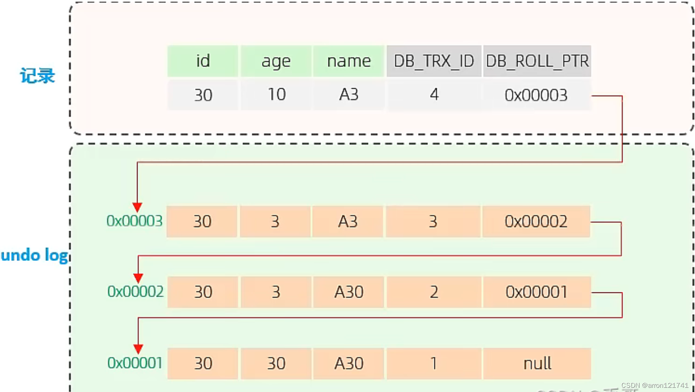
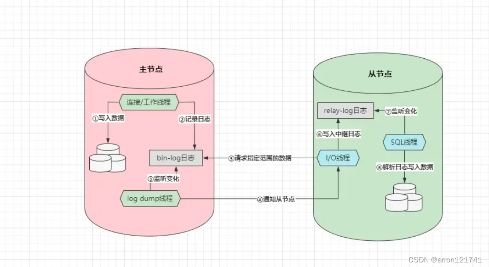
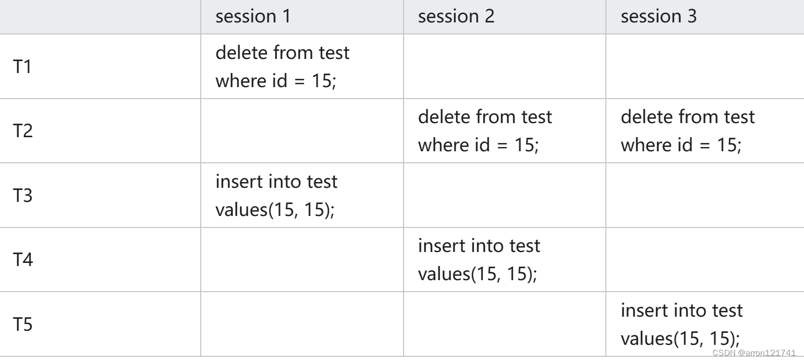

#  面试-mysql整体架构


- 网络连接层

  编辑

  **TCP/IP协议**连接客户端，用户校验，**开辟线程维护当前客户端的连接**，**数据库连接池**复用连接，节省了连接资源开销

- 系统服务层

  **SQL接口**，**存储过程**，**触发器**

  **解析器**（正确性验证），**优化器**（选择合适索引，join方式）

  **查询缓存**（**查询**的时候不必每次都去磁盘，**更新**的时候修改缓冲区然后刷盘）**5.7以前的版本**有，8以后移除（缓存命中率低，占用内存，需要`LRU`算法淘汰缓存，增加查询步骤，项目中存在业务缓存）

  **checkpoint机制**：是InnoDB引擎专有的，主要作用是用来刷写内存中变更过的数据页（索引页、日志页、表数据等等），有事务提交，每秒一次；提交事务刷新；放到内核缓冲区交给OS控制

- 存储引擎层

  `MySQL`支持的各大存储引擎

- 文件系统层

  **日志**（**binlog**：数据库的所有写操作，**redo-log**：重做/重写，**undo-logs**：记录事务开始前[修改数据]的备份，**relay-log**：主从复制做数据拷贝），以及**数据、索引文件**

# 面试-mysql-sql执行过程

**查语句**：

1. **SQL接口**：计算哈希值，去「查询缓存」中比对,找到返回
2. **解析器**：正确性验证
3. **优化器**：根据语法树制定出多个执行计划，
4. **执行器**：调用存储引擎所提供的`API`获取数据
5. **存储引擎**：去磁盘中检索数据（索引、表数据）,返回给sql接口
6. **SQL接口**：对所有的结果集进行处理（剔除列、合并数据）

**写语句**：

1. **SQL接口**：计算哈希值，去「查询缓存」中比对,找到删除
2. **解析器**：正确性验证
3. **优化器**：根据语法树制定出多个执行计划
4. **文件系统层**：记录一下**undo-log**日志和**redo-log(prepare状态)**日志
5. **执行器**：在**缓冲区**中查找行记录或表数据；**存在**：对缓冲区中的数据进行写操作，利用`Checkpoint`机制刷写到磁盘，**不存在**：调用存储引擎的`API`，发生磁盘`IO`，对磁盘中的数据做写操作
6. **执行器**：事务提交后，记录`bin-log`，将`redo-log`日志中的记录改为`commit`状态（两段提交）【redo-log和bin-log也有缓冲区，刷盘策略：有事务提交，每秒一次；提交事务刷新；放到内核缓冲区交给OS控制（redo独有）】

# 面试-mysql-连接池

- 客户端连接池：减少多次创建数据库连接时，**频繁出现的`TCP`三次握手**、四次挥手、`SSL`握手等过程。
- 服务端连接池：减少多次创建数据库连接时，**频繁创建和销毁工作线程**造成的资源开销
- **并不是最大连接数越大越好**：本质是线程，机器核心有限，频繁的在每条线程之间切换`CPU`资源，反而变慢
- **工作线程**，自身会绑定客户端的会话信息，执行完成后，根据这个地址去封装数据报文


# 面试-mysql-数据库范式

1. 第一**范式**(确保每列保持原子性)
2. 第二**范式**(确保表中的每列都和主键相关)
3. 第**三范式**(确保每列都和主键列直接相关,而不是间接相关)


# 面试-InnoDB 和 MyISAM

| 事务支持               | InnoDB       | MyISAM                             |
| ---------------------- | ------------ | ---------------------------------- |
| 事务支持               | 支持         | 不支持                             |
| 数据锁定范围           | 行           | 表                                 |
| 外键支持（引用完整性） | 支持         | 不支持                             |
| 性能                   | 高负载下较好 | 一般                               |
| 内存管理               | 内存小       | 静态表、动态表、压缩表（减少空间） |
| 全文检索               | 不支持       | 支持                               |


# 面试-mysql-索引

## **如何从磁盘中按条件读取数据**

一次`IO`会读取`16KB`磁盘数据放入内存，接着和`SQL`语句的条件做对比，符合条件的留在内存，其他的丢弃

存储在磁盘中的特定数据结构，用于搜索，排序

## **不同维度的索引**

**数据结构**：`Hash`索引（**无序**）、`B+Tree`索引、`R-Tree`索引、`T-Tree`索引

**字段数量**：单列索引（由单个字段组成）、联合索引（由多个字段组成，**符合最佳左前缀**）、前缀索引（**由单/多个字段的前面一部分组成，不支持ORDER BY、GROUP BY，索引覆盖**）

**功能逻辑**：普通索引、唯一索引（**查询快，插入需要验证**）、主键索引（**非自增导致索引树分裂**）、全文索引（like查询，**占用空间大，修改后反应慢**）、空间索引

**存储方式**：聚簇索引（索引数据和表数据会放在磁盘的同一块位置上存储）、非聚簇索引 （索引数据和表数据是分开的，通过地址指针的形式指向数据）

## **为什么选择B+树，不选择其他**

- 查找和排序
  - 二叉树（左小右大，最多两个叶子结点，可以二分查找，容易线性链表）
  - 平衡树（旋转维持每个节点左右子树高度差不超过1，绝对平衡，查找性能 O(log n) ，插入和删除使用旋转操作相对复杂，需要更多的计算资源）
  - 红黑树（颜色和旋转操作来维持平衡，追求大致平衡，只需要最多三次旋转就能达到平衡，单路）
  - B树（平衡的多路搜索树，其中每个节点可以有多个子节点。B树的阶（即每个节点允许的最大子节点数）决定了树的平衡性和查找性能）
  - B+树（所有数据都存储在叶子节点中，并且叶子节点之间通过指针链接。这使得范围查询和顺序访问更为高效）

## 一般选什么作为主键

- 递增特性或者和业务无关的
- 非递增需要**索引书树分裂**，后边的节点**批量移动过程中加锁、阻塞**

## 衡量一条sql语句性能

**SQL查询语句瓶颈**分析(**EXPLAIN + SQL**)

编辑

编辑编辑

- **ID（表加载顺序）**
  - 相同，执行顺序从上往下
  - 不同，有子查询，运算优先级高ID最大，先被执行
- **select_type**
  - SIMLPE：简单查询不包含子查询或者union
  - PRIMARY：包含子查询的最外层
  - SUBQUERY：在SELECT或WHERE包含子查询
  - DERIVED：在FROM列表包含的子查询
  - UNION：UNION后边的select
  - UNION RESULT：从UNION表获取结果的SELECT
- **table（属于哪张表）**
- **type（数据扫描类型）**
  - system：只有一行记录
  - const：主键或者唯一索引有且只有一条
  - eq_ref：主键或者唯一索引每个只有一条与之匹配
  - ref：非唯一索引匹配
  - range：范围索引扫描（between，in，》，《）
  - index：遍历索引树
  - all：全表扫描
- **possible_keys（可能用到的索引）**
- **key**
  - 实际使用的索引（**包含覆盖索引:select查询字段和索引字段排序、数量完全一致**），没有为NULL；
- **key_len**
  - 索引字段的最大可能长度
- **ref**
  - 索引的哪些列被使用，这些列被用于查找索引列上哪些值
- **rows**
  - 每张表多少行被优化器查询
- **Extra**
  - using filesort：mysql不能用索引完成的排序
  - using temporary：查询排序使用了临时表（group by，sort）
  - using index：索引用于数据行查找
  - using where：索引用于索引键值查找
  - using join buffer：使用了连接缓存
  - impossible where
  - select tables optimized away
  - distinct
  - using index condition：查找使用了索引，不需要回表查询，因为要过滤的字段在索引中

## 索引失效状况

- 查询中带有OR，模糊查询中like以%开头导致索引失效，索引字段参与计算，违背最左前缀原则，范围操作
- 不同字段值对比（**一张表中查询出一些值，**然后根据这些值去其他表中筛选数据）

## 索引优化

- 索引覆盖（查询列包含索引列）

- 索引下推（5.6以后，**完全用到联合索引的所有筛选字段，而不是回表筛选再回表**）

  ```
    SELECT * from user where  name like '陈%' and age=20
  ```

  - 5.6 以前，据联合索引最左前缀原则，我们在非主键索引树上找到第一个满足条件的值时，通过叶子节点记录的主键值再回到主键索引树上**查找到对应的行数据**，再对比是否为当前所要查找的性别
  - 只有符合条件了再进行回表。结合我们的例子来说就是**当满足了**性别 sex = 1 了，再回表查找。这样原本可能需要进行回表查找 4 次，现在可能只需要 2 次就可以了

- MRR（随机`IO`转换为顺序`IO`，**缓冲区数据排序，达到大小再去回表**）

- 索引跳跃式扫描（**优化器会自动对联合索引中的第一个字段的值去重，然后基于去重后的值全部拼**，如果字段具备唯一性就是全表）

## 创建索引后Mysql会干什么

- 判断索引数据是否符合规则（唯一索引、主键索引），分词（全文索引），截取（前缀索引），拼接（联合）
- 重构B+Tree，哈希计算，解决哈西冲突（链地址法）
- 存储引擎处理（主键：重排序；次级索引：将非聚簇索引的索引值，与行数据对应的聚簇索引键的关联起来）

# 面试-mysql-事务和锁机制

## ACID

> 作为逻辑单元的一系列操作并且满足ACID特性

```
  原子性(全部成功，要么全部失败)
  一致性（数据库中的数据应满足完整性约束）
  隔离性（多个事务并发执行的结果与这些事务串行执行的结果一致）
  持久性（对数据库的修改被持久化）
```

## 并发事务存在问题

- 更新丢失：**最后的更新覆盖**了**其他事务之前的更新**，而事务之间并不知道
- 脏读：读到了**其他事务未提交的数据**
- 不可重复读：**一个事务内**，**多次读取**同一批数据不一致（偏重读取）
- 幻读：**批量更新获取数据**仍有未更新数据（**B事务插入了**）

## 并发事务带来哪些问题?

1. **脏读（Dirty Read）：**一个事务读取了另一个事务未提交的数据。假设事务A修改了一条数据但未提交，事务B却读取了这个未提交的数据，导致事务B基于不准确的数据做出了错误的决策。【**读未提交**】
2. **不可重复读（Non-repeatable Read）：**一个事务在多次读取同一数据时，得到了不同的结果。假设事务A读取了一条数据，事务B修改或删除了该数据并提交，然后事务A再次读取同一数据，发现与之前的读取结果不一致，造成数据的不一致性。【**数据被修改了**】
3. **幻读（Phantom Read）：**一个事务在多次查询同一范围的数据时，得到了不同数量的结果。假设事务A根据某个条件查询了一组数据，事务B插入了符合该条件的新数据并提交，然后事务A再次查询同一条件下的数据，发现结果集发生了变化，产生了幻觉般的新增数据。【**范围数据中有新增的**】
4. **丢失修改（Lost Update）：**两个或多个事务同时修改同一数据，并且最终只有一个事务的修改被保留，其他事务的修改被覆盖或丢失。这种情况可能会导致数据的部分更新丢失，造成数据的不一致性【**部分数据的更新丢失**】


## 事务如何实现

- undo-log：主要记录`SQL`的**撤销日志**，比如目前是`insert`语句，就记录一条`delete`日志。
- redo-log：记录当前`SQL`归属事务的状态，以及记录修改内容和修改页的位置（redo-log两段式提交和刷盘）
- bin-log：记录每条SQL操作日志，只要是用于数据的**主从复制与数据恢复/备份**


## 都有什么锁

### 锁粒度划分：

#### **表锁**

- 全局锁：加上全局锁之后，**整个数据库只能允许读**，不允许做任何写操作。
- 元数据锁 / `MDL`锁：基于表的元数据加锁，加锁后**整张表不允许其他事务操作**。
- 意向锁：这个是`InnoDB`中为了支持多粒度的锁，为了**兼容行锁、表锁而设计的**。
- 自增锁 / `AUTO-INC`锁：这个是为了**提升自增ID的并发插入性能而设计的**

#### **页面锁**

#### **行锁**

| 记录锁                 | 等值查询，精确匹配     |
| ---------------------- | ---------------------- |
| 间隙锁                 | 范围查询               |
| 临建锁（左开右闭区间） | 范围查询且命中具体的值 |

### **互斥性**

- 共享锁 / `S`锁：不同事务之间不会相互排斥、可以同时获取的锁。
- 排他锁 / `X`锁：不同事务之间会相互排斥、同时只能允许一个事务获取的锁。
- 共享排他锁 / `SX`锁：`MySQL5.7`版本中新引入的锁，主要是解决`SMO`（**无序数据插入**，破坏树结构，**对整棵索引树上锁**）带来的问题

### **加锁方式**

- 显示锁：编写`SQL`语句时，手动指定加锁的粒度。
- 隐式锁：执行`SQL`语句时，根据隔离级别自动为`SQL`操作加锁
- 释放锁的工作都是`MySQL`自动完成，读未提交级别，`MySQL`执行完一条语句后就会立马释放锁，其他级别需要等待持有锁的事务结束


## MVCC【解决并发读写的读取】是什么，怎么实现

> mysql多线程下并发读不存在问题，并发读写会存在（脏读，不可重复读,幻读），并发写的情况下会存在丢失更新问题

如何实现：

- Undo-log日志的版本链 + 数据表上的隐藏字段【**提供多版本的数据**】

> 对于不同事务或相同事务对同一条记录进行修改，会导致该记录的undo log生成一条记录版本链（事务id + 回滚指针）

- `ReadView【`确定读取的时候读取哪个版本的数据】
  - 每开启一个事务都会形成一个读视图
    - 创建该视图时的 事务id
    - 创建该视图时的 活跃事务id集合
    - 创建该视图时的 最小活跃事务id
    - 创建该视图时的 下一个理论id
  - 确定读取哪个版本的数据
    - **读取的事务id** < 最小活跃事务id；该版本对当前事务可见
    - **读取的事务id** > 最大活跃事务id；该版本对当前事务不可见
    - 最小活跃事务id < **读取的事务id** < 最大活跃事务id
      - 读取的事务id在活跃事务id集合，不可见
      - 读取的事务id不在活跃事务id集合，可见


## 事务隔离机制如何实现

- 读未提交/`RU`：写操作加排他锁，读操作不加锁。
- 读已提交/`RC`：写操作加排他锁，读操作使用`MVCC`，但**每次`select`都生成读视图**。
- 可重复读/`RR`：写操作加间隙锁，读操作依旧采用`MVCC`机制，但**一次事务中只生成一个读视图**。
- 序列化/`Serializable`：所有**写操作加临键锁（具备互斥特性）**，所有读操作加共享锁。


# 面试-mysql-MySQL日志、内存与存储引擎

## 常用日志

- `Undo-log`撤销日志：当有操作变更数据前，都会把老数据放入该日志中
- `Redo-log`重做日志：该日志记录着`InnoDB`所有表的**变更语句**，也可用来做**灾难恢复**
- `Bin-log`变更日志：这里面记录着**所有对数据库会产生变更的语句**
- `Error-log`错误日志：记录着`MySQL`启动、运行期间所有的报错、警告信息
- `Slow-log`慢查询日志：记录着所有**执行时长超出指定阈值的查询语句**。
- `Relay-log`中继日志：主从集群中，丛节点用于存储主节点`Bin-log`数据的日志

## Redo-log、Bin-log区别

- `Redo-log`是`InnoDB`专享的【**记录的是页数据的变更**】，`Bin-log`是所有引擎通用【**记录的是所有的数据**】
- `Redo-log`是用两个文件循环写【**会有清除**】，而`Bin-log`是**不断创建新文件追加写**
- `Redo-log`中记录的都是**变更后的数据**，而`Bin-log`会记录**变更`SQL`语句**
- `Redo-log`主要实现**故障情况下的数据恢复**（**刷盘之后的**），`Bin-log`则用于数据灾备、同步
- 都有缓冲区和刷盘机制（间隔刷，有事务提交刷，有事务间隔刷）（有事务提交刷，有事务间隔刷）

## BufferPool

> `InnoDB`构建出的缓冲区，会把内存划分为一个个的「页」，每个页的默认大小为`16KB`，以页作为内存和磁盘交互的基本单位（空闲，数据，变更）

### **如何管理**

- BufferPool的大小应该根据系统的可用内存和数据库的工作负载来确定
- 定期检查BufferPool的命中率（hit ratio），即缓存命中的次数与总请求次数的比例
- 在多核CPU的系统中，可以通过增加BufferPool的实例数量来提高并发性能
- 使用`innodb_page_size`配置参数来设置页面大小。
- 使用LRU（最近最少使用）算法来管理BufferPool中的页面


# 面试-mysql-高级特性、性能调优与线上排查

## 高级特性

### 存储过程

- 复用性、灵活性（支持mysql不支持的条件和运算），省资源，高性能（避免多次编译），减少SQL暴露
- CPU开销大，多次执行长期在内存中，不支持调试

### 触发器

`insert、delete、update`三个操作都可以添加前/后置处理器，效果与`AOP`切面类似

### 定时器

## 性能优化

### 连接层优化

调整客户端`DB`连接池的参数和`DB`连接层的参数（**CPU`核心数`\*2+1**），**只有一个应用程序访问**，在客户端配好最大连接数就行，**如果提供给多个应用访问**，则需要限制一下`MySQL`的最大连接数

### 结构优化

- 表结构优化：选择合适的引擎、精细化字段数量、选择合适的主键、适当冗余字段和中间表
- 字段结构优化（字段大小，索引非NULL，类型简单）
- 索引结构（多联合索引，考虑模糊查询，字段过长，无范围查询可以用Hash）

### 参数优化

- 调大缓冲区、线程缓冲区

### 架构优化

- `Redis`做缓存，来减少落入数据库中的读请求
- `MQ`做削峰，来将并发情况下的写压力，平缓到数据库可承载的级别
- 部署架构
  - 读写分离架构（主从）
  - 多主多写架构：搭建多主集群，**集群内任意节点，都具备独立处理读写请求的能力**
  - 垂直分库架构：对**整库按照业务进行拆分**，不同业务属性的流量分发到不同库处理
  - 水平分库架构：在垂直分库基础上，再对**核心业务库做横向拓展，提升核心库的吞吐**

### SQL优化

- 查询时尽量不要使用*
- 连表查询时尽量不要关联太多表：
- 多表查询时一定要以小驱大
- 不要使用like左模糊和全模糊查询：
- 查询时尽量不要对字段做空值判断：。
- 不要在条件查询=前对字段做任何运算：在where字句的=号前做运算，也会导致索引失效。
- !=、!<>、not in、not like、or...要慎用：这些反范围查询的操作也有可能会导致索引失效。
- 必要情况下可以强制指定索引：
- 避免频繁创建、销毁临时表：
- ⑩量将大事务拆分为小事务执行
- 从业务设计层面减少大量数据返回
- 避免深分页的情况出现
- SQL要写完整，不要使用缩写法：缩写的语法会在底层做一次转换，完整的语句则省略此过程。
- 使用联合索引请确保字段的顺序性
- 批量化完成：


## **客户端连接异常的情况**

- 超出了`MySQL`中的最大连接数
- 连接池与`MySQL`版本不匹配
- 两台机器之间网络存在通信故障
  - 检测防火墙与安全组的端口是否开放，或与外网机器是否做了端口映射
  - `MySQL`的机器白名单，及登录的用户`IP`限制
  - 各网段之间交换机的连接超时时间
  - 不同网段是否带宽占满
- 如`CPU`、硬盘过高，导致`MySQL`没有资源分配给新连接


## MySQL磁盘利用率达到100%

- 执行大量写入操作，如主从数据同步时就会出现此问题
- 整体并发过高，磁盘`I/O`频率跟不上
- `BufferPool`缓冲池过小，大量读写操作落入磁盘处理
- 频繁使用临时表，导致内存无法存下临时表数据
- 加载海量数据
- 日志刷盘频率过高

### 如何解决

- 磁盘升级成固态硬盘
- 引入`Redis`降低读压力，引入`MQ`对写操作做流量削峰
- 调大内存中`BufferPool`缓冲池的大小，最好设置成机器内存的`70~75%`左右
- `SQL`语句时尽量减少多张大表联查，不要频繁的使用和销毁临时表

# 面试-mysql-表分区、新特性与高可用集群

## **表分区**

按时间或者按数据量级分区，解决历史数据很少用问题

## `MySQL`各版本的新特性

**5.6**

- 支持Read-Only只读事务：提升MVCC机制读取数据的速度。
- InnoDB缓冲池增强：分配**单独刷盘线程**、**热点数据支持写盘**，下次重启后可支持预热。
- 新增**performance_schema库监控全局资源**：统计网络、磁盘IO、锁资源、SQL语句...信息。
- 引入ICP索引下推机制：**将筛选数据的工作从服务层下移到引擎层**，减少查询的磁盘IO次数。
- 引入MRR机制：**减少离散IO**，并且将随机IO转换为顺序IO，从而提高查询效率。
- 主从复制技术优化：支持**GTID复制、无损复制、延时复制、并行复制**技术

**5.7**

- 引入**共享排他锁**：解决SMO问题发生时，**锁住整颗B+树**（表锁）影响并发性能。
- 内置数据类型中支持Json

**8.0**

- 移除了查询缓存：因为**查询缓存带来的弊端大过优势**，而且和缓冲池存储功能重复。
- 优化了锁机制：优化共享锁的写法、支持非阻塞式获取锁。
- 在线修改的系统参数支持持久化：之前运行期改过的参数重启后会失效，8.0中会持久化到本地。
- 优化多表连接：引入**哈希连接算法（会对构建表的每行数据生成哈希值，然后最终得到一张哈希表，接着只需要循环探测表的数据，将每条数据计算出哈希值，然后去哈希表中匹配即可）、支持隐式转换为反连接查询**。
- 增强索引机制：引入**索引跳跃扫描机制**、支持隐藏索引、降序索引、函数索引。
- 支持CTE通用表表达式：进一步提升了SQL编程的灵活性。
- 支持**窗口函数**：进一步丰富了MySQL的特性支持


## 单节点抗不住并发，你会如何处理

### **主从集群**

#### 优势

- 主机**宕机或故障**的情况下，从节点能**自动升级成主机**
- **数据备份**，主节点的数据发生损坏时，从节点中依旧保存着完整数据
- **读写分离**，主节点负责处理写请求，从节点处理读请求
- **多主多写**，数据库系统可以由多个节点组成，共同对外提供读写处理的能力

#### **问题**

- 所有节点的容量，**受限于容量最低的那台服务器**
- 同步数据的过程是基于网络传输完成的，所以存在**数据延迟**
- 从机会通过心跳机制来判断主机是否存活，**网络故障情况下会产生多主**

#### 数据同步原理

编辑

- 主节点先向**自身写入数据**
- 去**记录一份`Bin-log`二进制日志**
- log dump线程**监听到主节点日志发生变更**，通知从节点来拉取数据
- **从节点IO线程请求一定范围的数据**，写入到`relay-log`中继日志
- **从节点监听`relay-log`变更的`SQL`线程**，然后解析日志并将数据写入到自身磁盘

#### 同步方式

- 同步复制：主机收到客户端写入请求后，需要**等待所有从机都写入完成后再返回**
- 异步复制：主机收到客户端写入请求后，**自身写入数据就立即返回**
- 半同步复制：主机收到客户端写入请求后，**自身写入成功+一个从节点**写入成功就返回
- 在**未收到从机写入成功的`ACK`之前**，不会提交事务

#### 延迟复制、`GTID`复制、并行复制

- 延迟复制：支持从机同步数据后，并**不立刻执行写入操作**，而是等待指定时间后再写入。
- `GTID`复制：主从的同步点**依靠全局事务`ID`来实现**，开启后无需人工指定数据同步点。
- 并行复制：指**主节点上怎么并发写入数据的，从节点也开启相同数量的线程写入数据**

### 主从库数据一致性问题

- 户变更数据后，先显示「审核中」的状态，同步到从库后再让查询
- 同步复制，保障主从数据的严格一致性
- 按业务分库分表
- **`Canal`来监控主机的`Bin-log`日志**，一发生变化就立马同步数据
- 一致性较为敏感的数据，强制改写并路由到主节点上读取数据

# 面试-mysql-主从集群无法解决并发压力

## 分库分表

### 什么情况需要分

- 分库：单台数据库的并发访问压力问题（qps，tps和实际业务作比较），业务解耦
- 分表：单表海量数据的查询性能问题（慢查询，查询缓存使用情况，排序使用情况，表锁，表扫描情况）
  - 热点数据太多，尽管使用了数据库本身缓存，但是依旧有大量磁盘IO,导致sql执行速度慢
  - B+数的高度变多（索引存储在磁盘），磁盘IO变多
  - 范围查询扫描行数大、插入更新锁冲突、锁等待，数据排序cpu占用率过高
  - 数据传输大，网络带宽不够

### 水平分表如何做

日均数据量增长超百万的表：存储过程+定时器自动**按日期创建表**，**再将业务层的语句做改写**，查询的时候**配置好路由键和分片算法**，只要**根据配置好的分片规则，定位到数据表**

### **会存在的问题**

- 数据迁移与扩容
  - 异步双写法，如果是对水平分库的业务库再扩容，则采用水平双倍扩容法
- 跨库Join问题
  - 冗余字段
  - **全局表/广播表等方式，将需要的表数据直接完全同步到相应库中**
  - 拆分时配置**绑定表**，**具备主外键的表放在一个库**，保证数据落到同一数据库
  - 业务系统中组装数据
- 多表join
  - 分表数量固定，对所有表进行连接查询
  - 根据分表规则，确定要连接哪张表后再查询
  - 另一张表中设计冗余字段
- 跨节点分页
  - 常用的分页数据**提前聚合到`ES`或中间表**，运行期间跑**按时更新**其中的分页数据
  - 搭建**大数据中台**，将所有子库数据汇聚到其中，后续的分页数据直接从中获取
  - `Service`层再做过滤处理
- 排序、函数计算
  - **提前聚合好数据**放入第三方中间件中
  - **定期跑脚本**查询出一些常用的聚合数据，然后建立中间表
  - **从所有表中统计出各自的数据**，然后在`Java`中作聚合操作
- 分布式事务（`Seata`框架）
  - `Best Efforts 1PC`模式。
  - `XA 2PC、3PC`模式。
  - `TTC`事务补偿模式。
  - `MQ`最终一致性事务模式
- 分布式全局唯一 ID
  - 设置**自增机制的起始值和步长**，来控制**不同节点的`ID`交叉增长**
  - `Snowflake`雪花算法
  - 如使用`Redis`的`incr`命令、或创建独立的库专门做自增`ID`工作
- 分布式数据一致性
- 多维度查询
  - 为多个列规划多个水平库集群，也可以维护二级索引

### 技术栈

Mycat和ShardingJdbc区别

两者设计理念相同，**主流程都是SQL解析–>SQL路由–>SQL改写–>结果归并** **sharding-jdbc**（推荐）

- 分库分表、读写分离、SQL路由、数据分片，分布式事务，兼容市面上几乎所有的 ORM 框架，只支持mysql
- 是**基于 JDBC 接口的扩展**，是以 jar 包的形式提供轻量级服务的，性能高
- **代码有侵入性**
- **代理模式支持多种数据库**而且活跃度高

**Mycat**

- 分库分表、读写分离、SQL路由、数据分片，兼容市面上几乎所有的 ORM 框架，**只支持mysql**
- **请求需要转发**，中间包装了一层，效率偏低，中间包装了一层
- **代码无侵入性**

### 应用程序访问数据库

- 读取用户的配置好的**数据源、数据节点、分片规则**
- `SQL`解析（对语句进行拆解）
- 通过**路由键**根据分片算法选择单或多个数据节点
- 改写、优化用户的逻辑`SQL`，指向真实的库、表
- **多线程执行器异步执行**每条`SQL`
- 结果集合并
- 函数计算，排序

# 面试-日常遇到过的Mysql慢查询问题，怎么解决的

## 常见的Mysql索引失效（sql不规范）

## 深度分页问题

> select * from a limit 10000,100（查询性能受到偏移量和查询数量的影响）

- 使用部分列代替所有列（节省sql解析时间，压力较大情况下比较明显）
- 使用索引覆盖减少扫描的行数（避免全表扫描）
- 使用id限定方式改变执行计划让其走索引来优化查询

## 选错索引导致的线上慢查询事故

### 故障描述

监控平台出现数据库大量告警，慢查询数超标，并且引发了连接数暴增，导致数据库响应缓慢，影响业务

```
  select *
  from
    sample_table
  where
      1 = 1
      and (city_id = 565)
      and (type = 13)
  order by
    id desc
  limit
    0, 1
```

### **问题原因排查**（定位为选错索引）

**有idx_city_id_type联合索引和idx_1索引的」**，我们的查询条件是city_id和type，这两个索引都是能走到的

Explain分析SQL语句

> 比较重要的字段

- **select_type**
  - 查询类型，有简单查询、联合查询、子查询等
- **table（属于哪张表）**
- **type（数据扫描类型）**
  - system：只有一行记录
  - const：主键或者唯一索引有且只有一条
  - eq_ref：主键或者唯一索引每个只有一条与之匹配
  - ref：非唯一索引匹配
  - range：范围索引扫描（between，in，》，《）
  - index：遍历索引树
  - all：全表扫描
- **key**
  - 使用的索引
- **ref**
  - 索引的哪些列被使用，这些列被用于查找索引列上哪些值
- **rows**
  - 预计需要扫描的行数
- **Extra**
  - **using filesort**：mysql不能用索引完成的排序
  - **using temporary**：查询排序使用了临时表（group by，sort）
  - **using index**：索引用于数据行查找
  - **using where**：索引用于索引键值查找
  - **using join buffer**：使用了连接缓存
  - impossible where
  - select tables optimized away
  - distinct
  - **using index condition**：查找使用了索引，不需要回表查询，因为要过滤的字段在索引中

explain之后发现使用的是主键索引，**查询条件最后实际是返回的空数据**

force index(idx_city_id_type)让该语句**选择我们设置的联合索引，之后发现查询速度有了明显的提升**

### **MySQL索引选择原理**

查询缓存 - 解析 - 预处理 - 查询优化 - 执行计划 - 执行器 -存储引擎

**优化器**选择有许多考虑的因素：**「扫描行数、是否使用临时表、是否排序等等」**

走了**「主键索引」**的查询语句，rows预估行数1833，而强制走**「联合索引」**行数是45640，并且Extra信息中，显示需要Using filesort进行额外的排序。所以在不加强制索引的情况下，**「优化器选择了主键索引，因为它觉得主键索引扫描行数少，而且不需要额外的排序操作，主键索引天生有序。」**

### 解决方案

- **索引要考虑 order by 的字段**（几个的联合索引）

  - 建立索引非常耗时
  - 无限制的用索引解决问题，可能会带来新的问题。表中的索引不宜过多

- **干涉优化器选择：增大limit**

- **强制选择索引：force index**———-暴漏在外的

  - 这样做的优点是**见效快**，问题马上就能解决。

    缺点也很明显：

    - 高耦合，这种语句写在代码里，会变得难以维护，如果**索引名变化了，或者没有这个索引了，代码就要反复修改。属于硬编码**。
    - **很多代码用框架封装了SQL**，`force index()`并不容易加进去

- **干涉优化器选择：写成子查询**

  - 一般DBA不建议（MYSQL需要创建临时表，查询完毕后再删除这些临时表）

# 面试-日常遇到的Mysql死锁问题

> 最近初步上线推广时候组内出现了一次因 Mysql 死锁导致的线上问题，当时从监控可以看到**数据库活跃连接数飙升**，导致应用层数据库**连接池被打满**，**后续所有请求都因获取不到连接而失败**

```
 @Transaction
 public void service(Integer id) {
     delete(id);
     insert(id);
 }
```

## Mysql锁机制

- **互斥性**
  - 共享锁 / `S`锁：不同事务之间不会相互排斥、可以同时获取的锁。
  - 排他锁 / `X`锁：不同事务之间会相互排斥、同时只能允许一个事务获取的锁【可以解决脏读】
- 锁粒度
  - 表锁
  - 行锁（**防止可重复度**）
  - 间隙锁（**区间**，锁定某个范围内的数据，而不是具体的行。其主要目的是**防止幻读**）
  - 临建锁（**左开右闭**，组合了行级锁和间隙锁的锁类型，用于防止幻读和确保范围查询的一致性）
- 插入意向锁
  - InnoDB自动加的，判断待插入位置的**下一条记录上是否添加了 Gap Locks**，如果**下一条记录上存在 Gap Locks，那么插入操作就需要阻塞等待**

## 问题分析

- **id 记录在原数据库中不存在**

  编辑

**本地模拟 300 个线程并发执行**

- **T1 在执行插入语句**时，需要等待 T2- T101 上持有的 Gap Locks 释放，之后 T2 - T6 可能同时执行插入语句（**执行插入的时候**），然后**进行死锁检测**，事务回滚
- 死锁检测的过程中还会有**新事务** (T101 - T 200) 获取到 Gap Locks，**锁等待队列中的事务越来越多**，
  - 造成**死锁检查时间增加**，Mysql 活跃连接数大幅增加
  - 造成无法及时释放，应用层连接池被打满

## 结论

**避免短时间内存在对同一行数据的先更新再插入的并发操作**