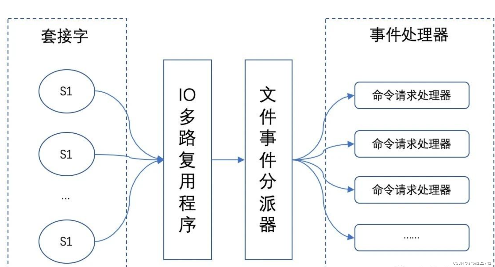
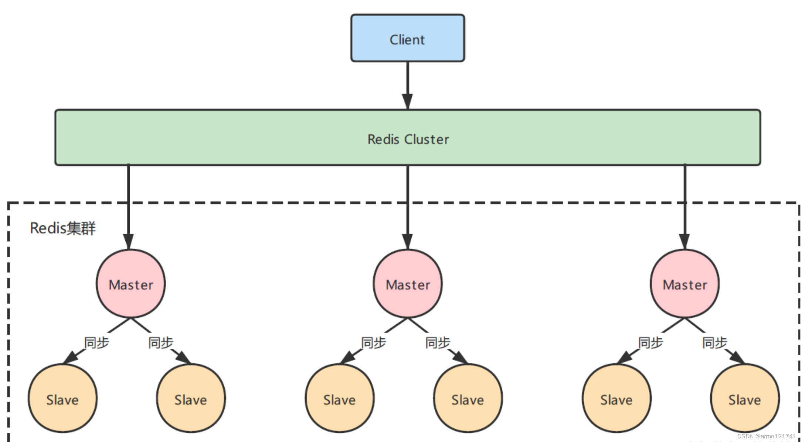

#  面试-客户端与redis的完整通信

**一个服务端进程**可以同时处理**多个套接字描述符**【Socket】。

IO多路复用程序负责**监听多个套接字并向文件事件分派器传送那些产生了事件的套接字**。**文件事件分派器**接收IO多路复用程序传来的套接字，并**根据套接字产生的事件的类型，调用相应的事件处理器**

编辑

事件分派器**每次从队列中取出一个 socket**，根据 socket 的事件类型交给对应的事件处理器进行处理

**建立连接**

- **服务端进程初始化**的时候，server socket **定义一个AE_READABLE 事件与连接应答处理器**关联
- **客户端 socket01** 向 **redis 进程的 server socket** **请求建立连接**，此时 server socket 会**产生一个 AE_READABLE 事件**，IO 多路复用程序监听到 server socket 产生的事件后，**将该 server socket压入队列中**
- **文件事件分派器**从队列中获取 socket，**交给连接应答处理器**
- 创建一个能与客户端通信的 **客户端 socket01**，并将该**客户端 socket01** 的 AE_READABLE 事件与命令请求处理器关联

**执行一个set请求**

- **客户端发送了一个 set key value 请求**，此时 redis 中的 socket01 会产生 AE_READABLE 事件，**IO 多路复用程序将 socket01 压入队列**
- 事件分派器将事件交给命令请求处理器来处理。命令请求处理器读取 socket01 的 key value 并在自己内存中完成 key value 的设置,它会将 **socket01 的 AE_WRITABLE 事件与命令回复处理器关联**
- 如果此时客户端准备好接收返回结果了，**那么 redis 中的 socket01 会产生一个 AE_WRITABLE 事件，同样压入队列中**
- 事件分派器找到相关联的命令回复处理器，**由命令回复处理器对 socket01 输入本次操作的一个结果，比如 ok，之后解除 socket01 的 AE_WRITABLE 事件与命令回复处理器的关联**

# 面试-Redis的数据结构有哪些

## 数据类型

- **字符串**

  - **编码格式**：**int编码**（小于等于12字节并且字符串可以表示为整数）；**embstr编码**【SDS】（字符串长度小于等于39字节时）；**raw编码**【SDS】（大于39字节或者字符串不能表示为整数）
  - **网站的访问次数统计**（自增自减），**限流**（incr和expire命令），**Session会话管理**；**缓存**；分布式锁

- **哈希**

  - **编码格式**：**ziplist**（压缩列表）：当Hash类型的**元素比较少**，且元素的**大小比较小**（小于64字节）时；hashtable（字典）
  - 存储对象：（购物车）将**对象的属性和属性值**存储在哈希类型中

- **列表**

  - **编码格式**：**ziplist**（压缩列表）：**最大长度**为2^16-1个元素；linkedlist（任意长度）
  - **应用场景**：**轻量级消息队列**，**时间序列**（LPUSH和RPUSH）；**排行榜**（比如**直播间进入**，ZADD broadcast:20210108231 1 zhangsan；**后期更新对应的得分**；ZRANGE获取排行榜）；**关注好友**（ZADD 1:follow time(时间戳) 2）–后期补充

- **不重复集合**

  - **编码格式**：**intset**（整数集合）：只包含整数类型的数据，并且元素数量较少（小于512个）时；**hashtable**（字典）
  - **应用场景**：朋友圈点赞、用户（微博好友）关注、相关关注、共同关注、好友关系等

- **有序集合**

  - **编码格式**：**ziplist**（压缩列表）：**最大长度**为2^16-1个元素；**skiplist**编码

  - **应用场景**：订阅关系、标签系统等

- **后续的四种数据类型**：bitmaps（在线用户统计、用户访问统计、用户点击统计）、hyperloglogs（统计独立UV）`、地理空间（`geospatial`）、消息（`Streams）

## 底层编码实现

- **intset(整数数组)**：编码方式 + 元素数量 + 数组
- **SDS**：（**len**：buf 中已占用空间的长度；**free**：buf 中剩余可用空间的长度；**char buf[]**：数据空间）；**优势**：（**避免获取长度遍历数组**；**防止缓冲区溢出**（检查给定SDS空间是否足够）；**预分配空间**的机制）
- **列表对象**：
  - **linkedlist**（ListNode组成的双向列表，不利于随机访问；**有内存碎片**（**不连续**））
  - **ziplist**（**连续内存块**组成的顺序型数据结构；解决了内存碎片问题；**查找复杂度高**，存在空间不够导致的**连锁更新**问题）
  - **quicklist**：双向链表与压缩列表的组合（**控制每个链表节点中的压缩列表的大小或者元素个数**；**通过链表的结构来管理每一个 ZipList 节点**）
  - **skipList**：每个节点中维持多个指向其他节点的指针（每层对应为接近2^n的数，查找效率略等于平衡树），从而达到快速访问的目的【**提升了链表的查询效率**】
- **哈希对象**（全局哈希表）

## 集群如何存储

# 面试-集群Redis数据存储

# 面试-redis-缓存一致性、雪崩、穿透

## 一致性方案

- 先写 MySQL，再写 Redis，**高并发下同步更新**（**更新Redis中A的操作稍微延迟了一点**，redis**仍为旧数据**）
- 先写 Redis，再写 MySQL，**高并发下同步更新**（**更新Mysql中A的操作稍微延迟了一点**，mysql**仍为旧数据**）
- 先删除 Redis，再写 MySQL（**请求 A 更新 MySQL 可能耗时会比较长，而请求 B 的前两步都是查询，获取到未更新数据**）
- 先删除 Redis，再写 MySQL，再删除**异步串行化删除** Redis+重试机制（**第一次查询的时候**可能数据不一致，保持了**最终一致性**）
- 先写 MySQL，再删除 Redis（**第一次查询的时候**可能数据不一致，保持了**最终一致性**）
- 先写 MySQL，通过 Binlog，异步更新 Redis（如果**中途请求 B 需要查询数据**，如果缓存无数据，就直接查 DB；如果缓存有数据，查询的数据也会存在不一致的情况）
- **实时一致性方案**：采用“先写 MySQL，再删除 Redis”的策略，这种情况虽然也会存在两者不一致，但是需要满足的条件有点苛刻，所以是满足实时性条件下，能尽量满足一致性的最优解。
- **最终一致性方案**：采用“先写 MySQL，通过 Binlog，异步更新 Redis”，可以通过 Binlog，结合消息队列异步更新 Redis，是最终一致性的最优解

## 缓存雪崩

**大量的热点key在同一时间内全部失效**

（设置热点数据永不过期，错开过期时间设置，分布式锁或者MQ队列使得请求串行化）

## 缓存穿透

**请求参数不合理**

（做IP限流与黑名单，请求做非法校验，DB中查询不存在的数据写入`Redis`中`“Not Data”`并设置短暂的过期时间，布隆过滤器）

## 缓存击穿

**某一个热点key突然过期**

（热点key永不过期，串行化不推荐）

# 面试-redis-淘汰和删除策略

**淘汰机制**

- volatile-lru：已设置过期时间，最近最少使用
- volatile-ttl：已设置过期时间，即将过期
- volatile-random：已设置过期时间，随机
- volatile-lfu：已设置过期时间，用频率最低
- allkeys-lru：所有数据，最近最少使用
- allkeys-lfu：所有数据，用频率最低
- allkeys-random：所有数据，随机
- no-enviction：内存满了写入报错

**删除策略**

定时（设置过期时间，定期检查），惰性（拿的时候判断），定期（固定时间随机选择一堆）

# 面试-redis-数据持久化

## RDB

**把内存中当前进程的数据生成快照**，采用**bgsave**

自动：（900s内存在1个写操作，300s内存在10个写操作，60s内存在10000个写操作）

手动触发：save（**阻塞**当前 `Redis`，直到`RDB`持久化过程完成为止），bgsave（操作创建子进程，由子进程完成持久化，**阻塞时间很短**）

**缺点：**

**持久化之间数据丢失**，**子进程频繁创建**成本过高，存在**新老版本不兼容**

## AOF

**类似`MySQL`的`binlog`日志一样记录写入命令**

appendfsync always：**每次发生数据更改**都将命令追加到`AOF`文件，数据最安全，产生大量磁盘IO

appendfsync everysec：**每秒**将写入命令追加到`AOF`文件，1S的数据丢失

appendfsync no：根据`buffer`填充情况/通道空闲时间等择机触发同步

**优点**：**数据丢失风险**降到最低，**后台线程处理**

**缺点**：文件体积大，**恢复数据的时间慢**，**两个线程**还是在共享同一台机器的资源，所以在**高并发场景**下也会一定受到影响

**AOF机制重写**

比上一次重写时的文件大小增长`100%`并且文件大小不小于`64MB`

- fork**创建子进程**，创建数据库重建命令序列于临时文件中
- **父进程继续响应**客户端请求，并将其中的**写请求继续追加至原来的AOF文件**中，额外的，这些新的写请求会被**放置在一个缓冲队列**中
- 子进程重写完成后会通知父进程，父进程**把缓冲队列中的命令写入临时文件中**

## 混合

这里的`AOF`日志不再是全量 的日志，而是**自持久化开始到持久化结束的这段时间发生的增量`AOF`日志**，通常这部分`AOF`日志很小。`Redis`重启的时候，可以**先加载`RDB`的内容**，然后**再重放增量`AOF`日志**

# 面试-redis-内存模型

## 估算Redis内存使用量

**info memory**（Redis角度）：（**used_memory**：分配的内存总量 + 虚拟内存）

**used_memory_rss**（操作系统角度）：（分配的内存总量 + 进程运行本身需要的内存 + 内存碎片）

**mem_fragmentation_ratio**（内存碎片比例：**值越大，内存碎片比例越大**；小于1，使用了虚拟内存（**介质是磁盘**），此时及时优化）

**mem_allocator**：使用的内存分配器

## 内存占用

- **数据内存**
- **主进程占用内存**（代码、常量池），**子进程内存**（AOF、RDB）
- **缓冲内存**（**客户端缓冲区**【存储客户端连接的输入输出缓冲】、复制积压缓冲区【复制功能】、**AOF缓冲区**【重写时，保存最近的写入命令】）
- **内存碎片**：分配、回收物理内存过程中产生（对数据的**更改频繁**，而且数据之间的**大小相差很大**），可以选择合适的内存分配器，重启减少内存碎片
- **共享对象**（refcount>1：创建为1，有人使用加1，不再使用减一，**新对象重复出现，仍然使用原来的对象**，只支持0-9999整数字符串【1.其他类型判断相等时间复杂度过高，整数为O（1）】）
- **虚拟内存**（**尽量在内存中只保留Keys的数据**，这样可以**保证数据检索的效率**：大量keys，value很小，不适合；少量keys，value很大，适合）
- **虚拟内存配置**
  - Redis**最大可用的虚拟内存字节数**。如果**内存中的数据大于该值**，**部分对象被持久化到磁盘**
  - 即**最长时间没有使用的数据**将被持久化
  - 那么Redis最终可用的交换文件大小为：vm-pages （页个数）* vm-page-size（**每页字节数**），一个页不能有多个value
  - 对交换文件**执行IO操作时所应用的最大线程数量**（等于主机的CPU cores）
- **虚拟内存交换模式**
  - 阻塞模式（主线程定期检査，**以阻塞的方式**,将选中的对象保存到`swap`文件中；客户端请求被换出的value对象，阻塞客户端）
  - 非阻塞模式（主线程定期检査，放到队列中**工作线程后台处理**；先**阻塞发出命令的客户端**，**工作线程**去加载。加载完毕后工作线程**通知主线程**）

# 面试-redis-高可用机制

## 主从数据同步

- **runId**：每个数据节点唯一ID
- **offset**：各自维护主从复制偏移量，**主节点接受命令，增加offset**；**从节点在收到命令后，增加自己的offset**；发给主节点，判断主从偏移量是否一致
- **repl_back_buffer**：复制缓冲区，用来存储增量数据命令

**全量同步过程**

- slave发送Psync同步指令（master和slave通过ping/pong**避免通信故障**）
- bgsave**生成最新RDB快照**，**请求指令写入buffer**
- **发送RDB给slave**，**再将buffer发给slave**，
- slave**清除旧数据**，**加载RDB和缓冲区指令**
- master**同步长连接**持续把写命令发给slave，也是先记录buffer，一定时间后再发过去

**部分复制过程**

- 出现**网络抖动或者节点失效**，master会写复制缓冲区
- slave**尝试连接主机**，把自己**run_id**和**偏移量**传给master，偏移量在复制缓冲区中，增量复制，否则全量复制
- master**同步长连接**持续把写命令发给slave，也是先记录buffer，一定时间后再发过去

**主从复制优缺点**

- 优点
  - **持久化的基础上**能够**将数据同步到其他机器**，在**极端情况下做到灾备的效果**
  - **主从读写分离**，**读的性能**可以通过**对从节点进行线性扩容无限提升**
- 缺点
  - **全量数据同步短暂卡顿**
  - **需要人工干预修改主节点**
  - **写入的QPS性能受到主节点限制**
  - 整个`Redis`节点群能够存储的数据容量受到**所有节点中内存最小的那台限制**

## 哨兵机制

**一般是一主两从三哨兵**（**主节点存活检测**；**主从运行情况检测**；**通过API脚本发出通知**；**自动故障转移**；**主从切换**；**主节点配置提供者**）

**工作原理**

- **获取级联结构图**：每个哨兵节点**每10秒会向主节点和从节点发送**`info`命令获取最级联结构图
- **广播主节点判断和当前哨兵节点的信息**：每个哨兵节点**每隔2秒**会向`Redis`**数据节点的指定频道**上发送该哨兵节点**对于主节点的判断**以及**当前哨兵节点的信息**，同时**每个哨兵节点也会订阅该频道，来了解其它哨兵节点的信息及对主节点的判断**，其实就是通过消息`publish`和`subscribe`来完成的
- **根据级联结构图做心跳检测**：隔1秒**每个哨兵**根据自己info获取的级联结构信息，**会向主节点、从节点及其余哨兵节点发送一次ping命令做一次心跳检测**（**（主观）下线**：单个Sentinel认为下线；有可能**存在多个`Sentinel`的`down-after-milliseconds`配置不同**，这个在实际生产中要注意）
- **发生主节点客观下线**：寻求其他节点对主节点的判断，这时候 `Sentinel`**向下线主服务器的所有从服务器发送**`INFO`命令的频率，会从10秒一次改为**每秒一次**，多数都同意就是客观下线
- **客观下线后自动选举新节点**
  - **挑选规则**
    - 过滤掉主观下线节点
    - **slave-priority**最高
    - 复制偏移量最大
    - `run_id`最小的节点
  - **选取一个哨兵做故障转移**
    - 每个节点会向其它哨兵发`is-master-down-by-addr`命令，**征求判断并要求将自己设置为领导者**
    - 其它哨兵同意或者拒绝
    - 选举的票数**大于等于**`num(sentinels)/2+1`时，将成为领导者，如果没有超过，继续重复选举

**哨兵优缺点**

- 优点
  - 主从切换不需要人工干预问题
- 缺点
  - 全量数据同步导致线上出现短暂卡顿
  - **写入QPS**仍然受到主节点单机限制
  - 存在主从复制时的**木桶效应**问题，**存储容量**受到节点群中最小内存机器限制

## 代理式集群（不建议）

### TwemProxy代理分片

解决了单个`Redis`实例承载能力，**无法平滑地扩容/缩容**，中间件代理，相比客户端直接连服务器方式，**性能上有所损耗，实测结果降低20%左右**

### Codis

引入了`Group`的概念,每个`Group`包括1个`Master`及至少1个`Slave`，Dashboard**自助式切换**到Slave，修改了`RedisServer`源码，分成1024个`slots`

集群的组成就很好的打破了之前的一主多从架构，形成了多主多从的模式，每个节点由一个个主从来构建，**每个节点存储不同的数据**

## 为什么不建议

- 代理层需要承担所有工作
- 代理层需要维护，保证**高可用**
- 代理层需要**承载所有客户端流量**，处理所有分发请求
- 代理层需要**实现服务动态感知、注册与监听**
- `Redis`的很多命令不再完美支持，如set的交集、并集、差集等

## 去中心化分片集群

### 原理

编辑

- 集群由多个Redis主从组成，每一个主从代表一个节点，每个节点负责一部分数据，他们之间通过一种特殊的二进制协议交互集群信息
- 使用数据分片（`Sharding`）引入**哈希槽**（`hashSlot`）来实现
- 存储在`RedisCluster`中的**所有键都会被映射**到这些`slot`中，集群中的每个键都属于这`16384`个哈希槽中的一个
- **容错**：每个主节点（Master）都负责处理16384个哈希槽中的一部分，当主节点出现宕机或网络断线等不可用时，从节点能自动提升为主节点进行处理
- **扩容**：节点超过1000，会导致网络拥堵。因此Redis作者不建议Redis Cluster节点数量超过1000

[一文搞懂 Redis高性能之IO多路复用-阿里云开发者社区 (aliyun.com)](https://developer.aliyun.com/article/947375)